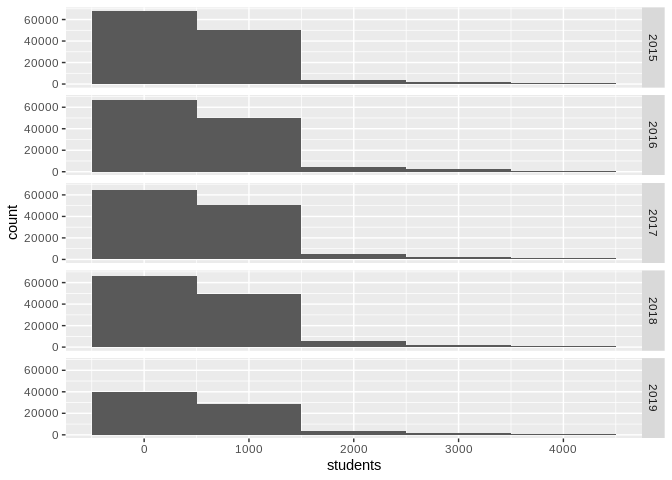

Data exploration
================

# Loading data

``` r
load("../data/ilposdata.RData")
# load("../data/ilposdata.Rdata")

load("../data/paavodata.RData")
```

# table 1

``` r
#table 1 
library(arsenal)
```

    ## 
    ## Attaching package: 'arsenal'

    ## The following object is masked from 'package:lubridate':
    ## 
    ##     is.Date

``` r
tab1 <- tableby(gender ~ Hb + age+ aborh + age.group + FirstEvent, data=ilposdata)
summary(tab1, text=T)
```

    ## 
    ## 
    ## |                |  Men (N=716769)  | Women (N=820911) | Total (N=1537680) | p value|
    ## |:---------------|:----------------:|:----------------:|:-----------------:|-------:|
    ## |Hb              |                  |                  |                   | < 0.001|
    ## |-  N-Miss       |      23216       |      30147       |       53363       |        |
    ## |-  Mean (SD)    | 154.358 (10.977) | 139.746 (10.434) | 146.574 (12.941)  |        |
    ## |-  Range        | 50.000 - 218.000 | 56.000 - 211.000 | 50.000 - 218.000  |        |
    ## |age             |                  |                  |                   | < 0.001|
    ## |-  Mean (SD)    | 46.381 (14.184)  | 42.231 (15.000)  |  44.165 (14.771)  |        |
    ## |-  Range        | 18.000 - 78.000  | 18.000 - 72.000  |  18.000 - 78.000  |        |
    ## |aborh           |                  |                  |                   | < 0.001|
    ## |-               |   9939 (1.4%)    |   17690 (2.2%)   |   27629 (1.8%)    |        |
    ## |-  A Rh(D) neg  |   44784 (6.2%)   |   53097 (6.5%)   |   97881 (6.4%)    |        |
    ## |-  A Rh(D) pos  |  249160 (34.8%)  |  273247 (33.3%)  |  522407 (34.0%)   |        |
    ## |-  AB Rh(D) neg |   7714 (1.1%)    |   9388 (1.1%)    |   17102 (1.1%)    |        |
    ## |-  AB Rh(D) pos |   39622 (5.5%)   |   43277 (5.3%)   |   82899 (5.4%)    |        |
    ## |-  B Rh(D) neg  |   18752 (2.6%)   |   21847 (2.7%)   |   40599 (2.6%)    |        |
    ## |-  B Rh(D) pos  |  92768 (12.9%)   |  105589 (12.9%)  |  198357 (12.9%)   |        |
    ## |-  Eriävä tulos |    11 (0.0%)     |     0 (0.0%)     |     11 (0.0%)     |        |
    ## |-  O Rh(D) neg  |   51365 (7.2%)   |   62552 (7.6%)   |   113917 (7.4%)   |        |
    ## |-  O Rh(D) pos  |  202654 (28.3%)  |  234224 (28.5%)  |  436878 (28.4%)   |        |
    ## |age.group       |                  |                  |                   | < 0.001|
    ## |-  [18,25]      |  82666 (11.5%)   |  166882 (20.3%)  |  249548 (16.2%)   |        |
    ## |-  (25,35]      |  103706 (14.5%)  |  138593 (16.9%)  |  242299 (15.8%)   |        |
    ## |-  (35,45]      |  114349 (16.0%)  |  132980 (16.2%)  |  247329 (16.1%)   |        |
    ## |-  (45,55]      |  180534 (25.2%)  |  181176 (22.1%)  |  361710 (23.5%)   |        |
    ## |-  (55,65]      |  200532 (28.0%)  |  175639 (21.4%)  |  376171 (24.5%)   |        |
    ## |-  (65,82]      |   34982 (4.9%)   |   25641 (3.1%)   |   60623 (3.9%)    |        |
    ## |FirstEvent      |                  |                  |                   | < 0.001|
    ## |-  FALSE        |  664071 (92.6%)  |  742978 (90.5%)  |  1407049 (91.5%)  |        |
    ## |-  TRUE         |   52698 (7.4%)   |   77933 (9.5%)   |   130631 (8.5%)   |        |

``` r
results="asis"

# remove p-values + missing values and make it look prettier
```

# Preprocessing

You can also embed plots, for example: \#\# Donation data

## Paavo data

``` r
preprocessed_paavo_data <- 
  paavodata %>% 
    dplyr::select(pono, vuosi, hr_mtu, hr_ktu,nimi) %>% 
    rename(zip = pono,
           Year= vuosi,
           medianincome= hr_mtu,
           averageincome= hr_ktu,
           Zipname= nimi)
```

``` r
final_data <-
  left_join(summarised_donor_data,
            preprocessed_paavo_data,
            by = c("zip", "Year")) %>% 
  filter(Year > 2014)
```

    ## Warning: Column `zip` joining factor and character vector, coercing into
    ## character vector

# Preliminary plots

``` r
final_data %>% 
  ggplot(aes(x = medianincome)) +
  geom_histogram(binwidth = 1000) +
  facet_grid(Year ~. )
```

    ## Warning: Removed 21895 rows containing non-finite values (stat_bin).

<!-- -->

``` r
final_data %>% 
  ggplot(aes(x = averageincome)) +
  geom_histogram(binwidth = 1000) +
  facet_grid(Year ~. )
```

    ## Warning: Removed 21895 rows containing non-finite values (stat_bin).

<!-- --> \#
educational, living arragements and job-status
distributions

``` r
#add educational data to paavodata and combine the education data to 3 categories: 1) basic level 2) Matriculation examination and vocational diploma, 3) university degree (higher and lower)

preprocessed_paavo_data <- 
  paavodata %>% 
    dplyr::select(pono, vuosi, hr_mtu, hr_ktu,nimi, ko_perus, ko_yliop, ko_ammat, ko_al_kork, ko_yl_kork, pt_tyott, pt_opisk, pt_tyoll, te_omis_as, te_vuok_as) %>% 
    rename(zip = pono,
           Year= vuosi,
           medianincome= hr_mtu,
           averageincome= hr_ktu,
           Zipname= nimi,
           Basiceducation=ko_perus,
           unemployed = pt_tyott,
           students = pt_opisk,
           employed = pt_tyoll,
           owner_apartment = te_omis_as,
           rental_apartment = te_vuok_as)

#Remove the old variables, which were combined
preprocessed_paavo_data["secondaryeducation"] <- rowSums(preprocessed_paavo_data[c("ko_yliop",
                                  "ko_ammat")])
preprocessed_paavo_data["tertiaryeducation"] <- rowSums(preprocessed_paavo_data[c("ko_al_kork",
                                 "ko_yl_kork")])

preprocessed_paavo_data <- subset(preprocessed_paavo_data, select=-c(ko_yliop,
                                                                     ko_ammat,
                                                                     ko_al_kork,
                                                                     ko_yl_kork))


final_data <-
  left_join(final_data,
            preprocessed_paavo_data,
            by = c("zip", "Year")) %>% 
  filter(Year > 2014)
```

``` r
final_data %>% 
ggplot(aes(x = Basiceducation)) +
geom_histogram(binwidth = 1000) +
  facet_grid(Year ~. )
```

    ## Warning: Removed 21896 rows containing non-finite values (stat_bin).

<!-- -->

``` r
final_data %>% 
ggplot(aes(x = secondaryeducation)) +
geom_histogram(binwidth = 1000) +
  facet_grid(Year ~. )
```

    ## Warning: Removed 21896 rows containing non-finite values (stat_bin).

<!-- -->

``` r
final_data %>% 
ggplot(aes(x = tertiaryeducation)) +
geom_histogram(binwidth = 1000) +
  facet_grid(Year ~. )
```

    ## Warning: Removed 21896 rows containing non-finite values (stat_bin).

<!-- -->

# Plotting housing variables

``` r
final_data  %>% 
ggplot(aes(x = owner_apartment)) +
geom_histogram(binwidth = 1000) +
  facet_grid(Year ~. )
```

    ## Warning: Removed 22150 rows containing non-finite values (stat_bin).

<!-- -->

``` r
final_data  %>% 
ggplot(aes(x = rental_apartment)) +
geom_histogram(binwidth = 1000) +
  facet_grid(Year ~. )
```

    ## Warning: Removed 22150 rows containing non-finite values (stat_bin).

<!-- -->

# Plotting main type of activity

``` r
final_data  %>% 
ggplot(aes(x = unemployed)) +
geom_histogram(binwidth = 1000) +
  facet_grid(Year ~. )
```

    ## Warning: Removed 22221 rows containing non-finite values (stat_bin).

<!-- -->

``` r
final_data  %>% 
ggplot(aes(x = employed)) +
geom_histogram(binwidth = 1000) +
  facet_grid(Year ~. )
```

    ## Warning: Removed 22221 rows containing non-finite values (stat_bin).

<!-- -->

``` r
final_data  %>% 
ggplot(aes(x = students)) +
geom_histogram(binwidth = 1000) +
  facet_grid(Year ~. )
```

    ## Warning: Removed 22032 rows containing non-finite values (stat_bin).

<!-- -->

``` 
# Voter turnout and biggest party by zip-code (pending)


```

\#GGally correlation matrix

``` r
library("GGally")
```

    ## Registered S3 method overwritten by 'GGally':
    ##   method from   
    ##   +.gg   ggplot2

    ## 
    ## Attaching package: 'GGally'

    ## The following object is masked from 'package:dplyr':
    ## 
    ##     nasa

\#Summarise the data by hb + average yearly count of donations
