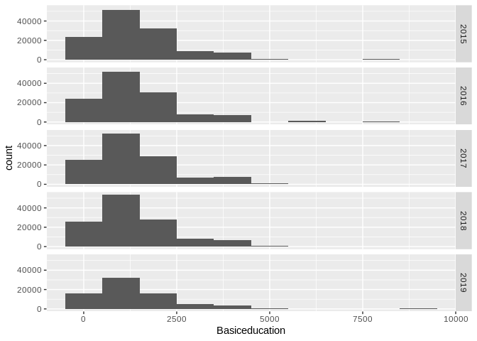
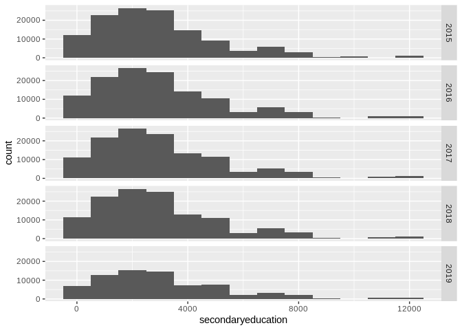
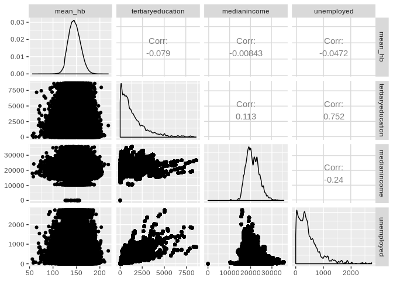

Data exploration
================

# Loading data

``` r
load("../data/ilposdata.RData")
# load("../data/ilposdata.Rdata")

load("../data/paavodata.RData")

rename(ilposdata, sex= gender )
```

    ## # A tibble: 1,537,680 x 13
    ##    donor Site  dateonly   status donat_phleb    Hb sex   aborh zip     age
    ##    <fct> <fct> <date>     <fct>  <fct>       <dbl> <fct> <fct> <fct> <int>
    ##  1 DR00… L3149 2018-10-08 -      K             141 Women A Rh… 90570    19
    ##  2 DR00… L3149 2018-10-08 -      K             156 Men   O Rh… 90530    21
    ##  3 DR00… L3149 2018-10-08 -      K             156 Men   A Rh… 90560    22
    ##  4 DR00… L0564 2019-01-17 -      K             163 Men   A Rh… 90560    22
    ##  5 DR00… L3149 2018-10-08 R      K             127 Women A Rh… 90570    20
    ##  6 DR00… L3149 2019-01-14 E      *             138 Women A Rh… 90570    20
    ##  7 DR00… L3149 2018-10-08 E      *             144 Women ""    90550    19
    ##  8 DR00… L3149 2018-10-08 -      K             140 Women O Rh… 90530    21
    ##  9 DR00… L3149 2018-10-08 -      K             128 Women B Rh… 90500    19
    ## 10 DR00… L3149 2018-10-08 -      K             153 Women AB R… 90530    20
    ## # … with 1,537,670 more rows, and 3 more variables: age.group <fct>,
    ## #   Hb_deferral <fct>, FirstEvent <lgl>

``` r
rm(aluejakokartat,cc,Data,hoobee_data,nb_donations_data,paavo,paavo_shares,paavo_vars,paavo18,preprocessed_paavo_data,summarised_donor_data,zipcode_maps,api_key,columns_to_mutate,corvallis,file,hb_data,helsinki,i,results,share_column_suffix,sp.vaesto,collapse_names,data,get_geo,map_fi_zipcode,map_fi_zipcode_interactive,order_columns,paavo_aggr,sum_finite,wmean,zip_code_map,fi_commune_number2name)
```

    ## Warning in rm(aluejakokartat, cc, Data, hoobee_data, nb_donations_data, :
    ## object 'hoobee_data' not found

    ## Warning in rm(aluejakokartat, cc, Data, hoobee_data, nb_donations_data, :
    ## object 'nb_donations_data' not found

    ## Warning in rm(aluejakokartat, cc, Data, hoobee_data, nb_donations_data, :
    ## object 'preprocessed_paavo_data' not found

    ## Warning in rm(aluejakokartat, cc, Data, hoobee_data, nb_donations_data, :
    ## object 'summarised_donor_data' not found

    ## Warning in rm(aluejakokartat, cc, Data, hoobee_data, nb_donations_data, :
    ## object 'hb_data' not found

    ## Warning in rm(aluejakokartat, cc, Data, hoobee_data, nb_donations_data, :
    ## object 'results' not found

# table 1

``` r
#table 1 
library(arsenal)
```

    ## 
    ## Attaching package: 'arsenal'

    ## The following object is masked from 'package:lubridate':
    ## 
    ##     is.Date

``` r
tab1 <- tableby(gender ~ Hb + age+ aborh + age.group + FirstEvent, data=ilposdata)
summary(tab1, text=T)
```

    ## 
    ## 
    ## |                |  Men (N=716769)  | Women (N=820911) | Total (N=1537680) | p value|
    ## |:---------------|:----------------:|:----------------:|:-----------------:|-------:|
    ## |Hb              |                  |                  |                   | < 0.001|
    ## |-  N-Miss       |      23216       |      30147       |       53363       |        |
    ## |-  Mean (SD)    | 154.358 (10.977) | 139.746 (10.434) | 146.574 (12.941)  |        |
    ## |-  Range        | 50.000 - 218.000 | 56.000 - 211.000 | 50.000 - 218.000  |        |
    ## |age             |                  |                  |                   | < 0.001|
    ## |-  Mean (SD)    | 46.381 (14.184)  | 42.231 (15.000)  |  44.165 (14.771)  |        |
    ## |-  Range        | 18.000 - 78.000  | 18.000 - 72.000  |  18.000 - 78.000  |        |
    ## |aborh           |                  |                  |                   | < 0.001|
    ## |-               |   9939 (1.4%)    |   17690 (2.2%)   |   27629 (1.8%)    |        |
    ## |-  A Rh(D) neg  |   44784 (6.2%)   |   53097 (6.5%)   |   97881 (6.4%)    |        |
    ## |-  A Rh(D) pos  |  249160 (34.8%)  |  273247 (33.3%)  |  522407 (34.0%)   |        |
    ## |-  AB Rh(D) neg |   7714 (1.1%)    |   9388 (1.1%)    |   17102 (1.1%)    |        |
    ## |-  AB Rh(D) pos |   39622 (5.5%)   |   43277 (5.3%)   |   82899 (5.4%)    |        |
    ## |-  B Rh(D) neg  |   18752 (2.6%)   |   21847 (2.7%)   |   40599 (2.6%)    |        |
    ## |-  B Rh(D) pos  |  92768 (12.9%)   |  105589 (12.9%)  |  198357 (12.9%)   |        |
    ## |-  Eriävä tulos |    11 (0.0%)     |     0 (0.0%)     |     11 (0.0%)     |        |
    ## |-  O Rh(D) neg  |   51365 (7.2%)   |   62552 (7.6%)   |   113917 (7.4%)   |        |
    ## |-  O Rh(D) pos  |  202654 (28.3%)  |  234224 (28.5%)  |  436878 (28.4%)   |        |
    ## |age.group       |                  |                  |                   | < 0.001|
    ## |-  [18,25]      |  82666 (11.5%)   |  166882 (20.3%)  |  249548 (16.2%)   |        |
    ## |-  (25,35]      |  103706 (14.5%)  |  138593 (16.9%)  |  242299 (15.8%)   |        |
    ## |-  (35,45]      |  114349 (16.0%)  |  132980 (16.2%)  |  247329 (16.1%)   |        |
    ## |-  (45,55]      |  180534 (25.2%)  |  181176 (22.1%)  |  361710 (23.5%)   |        |
    ## |-  (55,65]      |  200532 (28.0%)  |  175639 (21.4%)  |  376171 (24.5%)   |        |
    ## |-  (65,82]      |   34982 (4.9%)   |   25641 (3.1%)   |   60623 (3.9%)    |        |
    ## |FirstEvent      |                  |                  |                   | < 0.001|
    ## |-  FALSE        |  664071 (92.6%)  |  742978 (90.5%)  |  1407049 (91.5%)  |        |
    ## |-  TRUE         |   52698 (7.4%)   |   77933 (9.5%)   |   130631 (8.5%)   |        |

``` r
results="asis"

# remove p-values + missing values and make it look prettier
```

# Preprocessing

You can also embed plots, for example: \#\# Donation data

``` r
nb_donations_data <-
  ilposdata %>% 
    mutate(Year = year(dateonly)) %>% 
    filter(donat_phleb == "K") %>% 
    count(donor,Year, zip)
 
 summarised_donor_data <- 
  ilposdata %>% 
    mutate(Year = year(dateonly),
           Hb = ifelse(is.nan(Hb), NA, Hb)) %>% 
    group_by(donor, Year, zip) %>% 
    summarize(mean_hb=mean(Hb, na.rm = TRUE),
              aborh=last(aborh),
              gender=last(gender),
              age=last(age)
                           ) %>% 
   drop_na(mean_hb) %>% 
   full_join(nb_donations_data,
             by = c("donor", "zip","Year")) %>% 
   mutate(n = replace_na(n, 0))
```

## Paavo data

``` r
preprocessed_paavo_data <- 
  paavodata %>% 
    dplyr::select(pono, vuosi, hr_mtu, hr_ktu,nimi, ko_perus, ko_yliop, ko_ammat, ko_al_kork, ko_yl_kork, pt_tyott, pt_opisk, pt_tyoll, te_omis_as, te_vuok_as,he_vakiy, ko_ika18y) %>% 
    rename(zip = pono,
           Year= vuosi,
           Basiceducation=ko_perus,
           unemployed = pt_tyott,
           students = pt_opisk,
           employed = pt_tyoll,
           owner_apartment = te_omis_as,
           rental_apartment = te_vuok_as,
           medianincome= hr_mtu,
           averageincome= hr_ktu,
           population= he_vakiy,
           population18= ko_ika18y)

#Remove the old variables, which were combined
preprocessed_paavo_data["secondaryeducation"] <- rowSums(preprocessed_paavo_data[c("ko_yliop",
                                  "ko_ammat")])
preprocessed_paavo_data["tertiaryeducation"] <- rowSums(preprocessed_paavo_data[c("ko_al_kork",
                                 "ko_yl_kork")])

preprocessed_paavo_data <- subset(preprocessed_paavo_data, select=-c(ko_yliop,
                                                           ko_ammat, ko_al_kork,
                                                                     ko_yl_kork))


final_data <-
  left_join(summarised_donor_data,
            preprocessed_paavo_data,
            by = c("zip", "Year")) %>% 
  filter(Year > 2014)
```

    ## Warning: Column `zip` joining factor and character vector, coercing into
    ## character vector

# Preliminary plots

``` r
final_data %>% 
  ggplot(aes(x = medianincome)) +
  geom_histogram(binwidth = 1000) +
  facet_grid(Year ~. )
```

    ## Warning: Removed 21895 rows containing non-finite values (stat_bin).

<!-- -->

``` r
final_data %>% 
  ggplot(aes(x = averageincome)) +
  geom_histogram(binwidth = 1000) +
  facet_grid(Year ~. )
```

    ## Warning: Removed 21895 rows containing non-finite values (stat_bin).

<!-- -->

``` r
final_data %>% 
  ggplot(aes(x = averageincome)) +
  geom_histogram(binwidth = 1000) +
  facet_grid(Year ~. ) +
  scale_y_log10()
```

    ## Warning: Removed 21895 rows containing non-finite values (stat_bin).

    ## Warning: Transformation introduced infinite values in continuous y-axis

    ## Warning: Removed 312 rows containing missing values (geom_bar).

<!-- -->

``` r
final_data %>% 
  ggplot(aes(x = Year, y = averageincome)) +
  geom_jitter(alpha = 0.2)
```

    ## Warning: Removed 21895 rows containing missing values (geom_point).

<!-- -->

``` r
final_data %>% 
ggplot(aes(x = Basiceducation)) +
geom_histogram(binwidth = 1000) +
  facet_grid(Year ~. )
```

    ## Warning: Removed 21896 rows containing non-finite values (stat_bin).

<!-- -->

``` r
final_data %>% 
ggplot(aes(x = secondaryeducation)) +
geom_histogram(binwidth = 1000) +
  facet_grid(Year ~. )
```

    ## Warning: Removed 21896 rows containing non-finite values (stat_bin).

<!-- -->

``` r
final_data %>% 
ggplot(aes(x = tertiaryeducation)) +
geom_histogram(binwidth = 1000) +
  facet_grid(Year ~. )
```

    ## Warning: Removed 21896 rows containing non-finite values (stat_bin).

<!-- -->

# Plotting housing variables

``` r
final_data  %>% 
ggplot(aes(x = owner_apartment)) +
geom_histogram(binwidth = 1000) +
  facet_grid(Year ~. )
```

    ## Warning: Removed 22150 rows containing non-finite values (stat_bin).

<!-- -->

``` r
final_data  %>% 
ggplot(aes(x = rental_apartment)) +
geom_histogram(binwidth = 1000) +
  facet_grid(Year ~. )
```

    ## Warning: Removed 22150 rows containing non-finite values (stat_bin).

<!-- -->

# Plotting main type of activity

``` r
final_data  %>% 
ggplot(aes(x = unemployed)) +
geom_histogram(binwidth = 1000) +
  facet_grid(Year ~. )
```

    ## Warning: Removed 22221 rows containing non-finite values (stat_bin).

<!-- -->

``` r
final_data  %>% 
ggplot(aes(x = employed)) +
geom_histogram(binwidth = 1000) +
  facet_grid(Year ~. )
```

    ## Warning: Removed 22221 rows containing non-finite values (stat_bin).

<!-- -->

``` r
final_data  %>% 
ggplot(aes(x = students)) +
geom_histogram(binwidth = 1000) +
  facet_grid(Year ~. )
```

    ## Warning: Removed 22032 rows containing non-finite values (stat_bin).

<!-- -->

# summarised by hb

``` r
hb_by_zip <- final_data %>% 
  group_by(zip, Year) %>% 
  summarise(mean_hb=mean(mean_hb)) 

hb_by_zip %>% 
  ggplot(aes(x = Year, y = mean_hb)) +
  geom_jitter(alpha = 0.2)
```

    ## Warning: Removed 32 rows containing missing values (geom_point).

<!-- -->

# correlation matrix and plots

\#Paavodata

``` r
library("GGally")
```

    ## Registered S3 method overwritten by 'GGally':
    ##   method from   
    ##   +.gg   ggplot2

    ## 
    ## Attaching package: 'GGally'

    ## The following object is masked from 'package:dplyr':
    ## 
    ##     nasa

``` r
varspaavo <- c("medianincome","averageincome","tertiaryeducation","secondaryeducation","rental_apartment", "employed","unemployed","Basiceducation")

ggpairs(final_data,columns= varspaavo)
```

    ## Warning: Removed 21895 rows containing non-finite values (stat_density).

    ## Warning in (function (data, mapping, alignPercent = 0.6, method =
    ## "pearson", : Removed 21895 rows containing missing values

    ## Warning in (function (data, mapping, alignPercent = 0.6, method =
    ## "pearson", : Removed 21897 rows containing missing values

    ## Warning in (function (data, mapping, alignPercent = 0.6, method =
    ## "pearson", : Removed 21897 rows containing missing values

    ## Warning in (function (data, mapping, alignPercent = 0.6, method =
    ## "pearson", : Removed 22151 rows containing missing values

    ## Warning in (function (data, mapping, alignPercent = 0.6, method =
    ## "pearson", : Removed 22223 rows containing missing values

    ## Warning in (function (data, mapping, alignPercent = 0.6, method =
    ## "pearson", : Removed 22223 rows containing missing values

    ## Warning in (function (data, mapping, alignPercent = 0.6, method =
    ## "pearson", : Removed 21897 rows containing missing values

    ## Warning: Removed 21895 rows containing missing values (geom_point).

    ## Warning: Removed 21895 rows containing non-finite values (stat_density).

    ## Warning in (function (data, mapping, alignPercent = 0.6, method =
    ## "pearson", : Removed 21897 rows containing missing values

    ## Warning in (function (data, mapping, alignPercent = 0.6, method =
    ## "pearson", : Removed 21897 rows containing missing values

    ## Warning in (function (data, mapping, alignPercent = 0.6, method =
    ## "pearson", : Removed 22151 rows containing missing values

    ## Warning in (function (data, mapping, alignPercent = 0.6, method =
    ## "pearson", : Removed 22223 rows containing missing values

    ## Warning in (function (data, mapping, alignPercent = 0.6, method =
    ## "pearson", : Removed 22223 rows containing missing values

    ## Warning in (function (data, mapping, alignPercent = 0.6, method =
    ## "pearson", : Removed 21897 rows containing missing values

    ## Warning: Removed 21897 rows containing missing values (geom_point).
    
    ## Warning: Removed 21897 rows containing missing values (geom_point).

    ## Warning: Removed 21896 rows containing non-finite values (stat_density).

    ## Warning in (function (data, mapping, alignPercent = 0.6, method =
    ## "pearson", : Removed 21896 rows containing missing values

    ## Warning in (function (data, mapping, alignPercent = 0.6, method =
    ## "pearson", : Removed 22151 rows containing missing values

    ## Warning in (function (data, mapping, alignPercent = 0.6, method =
    ## "pearson", : Removed 22224 rows containing missing values

    ## Warning in (function (data, mapping, alignPercent = 0.6, method =
    ## "pearson", : Removed 22224 rows containing missing values

    ## Warning in (function (data, mapping, alignPercent = 0.6, method =
    ## "pearson", : Removed 21896 rows containing missing values

    ## Warning: Removed 21897 rows containing missing values (geom_point).
    
    ## Warning: Removed 21897 rows containing missing values (geom_point).

    ## Warning: Removed 21896 rows containing missing values (geom_point).

    ## Warning: Removed 21896 rows containing non-finite values (stat_density).

    ## Warning in (function (data, mapping, alignPercent = 0.6, method =
    ## "pearson", : Removed 22151 rows containing missing values

    ## Warning in (function (data, mapping, alignPercent = 0.6, method =
    ## "pearson", : Removed 22224 rows containing missing values

    ## Warning in (function (data, mapping, alignPercent = 0.6, method =
    ## "pearson", : Removed 22224 rows containing missing values

    ## Warning in (function (data, mapping, alignPercent = 0.6, method =
    ## "pearson", : Removed 21896 rows containing missing values

    ## Warning: Removed 22151 rows containing missing values (geom_point).
    
    ## Warning: Removed 22151 rows containing missing values (geom_point).
    
    ## Warning: Removed 22151 rows containing missing values (geom_point).
    
    ## Warning: Removed 22151 rows containing missing values (geom_point).

    ## Warning: Removed 22150 rows containing non-finite values (stat_density).

    ## Warning in (function (data, mapping, alignPercent = 0.6, method =
    ## "pearson", : Removed 22288 rows containing missing values

    ## Warning in (function (data, mapping, alignPercent = 0.6, method =
    ## "pearson", : Removed 22288 rows containing missing values

    ## Warning in (function (data, mapping, alignPercent = 0.6, method =
    ## "pearson", : Removed 22151 rows containing missing values

    ## Warning: Removed 22223 rows containing missing values (geom_point).
    
    ## Warning: Removed 22223 rows containing missing values (geom_point).

    ## Warning: Removed 22224 rows containing missing values (geom_point).
    
    ## Warning: Removed 22224 rows containing missing values (geom_point).

    ## Warning: Removed 22288 rows containing missing values (geom_point).

    ## Warning: Removed 22221 rows containing non-finite values (stat_density).

    ## Warning in (function (data, mapping, alignPercent = 0.6, method =
    ## "pearson", : Removed 22221 rows containing missing values

    ## Warning in (function (data, mapping, alignPercent = 0.6, method =
    ## "pearson", : Removed 22224 rows containing missing values

    ## Warning: Removed 22223 rows containing missing values (geom_point).
    
    ## Warning: Removed 22223 rows containing missing values (geom_point).

    ## Warning: Removed 22224 rows containing missing values (geom_point).
    
    ## Warning: Removed 22224 rows containing missing values (geom_point).

    ## Warning: Removed 22288 rows containing missing values (geom_point).

    ## Warning: Removed 22221 rows containing missing values (geom_point).

    ## Warning: Removed 22221 rows containing non-finite values (stat_density).

    ## Warning in (function (data, mapping, alignPercent = 0.6, method =
    ## "pearson", : Removed 22224 rows containing missing values

    ## Warning: Removed 21897 rows containing missing values (geom_point).
    
    ## Warning: Removed 21897 rows containing missing values (geom_point).

    ## Warning: Removed 21896 rows containing missing values (geom_point).
    
    ## Warning: Removed 21896 rows containing missing values (geom_point).

    ## Warning: Removed 22151 rows containing missing values (geom_point).

    ## Warning: Removed 22224 rows containing missing values (geom_point).
    
    ## Warning: Removed 22224 rows containing missing values (geom_point).

    ## Warning: Removed 21896 rows containing non-finite values (stat_density).

<!-- -->
\#correlation matrix with donor data

``` r
library(GGally)
donorvars <- c ("Hb","age","gender","aborh")
ggpairs(ilposdata, columns= donorvars)
```

    ## Warning: Removed 53363 rows containing non-finite values (stat_density).

    ## Warning in (function (data, mapping, alignPercent = 0.6, method =
    ## "pearson", : Removed 53363 rows containing missing values

    ## Warning: Removed 53363 rows containing non-finite values (stat_boxplot).
    
    ## Warning: Removed 53363 rows containing non-finite values (stat_boxplot).

    ## Warning: Removed 53363 rows containing missing values (geom_point).

    ## `stat_bin()` using `bins = 30`. Pick better value with `binwidth`.

    ## Warning: Removed 53363 rows containing non-finite values (stat_bin).

    ## `stat_bin()` using `bins = 30`. Pick better value with `binwidth`.
    ## `stat_bin()` using `bins = 30`. Pick better value with `binwidth`.

    ## Warning: Removed 53363 rows containing non-finite values (stat_bin).

    ## `stat_bin()` using `bins = 30`. Pick better value with `binwidth`.

<!-- -->
\#ggpairs with both
datasets

``` r
varboth <-  c( "mean_hb", "tertiaryeducation","medianincome","unemployed")
ggpairs(final_data, columns= varboth)
```

    ## Warning: Removed 32 rows containing non-finite values (stat_density).

    ## Warning in (function (data, mapping, alignPercent = 0.6, method =
    ## "pearson", : Removed 21927 rows containing missing values

    ## Warning in (function (data, mapping, alignPercent = 0.6, method =
    ## "pearson", : Removed 21926 rows containing missing values

    ## Warning in (function (data, mapping, alignPercent = 0.6, method =
    ## "pearson", : Removed 22252 rows containing missing values

    ## Warning: Removed 21927 rows containing missing values (geom_point).

    ## Warning: Removed 21896 rows containing non-finite values (stat_density).

    ## Warning in (function (data, mapping, alignPercent = 0.6, method =
    ## "pearson", : Removed 21897 rows containing missing values

    ## Warning in (function (data, mapping, alignPercent = 0.6, method =
    ## "pearson", : Removed 22224 rows containing missing values

    ## Warning: Removed 21926 rows containing missing values (geom_point).

    ## Warning: Removed 21897 rows containing missing values (geom_point).

    ## Warning: Removed 21895 rows containing non-finite values (stat_density).

    ## Warning in (function (data, mapping, alignPercent = 0.6, method =
    ## "pearson", : Removed 22223 rows containing missing values

    ## Warning: Removed 22252 rows containing missing values (geom_point).

    ## Warning: Removed 22224 rows containing missing values (geom_point).

    ## Warning: Removed 22223 rows containing missing values (geom_point).

    ## Warning: Removed 22221 rows containing non-finite values (stat_density).

<!-- -->

Correlation matrix and plots on final data with psycho package

``` r
library(psycho)
```

    ## Registered S3 method overwritten by 'MuMIn':
    ##   method         from
    ##   predict.merMod lme4

    ## Registered S3 methods overwritten by 'huge':
    ##   method    from   
    ##   plot.sim  BDgraph
    ##   print.sim BDgraph

    ## Registered S3 method overwritten by 'xts':
    ##   method     from
    ##   as.zoo.xts zoo

    ## message: psycho's `analyze()` is deprecated in favour of the report package. Check it out at https://github.com/easystats/report

``` r
cor <- correlation (final_data) 


plot(cor)
```

<!-- -->

``` r
summary(cor)
```

    ##                        Year  mean_hb      age        n medianincome
    ## Year                                                               
    ## mean_hb             0.03***                                        
    ## age                 0.01***  0.15***                               
    ## n                  -0.11***  0.16***  0.27***                      
    ## medianincome        0.09*** -0.01***  0.03*** -0.02***             
    ## averageincome       0.08*** -0.03*** -0.01*** -0.02***      0.87***
    ## Basiceducation     -0.03*** -0.05*** -0.11*** -0.01***     -0.17***
    ## unemployed          0.11*** -0.05*** -0.17*** -0.02***     -0.24***
    ## students            0.01*** -0.05*** -0.22*** -0.03***     -0.22***
    ## employed           -0.01*** -0.07*** -0.18*** -0.03***      0.05***
    ## owner_apartment        0**  -0.05*** -0.12*** -0.01***           0 
    ## rental_apartment    0.03*** -0.08*** -0.23*** -0.04***     -0.22***
    ## population          0.02*** -0.06*** -0.17*** -0.03***     -0.04***
    ## population18        0.02*** -0.06*** -0.18*** -0.03***     -0.09***
    ## secondaryeducation  0.01*** -0.05*** -0.17*** -0.02***     -0.16***
    ## tertiaryeducation   0.07*** -0.08*** -0.22*** -0.05***      0.11***
    ##                    averageincome Basiceducation unemployed students
    ## Year                                                               
    ## mean_hb                                                            
    ## age                                                                
    ## n                                                                  
    ## medianincome                                                       
    ## averageincome                                                      
    ## Basiceducation          -0.14***                                   
    ## unemployed              -0.18***        0.87***                    
    ## students                -0.12***        0.77***     0.9***         
    ## employed                  0.1***        0.84***    0.85***  0.84***
    ## owner_apartment          0.04***        0.86***    0.81***  0.75***
    ## rental_apartment        -0.11***        0.82***    0.91***  0.91***
    ## population               0.02***        0.91***    0.91***  0.89***
    ## population18            -0.01***         0.9***    0.92***   0.9***
    ## secondaryeducation       -0.1***         0.9***    0.92***   0.9***
    ## tertiaryeducation        0.22***        0.65***    0.75***  0.79***
    ##                    employed owner_apartment rental_apartment population
    ## Year                                                                   
    ## mean_hb                                                                
    ## age                                                                    
    ## n                                                                      
    ## medianincome                                                           
    ## averageincome                                                          
    ## Basiceducation                                                         
    ## unemployed                                                             
    ## students                                                               
    ## employed                                                               
    ## owner_apartment     0.92***                                            
    ## rental_apartment     0.9***         0.77***                            
    ## population          0.98***         0.94***          0.91***           
    ## population18        0.98***         0.94***          0.94***    0.99***
    ## secondaryeducation  0.94***         0.94***          0.91***    0.98***
    ## tertiaryeducation   0.93***          0.8***          0.87***    0.87***
    ##                    population18 secondaryeducation
    ## Year                                              
    ## mean_hb                                           
    ## age                                               
    ## n                                                 
    ## medianincome                                      
    ## averageincome                                     
    ## Basiceducation                                    
    ## unemployed                                        
    ## students                                          
    ## employed                                          
    ## owner_apartment                                   
    ## rental_apartment                                  
    ## population                                        
    ## population18                                      
    ## secondaryeducation      0.98***                   
    ## tertiaryeducation       0.89***            0.82***

# Count division of post codes between mobile and fixed sites.

``` r
    Sitedata <- ilposdata %>%
    mutate(locSim = case_when(
      Site == "H0091" | Site == "H0092" ~ "Kivihaka",
      Site == "H0093"  ~ "Sanomatalo",
      Site == "H0096"  ~ "Espoo",
      Site == "K0297" ~ "Kuopio",
      Site == "T0837" ~ "Tampere",
      Site == "T07343" ~ "Seinäjoki",
      Site == "T0179" ~ "Jyväskylä",
      Site == "T0398" ~ "Lahti",
      Site == "L0564" ~ "Oulu",
       Site == "U0853" ~ "Turku",
      TRUE ~ "mobilesite"))
      

  
 Sitedata %>% 
mutate(Year = year(dateonly)) %>% 
filter(donat_phleb == "K") %>% 
filter(Year > 2015) %>% 
count(locSim, Year) 
```

    ## # A tibble: 40 x 3
    ##    locSim     Year     n
    ##    <chr>     <dbl> <int>
    ##  1 Espoo      2016  7152
    ##  2 Espoo      2017  7721
    ##  3 Espoo      2018  8892
    ##  4 Espoo      2019  3597
    ##  5 Jyväskylä  2016  8711
    ##  6 Jyväskylä  2017  8642
    ##  7 Jyväskylä  2018  8461
    ##  8 Jyväskylä  2019  3372
    ##  9 Kivihaka   2016 10139
    ## 10 Kivihaka   2017 10354
    ## # … with 30 more rows

``` r
 # make a new variable (fixedsites or plot without mobilesites)
```

\# As in for each zipcode, divide the number of donors from that zipcode
by the total number of potential donors from that zipcode (men and women
between ages 18-70). So now for each zipcode you have a proportion of
the population that donates.Then you could see if this proportion has
any correlation with for example incomes (median or average): do
zipcodes with a high proportion of blood donors tend tohave high (or
low) median or mean income. You would make scatterplots to see this.

\#so you would first need to decide what your income groups intervals
would be ie, 0-10 000 ; 10001-20000,20001-30000, etc then create a new
variable income group, and for each zip code, give it the right
income-group value according to its mean or median income so then you
would have for each zip code the income\_group and the nb of donors for
donor data and then each zip code the income\_group and the nb of
inhabitants. then you can make a “distribution” of income in either
group by grouping by income\_group and adding the number of people in
that income group across zip\_codes. FOr the donor population you would
add nb\_donors (you need to have the nb of donors per zip\_code already
computed) using a summarize(result= sum(nb\_donors)) and then for the
total population you need to. For the total population you can do the
same thing but add the over18 population. Then for each income\_group,
you should have the total nb of donors in one case and the total number
of people n the other case then you can plot something like ggplot(aes(x
= income\_group, y = total\_donors)) + geom\_col()
