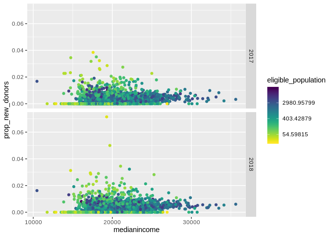
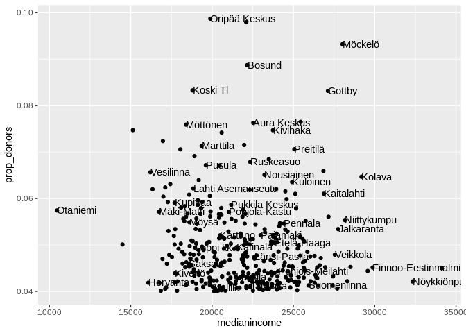
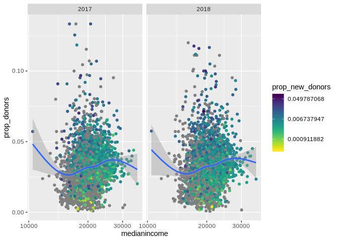

Visualisation
================

``` r
load("/home/ilpo/Paavo/data/preprocessed.2019-07-24.RData")
```

``` r
knitr::opts_chunk$set(echo = TRUE)
```

``` r
setwd(dir="/home/ilpo/Paavo/src")
getwd()
```

    ## [1] "/home/ilpo/Paavo/src"

## R Markdown

This is an R Markdown document. Markdown is a simple formatting syntax
for authoring HTML, PDF, and MS Word documents. For more details on
using R Markdown see <http://rmarkdown.rstudio.com>.

When you click the **Knit** button a document will be generated that
includes both content as well as the output of any embedded R code
chunks within the document. You can embed an R code chunk like
    this:

``` r
library(tidyverse)
```

    ## ── Attaching packages ────────────────────────────────────────────────────────────────────────────────────────────────────────────────────────────── tidyverse 1.2.1 ──

    ## ✔ ggplot2 3.2.0          ✔ purrr   0.3.2     
    ## ✔ tibble  2.1.3          ✔ dplyr   0.8.2     
    ## ✔ tidyr   0.8.3.9000     ✔ stringr 1.4.0     
    ## ✔ readr   1.3.1          ✔ forcats 0.4.0

    ## ── Conflicts ───────────────────────────────────────────────────────────────────────────────────────────────────────────────────────────────── tidyverse_conflicts() ──
    ## ✖ dplyr::filter() masks stats::filter()
    ## ✖ dplyr::lag()    masks stats::lag()

``` r
library(lubridate)
```

    ## 
    ## Attaching package: 'lubridate'

    ## The following object is masked from 'package:base':
    ## 
    ##     date

``` r
library(viridis)
```

    ## Loading required package: viridisLite

\#Relationship between proportion of donors and median income.

``` r
df <- as.tbl(preprosessed_paavo) %>% filter(!is.na(prop_donors))
p <- ggplot(data=df)
p <- p +  geom_point(mapping=aes(y = prop_donors, x = medianincome, colour=eligible_population))
p <- p +   scale_x_log10()+
  geom_smooth(aes(y = prop_donors, x = medianincome)) +
 scale_color_viridis(discrete=FALSE,direction = -1,trans="log")+
labs(x = "Median income",
        y = "Proportion of donors",
        title = "Proportion of donors per median income of postal codes per year")+
facet_grid(Year ~.)
p
```

    ## `geom_smooth()` using method = 'gam' and formula 'y ~ s(x, bs = "cs")'

    ## Warning: Removed 6 rows containing non-finite values (stat_smooth).

    ## Warning: Removed 6 rows containing missing values (geom_point).

<!-- --> Size
matters. Population and outliers needs to be controlled before any
modeling.

## New donors and per median income

``` r
df <- as.tbl(preprosessed_paavo) %>% filter(!is.na(prop_new_donors))
p <- ggplot(data=df)
p <- p +  geom_point(mapping=aes(y = prop_new_donors, x = medianincome, colour=eligible_population))
p <- p +   scale_x_log10()+
  geom_smooth(aes(y = prop_donors, x = medianincome)) +
 scale_color_viridis(discrete=FALSE,direction = -1,trans="log")+
labs(x = "Median income",
        y = "Proportion of new donors",
        title = "Proportion of new donors per median income of postal codes per year")+
facet_grid(Year ~.)
p
```

    ## `geom_smooth()` using method = 'gam' and formula 'y ~ s(x, bs = "cs")'

    ## Warning: Removed 6 rows containing non-finite values (stat_smooth).

    ## Warning: Removed 6 rows containing missing values (geom_point).

<!-- --> New
donors looks really weird. It could be by low numbers of first time
donors in many postal code areas. Maybe need to be modelled on their own
or at least filtered.

\#\#repeated donors

``` r
df <- as.tbl(preprosessed_paavo) %>% filter(!is.na(prop_new_donors))
p <- ggplot(data=df)
p <- p +  geom_point(mapping=aes(y = prop_new_donors, x = medianincome, colour=eligible_population))+
  scale_color_viridis(discrete=FALSE,direction = -1,trans="log")+
  facet_grid(Year~.)
p
```

    ## Warning: Removed 6 rows containing missing values (geom_point).

<!-- -->

``` r
df <- as.tbl(preprosessed_paavo) %>% filter(!is.na(prop_donors))
p <- ggplot(data=df)
p <- p +  geom_point(mapping=aes(y = prop_repeat_donors, x = medianincome, colour=eligible_population))+
  scale_color_viridis(discrete=FALSE,direction = -1,trans="log")+
geom_smooth(aes(y = prop_repeat_donors, x = medianincome)) + 
facet_grid (Year~.)
p
```

    ## `geom_smooth()` using method = 'gam' and formula 'y ~ s(x, bs = "cs")'

    ## Warning: Removed 6 rows containing non-finite values (stat_smooth).

    ## Warning: Removed 6 rows containing missing values (geom_point).

<!-- -->

``` r
df <- as.tbl(preprosessed_paavo) %>% filter(!is.na(prop_repeat_donors))
p <- ggplot(data=df)
p <- p +  geom_point(mapping=aes(y = prop_repeat_donors, x = medianincome, colour=eligible_population))
p <- p +   scale_x_log10()+
  geom_smooth(aes(y = prop_donors, x = medianincome)) +
 scale_color_viridis(discrete=FALSE,direction = -1,trans="log")+
labs(x = "Median income",
        y = "Proportion of repeat donors",
        title = "Proportion of repeat donors per median income of postal codes per year")+
facet_grid(Year ~.)
p
```

    ## `geom_smooth()` using method = 'gam' and formula 'y ~ s(x, bs = "cs")'

    ## Warning: Removed 6 rows containing non-finite values (stat_smooth).

    ## Warning: Removed 6 rows containing missing values (geom_point).

<!-- --> Repeat
donors also have high amount of outliers, where there are no postal
codes with donors.

# Relationship between higher education and proportion of donors

``` r
p <- ggplot(data=df)
p <- p +  geom_point(mapping=aes(y = prop_donors, x = proportion_inhabitants_with_higher_education, colour=eligible_population))
p <- p +   scale_x_log10() + geom_smooth(aes(y = prop_donors, x = proportion_inhabitants_with_higher_education)) +
scale_color_viridis(discrete=FALSE,direction = -1,trans="log") + 
  facet_grid(Year~.)
p
```

    ## Warning: Transformation introduced infinite values in continuous x-axis
    
    ## Warning: Transformation introduced infinite values in continuous x-axis

    ## `geom_smooth()` using method = 'gam' and formula 'y ~ s(x, bs = "cs")'

    ## Warning: Removed 15 rows containing non-finite values (stat_smooth).

    ## Warning: Removed 6 rows containing missing values (geom_point).

<!-- -->

\#\#First time donors

``` r
p <- ggplot(data=df)
p <- p +  geom_point(mapping=aes(y = prop_new_donors, x = proportion_inhabitants_with_higher_education, colour=eligible_population))
p <- p +   scale_x_log10() + geom_smooth(aes(y = prop_new_donors, x = proportion_inhabitants_with_higher_education)) +
scale_color_viridis(discrete=FALSE,direction = -1,trans="log") +
  facet_grid(Year~.)
p
```

    ## Warning: Transformation introduced infinite values in continuous x-axis
    
    ## Warning: Transformation introduced infinite values in continuous x-axis

    ## `geom_smooth()` using method = 'gam' and formula 'y ~ s(x, bs = "cs")'

    ## Warning: Removed 15 rows containing non-finite values (stat_smooth).

    ## Warning: Removed 6 rows containing missing values (geom_point).

<!-- -->

## repeated donors

``` r
p <- ggplot(data=df)
p <- p +  geom_point(mapping=aes(y = prop_repeat_donors, x = proportion_inhabitants_with_higher_education, colour=eligible_population))
p <- p +   scale_x_log10() + 
geom_smooth(aes(y = prop_repeat_donors, x = proportion_inhabitants_with_higher_education)) +
scale_color_viridis(discrete=FALSE,direction = -1,trans="log") +
  facet_grid(Year~.)
p
```

    ## Warning: Transformation introduced infinite values in continuous x-axis
    
    ## Warning: Transformation introduced infinite values in continuous x-axis

    ## `geom_smooth()` using method = 'gam' and formula 'y ~ s(x, bs = "cs")'

    ## Warning: Removed 15 rows containing non-finite values (stat_smooth).

    ## Warning: Removed 6 rows containing missing values (geom_point).

<!-- -->

``` r
mörkö <- preprosessed_paavo %>% 
filter(prop_donors > 0.04) %>% 
filter(Year == 2018) %>% 
filter(eligible_population > 400)
ggplot(data=mörkö, mapping= aes(x= medianincome, y= prop_donors )) +
geom_point() +
geom_text(data = mörkö,check_overlap =TRUE,show.legend = TRUE,hjust = 0,
mapping = aes(label = nimi)) 
```

<!-- --> \#\#
First attempt to visualise areas with population size and proportion of
donors. It has raised a question that Finnish-Swedish population could
have higher proportion of blood doning. Needs further
investigating.

``` r
ggplot(data=preprosessed_paavo, mapping= aes(x= medianincome, y= prop_donors,  color=prop_repeat_donors))+
geom_point ()+ 
scale_x_log10() +
geom_smooth()+
scale_color_viridis(discrete=FALSE,direction = -1,trans="log") +
facet_wrap (Year~.)
```

    ## Warning: Transformation introduced infinite values in discrete y-axis
    
    ## Warning: Transformation introduced infinite values in discrete y-axis

    ## `geom_smooth()` using method = 'gam' and formula 'y ~ s(x, bs = "cs")'

    ## Warning: Removed 6 rows containing non-finite values (stat_smooth).

    ## Warning: Removed 6 rows containing missing values (geom_point).

<!-- -->

``` r
ggplot(data=preprosessed_paavo, mapping= aes(x= medianincome, y= prop_donors,  color=prop_new_donors))+
geom_point ()+ 
scale_x_log10() +
geom_smooth()+
scale_color_viridis(discrete=FALSE,direction = -1,trans="log") +
facet_wrap (Year~.)
```

    ## Warning: Transformation introduced infinite values in discrete y-axis
    
    ## Warning: Transformation introduced infinite values in discrete y-axis

    ## `geom_smooth()` using method = 'gam' and formula 'y ~ s(x, bs = "cs")'

    ## Warning: Removed 6 rows containing non-finite values (stat_smooth).

    ## Warning: Removed 6 rows containing missing values (geom_point).

<!-- -->
