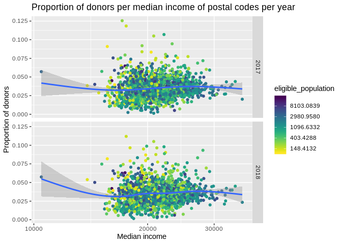
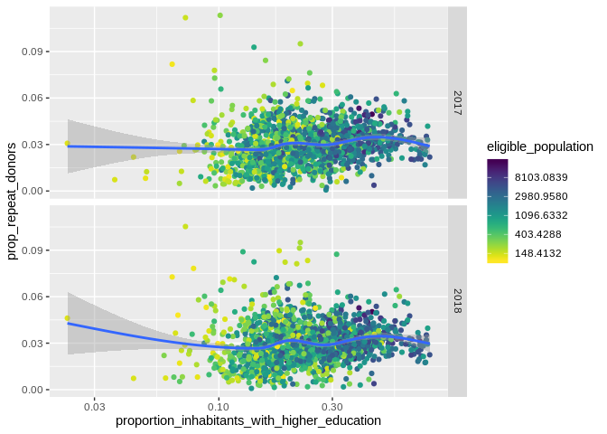

Filtered visualisation
================

``` r
library(tidyverse)
```

    ## ── Attaching packages ────────────────────────────────────────────────────────────────────────────────────────────────────────────────────────────── tidyverse 1.2.1 ──

    ## ✔ ggplot2 3.2.0          ✔ purrr   0.3.2     
    ## ✔ tibble  2.1.3          ✔ dplyr   0.8.2     
    ## ✔ tidyr   0.8.3.9000     ✔ stringr 1.4.0     
    ## ✔ readr   1.3.1          ✔ forcats 0.4.0

    ## ── Conflicts ───────────────────────────────────────────────────────────────────────────────────────────────────────────────────────────────── tidyverse_conflicts() ──
    ## ✖ dplyr::filter() masks stats::filter()
    ## ✖ dplyr::lag()    masks stats::lag()

``` r
library(lubridate)
```

    ## 
    ## Attaching package: 'lubridate'

    ## The following object is masked from 'package:base':
    ## 
    ##     date

``` r
library(viridis)
```

    ## Loading required package: viridisLite

## Including Plots

``` r
filtered_paavo <- preprosessed_paavo %>% 
filter(eligible_population > 99) %>%
filter(prop_new_donors > 0.0001) %>% 
filter(prop_repeat_donors > 0.00) 
```

Zipcodes are mostly from lapland with few exceptions (Meilahti
Sairaala-alue). Im losing 765 observations by filtering the suitable
population, but nb donation per zip is at is peak 19 in this
subset.

``` r
ggplot(data= filtered_paavo,mapping= aes(x= medianincome, y= prop_donors))+
geom_point(mapping=aes(y = prop_donors, x = medianincome, colour=eligible_population))+ 
  scale_x_log10()+
  geom_smooth(aes(y = prop_donors, x = medianincome)) +
 scale_color_viridis(discrete=FALSE,direction = -1,trans="log")+
labs(x = "Median income",
        y = "Proportion of donors",
        title = "Proportion of donors per median income of postal codes per year")+
facet_grid(Year ~.)
```

    ## `geom_smooth()` using method = 'gam' and formula 'y ~ s(x, bs = "cs")'

    ## Warning: Removed 1 rows containing non-finite values (stat_smooth).

    ## Warning: Removed 1 rows containing missing values (geom_point).

<!-- -->

``` r
filtered_paavo %>% 
filter(prop_repeat_donors > 0.00) %>%
  filter(!is.na(prop_repeat_donors)) %>% 
ggplot(data=filtered_paavo, mapping = aes(x= medianincome, y= prop_repeat_donors, colour= eligible_population)) +
geom_point(mapping=aes(y = prop_repeat_donors, x = medianincome, colour=eligible_population))+
scale_x_log10()+
  geom_smooth(aes(y = prop_repeat_donors, x = medianincome)) +
 scale_color_viridis(discrete=FALSE,direction = -1,trans="log")+
labs(x = "Median income",
        y = "Proportion of repeat donors",
        title = "Proportion of repeat donors per median income of postal codes per year") +
facet_grid(Year ~.)
```

    ## `geom_smooth()` using method = 'gam' and formula 'y ~ s(x, bs = "cs")'

    ## Warning: Removed 1 rows containing non-finite values (stat_smooth).

    ## Warning: Removed 1 rows containing missing values (geom_point).

<!-- -->

``` r
ggplot(data= filtered_paavo, mapping=aes(y = prop_new_donors, x = proportion_inhabitants_with_higher_education, colour=eligible_population))+
geom_point(mapping=aes(y = prop_new_donors, x = proportion_inhabitants_with_higher_education, colour=eligible_population))+
  scale_x_log10() + 
geom_smooth(aes(y = prop_new_donors, x = proportion_inhabitants_with_higher_education)) +
scale_color_viridis(discrete=FALSE,direction = -1,trans="log") +
  facet_grid(Year~.)
```

    ## `geom_smooth()` using method = 'gam' and formula 'y ~ s(x, bs = "cs")'

<!-- -->

``` r
ggplot(data= filtered_paavo, mapping=aes(y = prop_repeat_donors, x = proportion_inhabitants_with_higher_education, colour=eligible_population))+
geom_point(mapping=aes(y = prop_repeat_donors, x = proportion_inhabitants_with_higher_education, colour=eligible_population))+
  scale_x_log10() + 
geom_smooth(aes(y = prop_repeat_donors, x = proportion_inhabitants_with_higher_education)) +
scale_color_viridis(discrete=FALSE,direction = -1,trans="log") +
  facet_grid(Year~.)
```

    ## `geom_smooth()` using method = 'gam' and formula 'y ~ s(x, bs = "cs")'

<!-- -->

``` r
ggplot(data= filtered_paavo, mapping=aes(y = prop_donors, x = averageincome))+
geom_point(mapping=aes(y = prop_donors, x = medianincome, colour=eligible_population))+
  scale_x_log10() + 
geom_smooth(aes(y = prop_donors, x = averageincome)) +
scale_color_viridis(discrete=FALSE,direction = -1,trans="log") +
  facet_grid(Year~.)
```

    ## `geom_smooth()` using method = 'gam' and formula 'y ~ s(x, bs = "cs")'

    ## Warning: Removed 1 rows containing non-finite values (stat_smooth).

    ## Warning: Removed 1 rows containing missing values (geom_point).

<!-- -->
