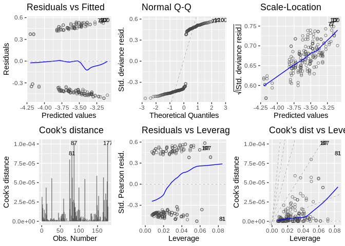
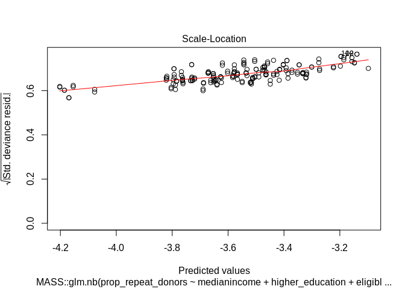

glm
================
Ilpo Arminen
8/21/2019

This code is based on
<https://github.com/FRCBS/iron_levels_of_blood_donors> script
<https://github.com/FRCBS/iron_levels_of_blood_donors/blob/master/src/index.Rmd>
by Muriel Lobier and published in
<https://journals.plos.org/plosone/article?id=10.1371/journal.pone.0220862>

``` r
knitr::opts_chunk$set(echo = TRUE)
library(tidyverse)
```

    ## ── Attaching packages ────────────────────────────────────────────────────────────────────────────────────────────────────────────────────────────────────────────────────────────────────────────────────────── tidyverse 1.2.1 ──

    ## ✔ ggplot2 3.2.0          ✔ purrr   0.3.2     
    ## ✔ tibble  2.1.3          ✔ dplyr   0.8.2     
    ## ✔ tidyr   0.8.3.9000     ✔ stringr 1.4.0     
    ## ✔ readr   1.3.1          ✔ forcats 0.4.0

    ## ── Conflicts ───────────────────────────────────────────────────────────────────────────────────────────────────────────────────────────────────────────────────────────────────────────────────────────── tidyverse_conflicts() ──
    ## ✖ dplyr::filter() masks stats::filter()
    ## ✖ dplyr::lag()    masks stats::lag()

``` r
library(lubridate)
```

    ## 
    ## Attaching package: 'lubridate'

    ## The following object is masked from 'package:base':
    ## 
    ##     date

``` r
library(viridis)
```

    ## Loading required package: viridisLite

``` r
library(stargazer)
```

    ## 
    ## Please cite as:

    ##  Hlavac, Marek (2018). stargazer: Well-Formatted Regression and Summary Statistics Tables.

    ##  R package version 5.2.2. https://CRAN.R-project.org/package=stargazer

``` r
library(ggfortify)
library(car)
```

    ## Loading required package: carData

    ## 
    ## Attaching package: 'car'

    ## The following object is masked from 'package:dplyr':
    ## 
    ##     recode

    ## The following object is masked from 'package:purrr':
    ## 
    ##     some

``` r
library(MASS)
```

    ## 
    ## Attaching package: 'MASS'

    ## The following object is masked from 'package:dplyr':
    ## 
    ##     select

``` r
library(relaimpo)
```

    ## Loading required package: boot

    ## 
    ## Attaching package: 'boot'

    ## The following object is masked from 'package:car':
    ## 
    ##     logit

    ## Loading required package: survey

    ## Loading required package: grid

    ## Loading required package: Matrix

    ## 
    ## Attaching package: 'Matrix'

    ## The following objects are masked from 'package:tidyr':
    ## 
    ##     expand, pack, unpack

    ## Loading required package: survival

    ## 
    ## Attaching package: 'survival'

    ## The following object is masked from 'package:boot':
    ## 
    ##     aml

    ## 
    ## Attaching package: 'survey'

    ## The following object is masked from 'package:graphics':
    ## 
    ##     dotchart

    ## Loading required package: mitools

    ## This is the global version of package relaimpo.

    ## If you are a non-US user, a version with the interesting additional metric pmvd is available

    ## from Ulrike Groempings web site at prof.beuth-hochschule.de/groemping.

``` r
library(broom)
```

``` r
load("/home/ilpo/Paavo/data/modified_data.RData")
```

standardization: \* All variables are centered only. They are not
standardized to increase interpretability of the coefficients. \* They
are not standardized also to highight that using std coeffs does not
enable comparison between groups as SDs of different groups are
different. Is this suitable for poisson/negative
binomial?

``` r
data <- modified_data %>% mutate(higher_education= scale(proportion_inhabitants_with_higher_education,scale=FALSE)[,1],
                eligible_population= scale(eligible_population,scale=FALSE)[,1],
                medianincome = scale(medianincome,scale=FALSE)[,1],
                minDistkm. = scale((minDistkm),scale=FALSE)[,1])
               # prop_donors= scale(prop_donors,scale=FALSE[1])) 
```

\# Making regression model for new donors and repeated donors separately
\# Poisson and negative binomial
regression

``` r
repeat_dn.poisson <- glm(prop_donors ~ medianincome + higher_education + eligible_population + minDistkm, data=modified_data,family=poisson)  #repeated donors
new_dn.poisson <- glm(prop_new_donors ~ medianincome + higher_education + eligible_population + minDistkm, data=data, family=poisson)#new donors
```

``` r
# Lets make binomial model for comparison 
repeat_dn.negabin <- MASS::glm.nb(prop_donors ~ medianincome + higher_education + eligible_population + minDistkm, data=data)
new_dn.negabin<-MASS::glm.nb(prop_new_donors ~ medianincome + higher_education + eligible_population + minDistkm, data=data)

#quasipoisson
repeat_dn.qpoisson <- glm(prop_donors ~ medianincome + higher_education + eligible_population + minDistkm, data=data,family=quasipoisson)  
new_dn.qpoisson <- glm(prop_new_donors ~ medianincome + higher_education + eligible_population + minDistkm, data=data, family=quasipoisson)
```

\#Repeat donor autoplots
\#Poisson

``` r
autoplot(repeat_dn.poisson,which = 1:6, ncol = 3, label.size = 3,shape = 1, alpha = 0.7) 
```

    ## Warning: Ignoring unknown parameters: shape

<!-- -->

\#negative
binomial

``` r
autoplot(repeat_dn.negabin,which = 1:6, ncol = 3, label.size = 3,shape = 1, alpha = 0.7) 
```

    ## Warning: Ignoring unknown parameters: shape

<!-- -->

\#quasi-poisson

``` r
autoplot(repeat_dn.qpoisson,which = 1:6, ncol = 3, label.size = 3,shape = 1, alpha = 0.7)
```

    ## Warning: Ignoring unknown parameters: shape

<!-- -->

\#The key criterion for using a Poisson model is after accounting for
the effect of predictors, the mean must equal the variance.

``` r
plot(repeat_dn.poisson, which = 3)
```

<!-- -->

``` r
plot(repeat_dn.negabin, which = 3)
```

<!-- -->

``` r
plot(repeat_dn.qpoisson, which = 3)
```

<!-- -->

\#regression tables

``` r
summary(repeat_dn.poisson)
```

    ## 
    ## Call:
    ## glm(formula = prop_donors ~ medianincome + higher_education + 
    ##     eligible_population + minDistkm, family = poisson, data = modified_data)
    ## 
    ## Deviance Residuals: 
    ##       Min         1Q     Median         3Q        Max  
    ## -0.081747  -0.027182  -0.003198   0.020426   0.097364  
    ## 
    ## Coefficients:
    ##                       Estimate Std. Error z value Pr(>|z|)
    ## (Intercept)         -1.959e+00  4.521e+00  -0.433    0.665
    ## medianincome        -4.498e-05  2.043e-04  -0.220    0.826
    ## higher_education     1.015e-04  7.510e-04   0.135    0.892
    ## eligible_population -9.382e-05  3.601e-04  -0.261    0.794
    ## minDistkm           -1.532e-02  8.358e-02  -0.183    0.855
    ## 
    ## (Dispersion parameter for poisson family taken to be 1)
    ## 
    ##     Null deviance: 0.54600  on 177  degrees of freedom
    ## Residual deviance: 0.23825  on 173  degrees of freedom
    ## AIC: Inf
    ## 
    ## Number of Fisher Scoring iterations: 6

``` r
summary(repeat_dn.negabin)
```

    ## 
    ## Call:
    ## MASS::glm.nb(formula = prop_donors ~ medianincome + higher_education + 
    ##     eligible_population + minDistkm, data = data, init.theta = 375879.3453, 
    ##     link = log)
    ## 
    ## Deviance Residuals: 
    ##     Min       1Q   Median       3Q      Max  
    ## -0.5369  -0.4492  -0.3854   0.4927   0.5973  
    ## 
    ## Coefficients:
    ##                       Estimate Std. Error z value Pr(>|z|)    
    ## (Intercept)         -3.265e+00  8.671e-01  -3.765 0.000167 ***
    ## medianincome        -3.519e-05  2.601e-04  -0.135 0.892371    
    ## higher_education     2.397e-01  5.569e+00   0.043 0.965671    
    ## eligible_population -5.290e-05  1.710e-04  -0.309 0.757077    
    ## minDistkm           -1.957e-02  9.061e-02  -0.216 0.829010    
    ## ---
    ## Signif. codes:  0 '***' 0.001 '**' 0.01 '*' 0.05 '.' 0.1 ' ' 1
    ## 
    ## (Dispersion parameter for Negative Binomial(375879.3) family taken to be 1)
    ## 
    ##     Null deviance: 40.081  on 177  degrees of freedom
    ## Residual deviance: 39.789  on 173  degrees of freedom
    ## AIC: 57.1
    ## 
    ## Number of Fisher Scoring iterations: 1
    ## 
    ## 
    ##               Theta:  375879 
    ##           Std. Err.:  51712825 
    ## Warning while fitting theta: iteration limit reached 
    ## 
    ##  2 x log-likelihood:  -45.1

``` r
summary(repeat_dn.qpoisson)
```

    ## 
    ## Call:
    ## glm(formula = prop_donors ~ medianincome + higher_education + 
    ##     eligible_population + minDistkm, family = quasipoisson, data = data)
    ## 
    ## Deviance Residuals: 
    ##       Min         1Q     Median         3Q        Max  
    ## -0.084674  -0.027922  -0.005555   0.023047   0.093409  
    ## 
    ## Coefficients:
    ##                       Estimate Std. Error t value Pr(>|t|)    
    ## (Intercept)         -3.265e+00  3.352e-02 -97.395  < 2e-16 ***
    ## medianincome        -3.519e-05  1.005e-05  -3.500 0.000591 ***
    ## higher_education     2.397e-01  2.153e-01   1.113 0.267097    
    ## eligible_population -5.290e-05  6.611e-06  -8.002 1.70e-13 ***
    ## minDistkm           -1.957e-02  3.503e-03  -5.587 8.83e-08 ***
    ## ---
    ## Signif. codes:  0 '***' 0.001 '**' 0.01 '*' 0.05 '.' 0.1 ' ' 1
    ## 
    ## (Dispersion parameter for quasipoisson family taken to be 0.001494294)
    ## 
    ##     Null deviance: 0.54600  on 177  degrees of freedom
    ## Residual deviance: 0.25459  on 173  degrees of freedom
    ## AIC: NA
    ## 
    ## Number of Fisher Scoring iterations: 6

\#New donors
autoplots

``` r
autoplot(new_dn.poisson,which = 1:6, ncol = 3, label.size = 3,shape = 1, alpha = 0.7)
```

    ## Warning: Ignoring unknown parameters: shape

<!-- -->

``` r
autoplot(new_dn.negabin,which = 1:6, ncol = 3, label.size = 3,shape = 1, alpha = 0.7)
```

    ## Warning: Ignoring unknown parameters: shape

<!-- -->

``` r
autoplot(new_dn.qpoisson,which = 1:6, ncol = 3, label.size = 3,shape = 1, alpha = 0.7)
```

    ## Warning: Ignoring unknown parameters: shape

<!-- -->

\#new donor regression tables

``` r
summary(new_dn.poisson)
```

    ## 
    ## Call:
    ## glm(formula = prop_new_donors ~ medianincome + higher_education + 
    ##     eligible_population + minDistkm, family = poisson, data = data)
    ## 
    ## Deviance Residuals: 
    ##       Min         1Q     Median         3Q        Max  
    ## -0.045714  -0.014057  -0.000179   0.009805   0.065185  
    ## 
    ## Coefficients:
    ##                       Estimate Std. Error z value Pr(>|z|)  
    ## (Intercept)         -5.304e+00  2.540e+00  -2.088   0.0368 *
    ## medianincome        -3.690e-05  7.548e-04  -0.049   0.9610  
    ## higher_education     4.710e-01  1.615e+01   0.029   0.9767  
    ## eligible_population -4.029e-05  4.929e-04  -0.082   0.9348  
    ## minDistkm           -3.016e-02  2.739e-01  -0.110   0.9123  
    ## ---
    ## Signif. codes:  0 '***' 0.001 '**' 0.01 '*' 0.05 '.' 0.1 ' ' 1
    ## 
    ## (Dispersion parameter for poisson family taken to be 1)
    ## 
    ##     Null deviance: 0.118964  on 177  degrees of freedom
    ## Residual deviance: 0.070255  on 173  degrees of freedom
    ## AIC: Inf
    ## 
    ## Number of Fisher Scoring iterations: 8

``` r
summary(new_dn.negabin)
```

    ## 
    ## Call:
    ## MASS::glm.nb(formula = prop_new_donors ~ medianincome + higher_education + 
    ##     eligible_population + minDistkm, data = data, init.theta = 146724.4497, 
    ##     link = log)
    ## 
    ## Deviance Residuals: 
    ##     Min       1Q   Median       3Q      Max  
    ## -0.2370  -0.1867  -0.1288   0.2273   0.3164  
    ## 
    ## Coefficients:
    ##                       Estimate Std. Error z value Pr(>|z|)  
    ## (Intercept)         -5.304e+00  2.540e+00  -2.088   0.0368 *
    ## medianincome        -3.690e-05  7.548e-04  -0.049   0.9610  
    ## higher_education     4.710e-01  1.615e+01   0.029   0.9767  
    ## eligible_population -4.029e-05  4.929e-04  -0.082   0.9348  
    ## minDistkm           -3.016e-02  2.739e-01  -0.110   0.9123  
    ## ---
    ## Signif. codes:  0 '***' 0.001 '**' 0.01 '*' 0.05 '.' 0.1 ' ' 1
    ## 
    ## (Dispersion parameter for Negative Binomial(146724.4) family taken to be 1)
    ## 
    ##     Null deviance: 7.7927  on 177  degrees of freedom
    ## Residual deviance: 7.7440  on 173  degrees of freedom
    ## AIC: 20.345
    ## 
    ## Number of Fisher Scoring iterations: 1
    ## 
    ## 
    ##               Theta:  146724 
    ##           Std. Err.:  36419777 
    ## Warning while fitting theta: iteration limit reached 
    ## 
    ##  2 x log-likelihood:  -8.345

``` r
summary(new_dn.qpoisson)
```

    ## 
    ## Call:
    ## glm(formula = prop_new_donors ~ medianincome + higher_education + 
    ##     eligible_population + minDistkm, family = quasipoisson, data = data)
    ## 
    ## Deviance Residuals: 
    ##       Min         1Q     Median         3Q        Max  
    ## -0.045714  -0.014057  -0.000179   0.009805   0.065185  
    ## 
    ## Coefficients:
    ##                       Estimate Std. Error  t value Pr(>|t|)    
    ## (Intercept)         -5.304e+00  5.187e-02 -102.261  < 2e-16 ***
    ## medianincome        -3.690e-05  1.541e-05   -2.394   0.0177 *  
    ## higher_education     4.710e-01  3.297e-01    1.429   0.1549    
    ## eligible_population -4.029e-05  1.007e-05   -4.003 9.26e-05 ***
    ## minDistkm           -3.016e-02  5.593e-03   -5.392 2.26e-07 ***
    ## ---
    ## Signif. codes:  0 '***' 0.001 '**' 0.01 '*' 0.05 '.' 0.1 ' ' 1
    ## 
    ## (Dispersion parameter for quasipoisson family taken to be 0.0004170568)
    ## 
    ##     Null deviance: 0.118964  on 177  degrees of freedom
    ## Residual deviance: 0.070255  on 173  degrees of freedom
    ## AIC: NA
    ## 
    ## Number of Fisher Scoring iterations: 8
