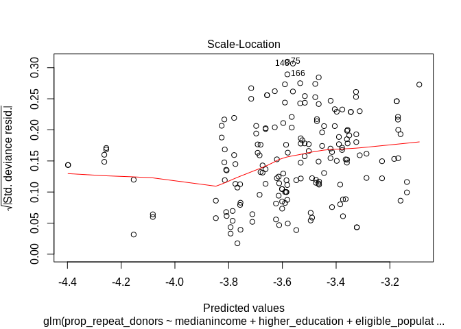

glm
================
Ilpo Arminen
8/21/2019

This code is based on
<https://github.com/FRCBS/iron_levels_of_blood_donors> script
<https://github.com/FRCBS/iron_levels_of_blood_donors/blob/master/src/index.Rmd>
by Muriel Lobier and published in
<https://journals.plos.org/plosone/article?id=10.1371/journal.pone.0220862>

``` r
knitr::opts_chunk$set(echo = TRUE)
library(tidyverse)
```

    ## ── Attaching packages ───────────────────────────────────────────────────────────────────────────────────────────────────────────── tidyverse 1.2.1 ──

    ## ✔ ggplot2 3.2.0          ✔ purrr   0.3.2     
    ## ✔ tibble  2.1.3          ✔ dplyr   0.8.2     
    ## ✔ tidyr   0.8.3.9000     ✔ stringr 1.4.0     
    ## ✔ readr   1.3.1          ✔ forcats 0.4.0

    ## ── Conflicts ──────────────────────────────────────────────────────────────────────────────────────────────────────────────── tidyverse_conflicts() ──
    ## ✖ dplyr::filter() masks stats::filter()
    ## ✖ dplyr::lag()    masks stats::lag()

``` r
library(lubridate)
```

    ## 
    ## Attaching package: 'lubridate'

    ## The following object is masked from 'package:base':
    ## 
    ##     date

``` r
library(viridis)
```

    ## Loading required package: viridisLite

``` r
library(stargazer)
```

    ## 
    ## Please cite as:

    ##  Hlavac, Marek (2018). stargazer: Well-Formatted Regression and Summary Statistics Tables.

    ##  R package version 5.2.2. https://CRAN.R-project.org/package=stargazer

``` r
library(ggfortify)
library(car)
```

    ## Loading required package: carData

    ## 
    ## Attaching package: 'car'

    ## The following object is masked from 'package:dplyr':
    ## 
    ##     recode

    ## The following object is masked from 'package:purrr':
    ## 
    ##     some

``` r
library(MASS)
```

    ## 
    ## Attaching package: 'MASS'

    ## The following object is masked from 'package:dplyr':
    ## 
    ##     select

``` r
library(relaimpo)
```

    ## Loading required package: boot

    ## 
    ## Attaching package: 'boot'

    ## The following object is masked from 'package:car':
    ## 
    ##     logit

    ## Loading required package: survey

    ## Loading required package: grid

    ## Loading required package: Matrix

    ## 
    ## Attaching package: 'Matrix'

    ## The following objects are masked from 'package:tidyr':
    ## 
    ##     expand, pack, unpack

    ## Loading required package: survival

    ## 
    ## Attaching package: 'survival'

    ## The following object is masked from 'package:boot':
    ## 
    ##     aml

    ## 
    ## Attaching package: 'survey'

    ## The following object is masked from 'package:graphics':
    ## 
    ##     dotchart

    ## Loading required package: mitools

    ## This is the global version of package relaimpo.

    ## If you are a non-US user, a version with the interesting additional metric pmvd is available

    ## from Ulrike Groempings web site at prof.beuth-hochschule.de/groemping.

``` r
library(broom)
library(AER)
```

    ## Loading required package: lmtest

    ## Loading required package: zoo

    ## 
    ## Attaching package: 'zoo'

    ## The following objects are masked from 'package:base':
    ## 
    ##     as.Date, as.Date.numeric

    ## Loading required package: sandwich

``` r
library(robustbase)
```

    ## 
    ## Attaching package: 'robustbase'

    ## The following object is masked from 'package:survival':
    ## 
    ##     heart

    ## The following object is masked from 'package:boot':
    ## 
    ##     salinity

``` r
library(modelr)
```

    ## 
    ## Attaching package: 'modelr'

    ## The following object is masked from 'package:broom':
    ## 
    ##     bootstrap

``` r
library(caret)
```

    ## Loading required package: lattice

    ## 
    ## Attaching package: 'lattice'

    ## The following object is masked from 'package:boot':
    ## 
    ##     melanoma

    ## 
    ## Attaching package: 'caret'

    ## The following object is masked from 'package:survival':
    ## 
    ##     cluster

    ## The following object is masked from 'package:purrr':
    ## 
    ##     lift

``` r
load("/home/ilpo/Paavo/data/modified_data.RData")
```

``` r
 sum(modified_data$nb_fixed_donations_per_zip)
```

    ## [1] 54256

``` r
sum(modified_data$nb_fixed_donors_per_zip)
```

    ## [1] 32096

standardization: \* All variables are centered only. They are not
standardized to increase interpretability of the coefficients. \* They
are not standardized also to highight that using std coeffs does not
enable comparison between groups as SDs of different groups are
different.

``` r
data <- modified_data %>% mutate(higher_education= scale(proportion_inhabitants_with_higher_education,scale=FALSE)[,1],
                eligible_population= scale(eligible_population,scale=FALSE)[,1],
                medianincome = scale(medianincome,scale=FALSE)[,1],
                minDistkm. = scale((minDistkm),scale=FALSE)[,1])
```

\# Making regression model for new donors and repeated donors separately
\# Poisson and negative binomial
regression

``` r
repeat_dn.poisson <- glm(prop_repeat_donors ~ medianincome + higher_education + eligible_population + minDistkm, data=modified_data,family=poisson)  #repeated donors
new_dn.poisson <- glm(prop_new_donors ~ medianincome + higher_education + eligible_population + minDistkm, data=data, family=poisson)#new donors
```

``` r
# Lets make binomial model for comparison 
#repeat_dn.negabin <- MASS::glm.nb(prop_repea_tdonors ~ medianincome + higher_education + eligible_population + minDistkm, data=data)
#new_dn.negabin<-MASS::glm.nb(prop_new_donors ~ medianincome + higher_education + eligible_population + minDistkm, data=data)

#quasipoisson
repeat_dn.qpoisson <- glm(prop_repeat_donors ~ medianincome + higher_education + eligible_population + minDistkm, data=data,family=quasipoisson)  
new_dn.qpoisson <- glm(prop_new_donors ~ medianincome + higher_education + eligible_population + minDistkm, data=data, family=quasipoisson)
```

\#Repeat donor autoplots
\#Poisson

``` r
autoplot(repeat_dn.poisson,which = 1:6, ncol = 3, label.size = 3,shape = 1, alpha = 0.7) 
```

    ## Warning: Ignoring unknown parameters: shape

<!-- -->

\#negative
binomial

``` r
#autoplot(repeat_dn.negabin,which = 1:6, ncol = 3, label.size = 3,shape = 1, alpha = 0.7) 
```

\#quasi-poisson

``` r
autoplot(repeat_dn.qpoisson,which = 1:6, ncol = 3, label.size = 3,shape = 1, alpha = 0.7)
```

    ## Warning: Ignoring unknown parameters: shape

<!-- -->

``` r
plot(repeat_dn.poisson, which = 3)
```

<!-- -->

``` r
#plot(repeat_dn.negabin, which = 3)
```

``` r
plot(repeat_dn.qpoisson, which = 3)
```

<!-- -->

\#regression tables

``` r
summary(repeat_dn.poisson)
```

    ## 
    ## Call:
    ## glm(formula = prop_repeat_donors ~ medianincome + higher_education + 
    ##     eligible_population + minDistkm, family = poisson, data = modified_data)
    ## 
    ## Deviance Residuals: 
    ##       Min         1Q     Median         3Q        Max  
    ## -0.079841  -0.024996  -0.002782   0.019204   0.093097  
    ## 
    ## Coefficients:
    ##                       Estimate Std. Error z value Pr(>|z|)
    ## (Intercept)         -2.073e+00  4.817e+00  -0.430    0.667
    ## medianincome        -4.567e-05  2.179e-04  -0.210    0.834
    ## higher_education     9.999e-05  8.013e-04   0.125    0.901
    ## eligible_population -9.495e-05  3.830e-04  -0.248    0.804
    ## minDistkm           -1.375e-02  8.852e-02  -0.155    0.877
    ## 
    ## (Dispersion parameter for poisson family taken to be 1)
    ## 
    ##     Null deviance: 0.48341  on 177  degrees of freedom
    ## Residual deviance: 0.22038  on 173  degrees of freedom
    ## AIC: Inf
    ## 
    ## Number of Fisher Scoring iterations: 6

``` r
#summary(repeat_dn.negabin)
```

``` r
summary(repeat_dn.qpoisson)
```

    ## 
    ## Call:
    ## glm(formula = prop_repeat_donors ~ medianincome + higher_education + 
    ##     eligible_population + minDistkm, family = quasipoisson, data = data)
    ## 
    ## Deviance Residuals: 
    ##       Min         1Q     Median         3Q        Max  
    ## -0.082423  -0.025651  -0.003497   0.020694   0.089525  
    ## 
    ## Coefficients:
    ##                       Estimate Std. Error t value Pr(>|t|)    
    ## (Intercept)         -3.403e+00  3.420e-02 -99.518  < 2e-16 ***
    ## medianincome        -3.484e-05  1.027e-05  -3.393 0.000857 ***
    ## higher_education     2.048e-01  2.200e-01   0.931 0.353186    
    ## eligible_population -5.459e-05  6.759e-06  -8.077 1.09e-13 ***
    ## minDistkm           -1.824e-02  3.559e-03  -5.125 7.90e-07 ***
    ## ---
    ## Signif. codes:  0 '***' 0.001 '**' 0.01 '*' 0.05 '.' 0.1 ' ' 1
    ## 
    ## (Dispersion parameter for quasipoisson family taken to be 0.00137378)
    ## 
    ##     Null deviance: 0.48341  on 177  degrees of freedom
    ## Residual deviance: 0.23469  on 173  degrees of freedom
    ## AIC: NA
    ## 
    ## Number of Fisher Scoring iterations: 6

\#New donors
autoplots

``` r
autoplot(new_dn.poisson,which = 1:6, ncol = 3, label.size = 3,shape = 1, alpha = 0.7)
```

    ## Warning: Ignoring unknown parameters: shape

<!-- -->

``` r
#autoplot(new_dn.negabin,which = 1:6, ncol = 3, label.size = 3,shape = 1, alpha = 0.7)
```

``` r
autoplot(new_dn.qpoisson,which = 1:6, ncol = 3, label.size = 3,shape = 1, alpha = 0.7)
```

    ## Warning: Ignoring unknown parameters: shape

<!-- -->

\#new donor regression tables

``` r
summary(new_dn.poisson)
```

    ## 
    ## Call:
    ## glm(formula = prop_new_donors ~ medianincome + higher_education + 
    ##     eligible_population + minDistkm, family = poisson, data = data)
    ## 
    ## Deviance Residuals: 
    ##       Min         1Q     Median         3Q        Max  
    ## -0.045714  -0.014057  -0.000179   0.009805   0.065185  
    ## 
    ## Coefficients:
    ##                       Estimate Std. Error z value Pr(>|z|)  
    ## (Intercept)         -5.304e+00  2.540e+00  -2.088   0.0368 *
    ## medianincome        -3.690e-05  7.548e-04  -0.049   0.9610  
    ## higher_education     4.710e-01  1.615e+01   0.029   0.9767  
    ## eligible_population -4.029e-05  4.929e-04  -0.082   0.9348  
    ## minDistkm           -3.016e-02  2.739e-01  -0.110   0.9123  
    ## ---
    ## Signif. codes:  0 '***' 0.001 '**' 0.01 '*' 0.05 '.' 0.1 ' ' 1
    ## 
    ## (Dispersion parameter for poisson family taken to be 1)
    ## 
    ##     Null deviance: 0.118964  on 177  degrees of freedom
    ## Residual deviance: 0.070255  on 173  degrees of freedom
    ## AIC: Inf
    ## 
    ## Number of Fisher Scoring iterations: 8

``` r
#summary(new_dn.negabin)
```

``` r
summary(new_dn.qpoisson)
```

    ## 
    ## Call:
    ## glm(formula = prop_new_donors ~ medianincome + higher_education + 
    ##     eligible_population + minDistkm, family = quasipoisson, data = data)
    ## 
    ## Deviance Residuals: 
    ##       Min         1Q     Median         3Q        Max  
    ## -0.045714  -0.014057  -0.000179   0.009805   0.065185  
    ## 
    ## Coefficients:
    ##                       Estimate Std. Error  t value Pr(>|t|)    
    ## (Intercept)         -5.304e+00  5.187e-02 -102.261  < 2e-16 ***
    ## medianincome        -3.690e-05  1.541e-05   -2.394   0.0177 *  
    ## higher_education     4.710e-01  3.297e-01    1.429   0.1549    
    ## eligible_population -4.029e-05  1.007e-05   -4.003 9.26e-05 ***
    ## minDistkm           -3.016e-02  5.593e-03   -5.392 2.26e-07 ***
    ## ---
    ## Signif. codes:  0 '***' 0.001 '**' 0.01 '*' 0.05 '.' 0.1 ' ' 1
    ## 
    ## (Dispersion parameter for quasipoisson family taken to be 0.0004170568)
    ## 
    ##     Null deviance: 0.118964  on 177  degrees of freedom
    ## Residual deviance: 0.070255  on 173  degrees of freedom
    ## AIC: NA
    ## 
    ## Number of Fisher Scoring iterations: 8

\#Stargazer for regression tables

``` r
# filtered the negative binomial out for not suitable for data 
stargazer(repeat_dn.poisson,repeat_dn.qpoisson,new_dn.poisson,new_dn.qpoisson,intercept.bottom = FALSE,
          type = "html",
single.row = TRUE,
          ci = TRUE,
          omit = "Constant",
          header = FALSE,
          covariate.labels = c(),
         column.labels = c("Repeat donors","First time donors","Repeat donors","First time donors"),
          #dep.var.caption   = "", 
          dep.var.labels.include = FALSE,
          # column.labels = c("
          star.cutoffs = c(0.05, 0.01, 0.001) ,
         out="regression.table.htm")
```

    ## 
    ## <table style="text-align:center"><tr><td colspan="5" style="border-bottom: 1px solid black"></td></tr><tr><td style="text-align:left"></td><td colspan="4"><em>Dependent variable:</em></td></tr>
    ## <tr><td></td><td colspan="4" style="border-bottom: 1px solid black"></td></tr>
    ## <tr><td style="text-align:left"></td><td><em>Poisson</em></td><td><em>glm: quasipoisson</em></td><td><em>Poisson</em></td><td><em>glm: quasipoisson</em></td></tr>
    ## <tr><td style="text-align:left"></td><td><em></em></td><td><em>link = log</em></td><td><em></em></td><td><em>link = log</em></td></tr>
    ## <tr><td style="text-align:left"></td><td>Repeat donors</td><td>First time donors</td><td>Repeat donors</td><td>First time donors</td></tr>
    ## <tr><td style="text-align:left"></td><td>(1)</td><td>(2)</td><td>(3)</td><td>(4)</td></tr>
    ## <tr><td colspan="5" style="border-bottom: 1px solid black"></td></tr><tr><td style="text-align:left">medianincome</td><td>-0.00005 (-0.0005, 0.0004)</td><td>-0.00003<sup>***</sup> (-0.0001, -0.00001)</td><td>-0.00004 (-0.002, 0.001)</td><td>-0.00004<sup>*</sup> (-0.0001, -0.00001)</td></tr>
    ## <tr><td style="text-align:left">higher_education</td><td>0.0001 (-0.001, 0.002)</td><td>0.205 (-0.226, 0.636)</td><td>0.471 (-31.175, 32.117)</td><td>0.471 (-0.175, 1.117)</td></tr>
    ## <tr><td style="text-align:left">eligible_population</td><td>-0.0001 (-0.001, 0.001)</td><td>-0.0001<sup>***</sup> (-0.0001, -0.00004)</td><td>-0.00004 (-0.001, 0.001)</td><td>-0.00004<sup>***</sup> (-0.0001, -0.00002)</td></tr>
    ## <tr><td style="text-align:left">minDistkm</td><td>-0.014 (-0.187, 0.160)</td><td>-0.018<sup>***</sup> (-0.025, -0.011)</td><td>-0.030 (-0.567, 0.507)</td><td>-0.030<sup>***</sup> (-0.041, -0.019)</td></tr>
    ## <tr><td colspan="5" style="border-bottom: 1px solid black"></td></tr><tr><td style="text-align:left">Observations</td><td>178</td><td>178</td><td>178</td><td>178</td></tr>
    ## <tr><td style="text-align:left">Log Likelihood</td><td>-Inf.000</td><td></td><td>-Inf.000</td><td></td></tr>
    ## <tr><td style="text-align:left">Akaike Inf. Crit.</td><td>Inf.000</td><td></td><td>Inf.000</td><td></td></tr>
    ## <tr><td colspan="5" style="border-bottom: 1px solid black"></td></tr><tr><td style="text-align:left"><em>Note:</em></td><td colspan="4" style="text-align:right"><sup>*</sup>p<0.05; <sup>**</sup>p<0.01; <sup>***</sup>p<0.001</td></tr>
    ## </table>

\#Scaling the
regressors

``` r
sc_data <- modified_data %>% mutate(higher_education= scale(proportion_inhabitants_with_higher_education,scale=TRUE)[,1],
                eligible_population= scale(eligible_population,scale=TRUE)[,1],
                medianincome = scale(medianincome,scale=TRUE)[,1],
                minDistkm. = scale((minDistkm),scale=TRUE)[,1])
```

``` r
repeat_donor_poisson <- glm(prop_repeat_donors ~ medianincome + higher_education + eligible_population + minDistkm, data=sc_data,family=poisson)  #repeated donors
new_donor_poisson <- glm(prop_new_donors ~ medianincome + higher_education + eligible_population + minDistkm, data=sc_data, family=poisson)#new donors

# Lets make binomial model for comparison 
#repeat_dn.negabin <- MASS::glm.nb(prop_repea_tdonors ~ medianincome + higher_education + eligible_population + minDistkm, data=data)
#new_dn.negabin<-MASS::glm.nb(prop_new_donors ~ medianincome + higher_education + eligible_population + minDistkm, data=data)

#quasipoisson
repeat_donor_qpoisson <- glm(prop_repeat_donors ~ medianincome + higher_education + eligible_population + minDistkm, data=sc_data,family=quasipoisson)  
new_donor_qpoisson <- glm(prop_new_donors ~ medianincome + higher_education + eligible_population + minDistkm, data=sc_data, family=quasipoisson)
```

\#scaling drops the standard error a lot

``` r
summary(repeat_donor_poisson)
```

    ## 
    ## Call:
    ## glm(formula = prop_repeat_donors ~ medianincome + higher_education + 
    ##     eligible_population + minDistkm, family = poisson, data = sc_data)
    ## 
    ## Deviance Residuals: 
    ##       Min         1Q     Median         3Q        Max  
    ## -0.082423  -0.025651  -0.003497   0.020694   0.089525  
    ## 
    ## Coefficients:
    ##                     Estimate Std. Error z value Pr(>|z|)    
    ## (Intercept)         -3.40306    0.92259  -3.689 0.000225 ***
    ## medianincome        -0.09478    0.75364  -0.126 0.899924    
    ## higher_education     0.03012    0.87304   0.035 0.972475    
    ## eligible_population -0.14995    0.50087  -0.299 0.764657    
    ## minDistkm           -0.01824    0.09602  -0.190 0.849350    
    ## ---
    ## Signif. codes:  0 '***' 0.001 '**' 0.01 '*' 0.05 '.' 0.1 ' ' 1
    ## 
    ## (Dispersion parameter for poisson family taken to be 1)
    ## 
    ##     Null deviance: 0.48341  on 177  degrees of freedom
    ## Residual deviance: 0.23469  on 173  degrees of freedom
    ## AIC: Inf
    ## 
    ## Number of Fisher Scoring iterations: 6

``` r
summary(repeat_donor_qpoisson)
```

    ## 
    ## Call:
    ## glm(formula = prop_repeat_donors ~ medianincome + higher_education + 
    ##     eligible_population + minDistkm, family = quasipoisson, data = sc_data)
    ## 
    ## Deviance Residuals: 
    ##       Min         1Q     Median         3Q        Max  
    ## -0.082423  -0.025651  -0.003497   0.020694   0.089525  
    ## 
    ## Coefficients:
    ##                      Estimate Std. Error t value Pr(>|t|)    
    ## (Intercept)         -3.403056   0.034195 -99.518  < 2e-16 ***
    ## medianincome        -0.094777   0.027934  -3.393 0.000857 ***
    ## higher_education     0.030124   0.032359   0.931 0.353186    
    ## eligible_population -0.149946   0.018565  -8.077 1.09e-13 ***
    ## minDistkm           -0.018238   0.003559  -5.125 7.90e-07 ***
    ## ---
    ## Signif. codes:  0 '***' 0.001 '**' 0.01 '*' 0.05 '.' 0.1 ' ' 1
    ## 
    ## (Dispersion parameter for quasipoisson family taken to be 0.00137378)
    ## 
    ##     Null deviance: 0.48341  on 177  degrees of freedom
    ## Residual deviance: 0.23469  on 173  degrees of freedom
    ## AIC: NA
    ## 
    ## Number of Fisher Scoring iterations: 6

``` r
summary(repeat_donor_qpoisson)
```

    ## 
    ## Call:
    ## glm(formula = prop_repeat_donors ~ medianincome + higher_education + 
    ##     eligible_population + minDistkm, family = quasipoisson, data = sc_data)
    ## 
    ## Deviance Residuals: 
    ##       Min         1Q     Median         3Q        Max  
    ## -0.082423  -0.025651  -0.003497   0.020694   0.089525  
    ## 
    ## Coefficients:
    ##                      Estimate Std. Error t value Pr(>|t|)    
    ## (Intercept)         -3.403056   0.034195 -99.518  < 2e-16 ***
    ## medianincome        -0.094777   0.027934  -3.393 0.000857 ***
    ## higher_education     0.030124   0.032359   0.931 0.353186    
    ## eligible_population -0.149946   0.018565  -8.077 1.09e-13 ***
    ## minDistkm           -0.018238   0.003559  -5.125 7.90e-07 ***
    ## ---
    ## Signif. codes:  0 '***' 0.001 '**' 0.01 '*' 0.05 '.' 0.1 ' ' 1
    ## 
    ## (Dispersion parameter for quasipoisson family taken to be 0.00137378)
    ## 
    ##     Null deviance: 0.48341  on 177  degrees of freedom
    ## Residual deviance: 0.23469  on 173  degrees of freedom
    ## AIC: NA
    ## 
    ## Number of Fisher Scoring iterations: 6

``` r
avPlots(repeat_donor_poisson)
```

<!-- -->

``` r
avPlots(repeat_donor_qpoisson)
```

<!-- -->

``` r
avPlots(new_donor_poisson)
```

<!-- -->

``` r
avPlots(new_donor_qpoisson)
```

<!-- -->

Overdispersion is a situation where the residual deviance of the glm is
large relative to the residual degrees of freedom. These values are
shown in the summary of the model. One guideline is that if the ratio of
the residual deviance to the residual degrees of freedom exceeds 1.5,
then the model is overdispersed. Overdispersion indicates that the model
doesn’t fit the data well: the explanatory variables may not well
describe the dependent variable or the model may not be specified
correctly for these data. If there is overdispersion, one potential
solution is to use the quasibinomial family option in
glm.

``` r
summary(repeat_donor_poisson$deviance/summary(repeat_donor_poisson$df.residual))
```

    ## Number of cases in table: 0.008139651 
    ## Number of factors: 0

``` r
mean(sc_data$prop_donors)
```

    ## [1] 0.03300626

``` r
var(sc_data$prop_donors)
```

    ## [1] 0.0001034144

This parameter tells us how many times larger the variance is than the
mean. Since our dispersion was less than one, it turns out the
conditional variance is actually smaller than the conditional mean. We
have under-dispersion, not over.

``` r
dispersiontest(repeat_dn.poisson)
```

    ## 
    ##  Overdispersion test
    ## 
    ## data:  repeat_dn.poisson
    ## z = -64.546, p-value = 1
    ## alternative hypothesis: true dispersion is greater than 1
    ## sample estimates:
    ##   dispersion 
    ## 0.0008635462

``` r
dispersiontest(repeat_donor_poisson)
```

    ## 
    ##  Overdispersion test
    ## 
    ## data:  repeat_donor_poisson
    ## z = -62.137, p-value = 1
    ## alternative hypothesis: true dispersion is greater than 1
    ## sample estimates:
    ##  dispersion 
    ## 0.001396481

``` r
dispersiontest(new_dn.poisson)
```

    ## 
    ##  Overdispersion test
    ## 
    ## data:  new_dn.poisson
    ## z = -39.702, p-value = 1
    ## alternative hypothesis: true dispersion is greater than 1
    ## sample estimates:
    ##    dispersion 
    ## -0.0007348255

``` r
dispersiontest(new_donor_poisson)
```

    ## 
    ##  Overdispersion test
    ## 
    ## data:  new_donor_poisson
    ## z = -39.702, p-value = 1
    ## alternative hypothesis: true dispersion is greater than 1
    ## sample estimates:
    ##    dispersion 
    ## -0.0007348255

Underdispersion is less common but is allowed in quasi-maximum
likelihood estimation (QMLE) (Woolridge 2014, 481)

\#prediction diagnostics for poisson and quasi-poisson with scaled data
plot the predicted values versus the observed values for these same
datasets.

The most useful way to plot the residuals, though, is with your
predicted values on the x-axis, and your residuals on the
y-axis.

``` r
modelr::spread_predictions(sc_data, repeat_donor_poisson, repeat_donor_qpoisson, new_donor_poisson,new_donor_qpoisson)
```

    ##       zip Year eligible_population medianincome averageincome
    ## 1   00120 2017         -0.42824611  1.451975532         39248
    ## 2   00140 2017         -0.30482533  1.812999538         48293
    ## 3   00150 2017          0.23982805  0.993158873         37054
    ## 4   00170 2017         -0.34632966  1.714103960         36132
    ## 5   00180 2017          1.24758243  0.834337721         30290
    ## 6   00200 2017          1.42670640  1.282125134         32601
    ## 7   00220 2017         -0.57241907 -0.140647679         26133
    ## 8   00240 2017         -0.89790043 -0.214911273         24612
    ## 9   00250 2017          0.68909427  0.740221484         29663
    ## 10  00260 2017         -0.85530388  0.968526889         34470
    ## 11  00270 2017         -0.26150063  0.321477754         27148
    ## 12  00280 2017         -1.42871903 -0.308659869         25519
    ## 13  00300 2017         -0.85676017  0.344271530         26642
    ## 14  00320 2017          0.36288476  0.242067178         26303
    ## 15  00330 2017         -0.31501938  1.553444601         37931
    ## 16  00350 2017          0.02065604  0.230670290         26409
    ## 17  00370 2017         -0.70749019 -0.107927581         25688
    ## 18  00390 2017         -0.64486962  0.125157164         25396
    ## 19  00400 2017          0.09856768 -0.734756430         22421
    ## 20  00410 2017         -0.05980412 -1.061589771         21033
    ## 21  00420 2017          1.12816645 -1.085118831         21737
    ## 22  00430 2017         -0.89353155  1.388005901         30321
    ## 23  00440 2017         -1.12034911 -0.634390286         23837
    ## 24  00500 2017          1.43253157 -0.719683126         22874
    ## 25  00510 2017          0.43788383 -0.350571006         24037
    ## 26  00520 2017         -0.37181478 -0.588435092         23484
    ## 27  00530 2017          2.73554925 -0.413437712         25283
    ## 28  00550 2017          0.35305479 -1.113427230         21904
    ## 29  00560 2017          1.00365345  0.439490693         26999
    ## 30  00610 2017         -0.38128068  0.271478503         25743
    ## 31  00630 2017         -0.32193676 -0.779241058         23748
    ## 32  00640 2017         -0.33031045  0.118907258         26497
    ## 33  00660 2017         -0.80287735  2.318874316         35216
    ## 34  00700 2017          0.95013470 -0.768947095         22695
    ## 35  00710 2017          0.68690984 -0.698359916         22323
    ## 36  00720 2017         -0.20252078 -0.628508021         22734
    ## 37  00730 2017          0.37489918  0.769632808         27406
    ## 38  00740 2017          0.11895578 -0.214175990         24432
    ## 39  00750 2017          0.02138418 -0.264542883         23957
    ## 40  00760 2017         -0.51671588  1.214111446         28636
    ## 41  00780 2017         -0.59754011  0.636914207         28004
    ## 42  00790 2017          0.30936602 -0.134765414         23712
    ## 43  00800 2017         -0.50724998 -0.609023019         24261
    ## 44  00810 2017          0.58642566  0.187656228         25751
    ## 45  00820 2017         -0.49705593 -0.982179196         21884
    ## 46  00840 2017         -0.43225092  0.689119308         29092
    ## 47  00910 2017         -0.76829040 -0.817843421         22420
    ## 48  00920 2017          0.60863412 -0.505348100         23493
    ## 49  00940 2017          3.59039292 -1.418937362         20403
    ## 50  00970 2017          0.26422095 -0.819681629         21999
    ## 51  00980 2017          2.91103249 -0.814534647         22537
    ## 52  01280 2017          0.05997593 -0.229984577         23498
    ## 53  01300 2017          2.38858757  0.065966874         25420
    ## 54  01350 2017          0.20960998 -0.024105307         24694
    ## 55  01450 2017          1.92585064  0.089863575         24754
    ## 56  01600 2017          1.57961711 -0.505348100         22895
    ## 57  01620 2017          0.46300487 -0.242484390         23867
    ## 58  01700 2017         -0.52399734  0.935071507         28674
    ## 59  02200 2017         -0.27424319  1.832116898         32833
    ## 60  02210 2017          0.24856581  0.789117810         28471
    ## 61  02320 2017          1.35170734  0.070746214         26529
    ## 62  02330 2017         -0.13990021  1.992408616         35384
    ## 63  02340 2017         -1.15275161  1.960056159         31457
    ## 64  02360 2017         -0.07291075  0.489489944         31458
    ## 65  02400 2017          0.50596550  0.436917202         27131
    ## 66  02600 2017          0.32429301  0.241699537         26828
    ## 67  02620 2017         -0.49377927  0.681766477         28348
    ## 68  02650 2017          0.37526325  0.428461446         26999
    ## 69  02750 2017         -0.78540184  1.811528971         35477
    ## 70  02760 2017          1.05098295 -0.007561437         25436
    ## 71  02770 2017          0.27477907 -0.464539888         24518
    ## 72  02780 2017          0.03303452  1.076245864         30496
    ## 73  02940 2017          0.07490293  1.394991091         30340
    ## 74  15110 2017         -0.91537594 -1.688050979         22971
    ## 75  15140 2017          1.33131925 -1.635845878         22005
    ## 76  15150 2017         -1.18042117 -1.682903997         21366
    ## 77  15170 2017         -1.29109940 -1.759741082         20676
    ## 78  15210 2017         -1.13199944 -2.015619603         19491
    ## 79  15240 2017         -0.54183693 -1.612684460         22162
    ## 80  15300 2017         -1.24995913 -0.499833477         23739
    ## 81  15500 2017         -1.04098117 -2.495759473         17870
    ## 82  15540 2017         -1.22811475  0.167068301         24918
    ## 83  15610 2017         -1.02277751 -0.468951587         23379
    ## 84  15700 2017         -0.58006460 -0.979973346         22515
    ## 85  15800 2017         -1.32168154 -1.472245387         21248
    ## 86  15860 2017         -1.38721470 -0.988796744         22281
    ## 87  15880 2017         -1.14619830 -0.284763168         24172
    ## 88  16300 2017          0.06179630 -1.150559027         22493
    ## 89  00120 2018         -0.42824611  1.451975532         39248
    ## 90  00140 2018         -0.30482533  1.812999538         48293
    ## 91  00150 2018          0.23982805  0.993158873         37054
    ## 92  00170 2018         -0.34632966  1.714103960         36132
    ## 93  00180 2018          1.24758243  0.834337721         30290
    ## 94  00200 2018          1.42670640  1.282125134         32601
    ## 95  00220 2018         -0.57241907 -0.140647679         26133
    ## 96  00240 2018         -0.89790043 -0.214911273         24612
    ## 97  00250 2018          0.68909427  0.740221484         29663
    ## 98  00260 2018         -0.85530388  0.968526889         34470
    ## 99  00270 2018         -0.26150063  0.321477754         27148
    ## 100 00280 2018         -1.42871903 -0.308659869         25519
    ## 101 00300 2018         -0.85676017  0.344271530         26642
    ## 102 00320 2018          0.36288476  0.242067178         26303
    ## 103 00330 2018         -0.31501938  1.553444601         37931
    ## 104 00350 2018          0.02065604  0.230670290         26409
    ## 105 00370 2018         -0.70749019 -0.107927581         25688
    ## 106 00380 2018         -1.05627224  0.122216032         25666
    ## 107 00390 2018         -0.64486962  0.125157164         25396
    ## 108 00400 2018          0.09856768 -0.734756430         22421
    ## 109 00410 2018         -0.05980412 -1.061589771         21033
    ## 110 00420 2018          1.12816645 -1.085118831         21737
    ## 111 00430 2018         -0.89353155  1.388005901         30321
    ## 112 00440 2018         -1.12034911 -0.634390286         23837
    ## 113 00500 2018          1.43253157 -0.719683126         22874
    ## 114 00510 2018          0.43788383 -0.350571006         24037
    ## 115 00520 2018         -0.37181478 -0.588435092         23484
    ## 116 00530 2018          2.73554925 -0.413437712         25283
    ## 117 00550 2018          0.35305479 -1.113427230         21904
    ## 118 00560 2018          1.00365345  0.439490693         26999
    ## 119 00610 2018         -0.38128068  0.271478503         25743
    ## 120 00630 2018         -0.32193676 -0.779241058         23748
    ## 121 00640 2018         -0.33031045  0.118907258         26497
    ## 122 00660 2018         -0.80287735  2.318874316         35216
    ## 123 00700 2018          0.95013470 -0.768947095         22695
    ## 124 00710 2018          0.68690984 -0.698359916         22323
    ## 125 00720 2018         -0.20252078 -0.628508021         22734
    ## 126 00730 2018          0.37489918  0.769632808         27406
    ## 127 00740 2018          0.11895578 -0.214175990         24432
    ## 128 00750 2018          0.02138418 -0.264542883         23957
    ## 129 00760 2018         -0.51671588  1.214111446         28636
    ## 130 00780 2018         -0.59754011  0.636914207         28004
    ## 131 00790 2018          0.30936602 -0.134765414         23712
    ## 132 00800 2018         -0.50724998 -0.609023019         24261
    ## 133 00810 2018          0.58642566  0.187656228         25751
    ## 134 00820 2018         -0.49705593 -0.982179196         21884
    ## 135 00840 2018         -0.43225092  0.689119308         29092
    ## 136 00910 2018         -0.76829040 -0.817843421         22420
    ## 137 00920 2018          0.60863412 -0.505348100         23493
    ## 138 00940 2018          3.59039292 -1.418937362         20403
    ## 139 00970 2018          0.26422095 -0.819681629         21999
    ## 140 00980 2018          2.91103249 -0.814534647         22537
    ## 141 01280 2018          0.05997593 -0.229984577         23498
    ## 142 01300 2018          2.38858757  0.065966874         25420
    ## 143 01350 2018          0.20960998 -0.024105307         24694
    ## 144 01450 2018          1.92585064  0.089863575         24754
    ## 145 01600 2018          1.57961711 -0.505348100         22895
    ## 146 01620 2018          0.46300487 -0.242484390         23867
    ## 147 01700 2018         -0.52399734  0.935071507         28674
    ## 148 02200 2018         -0.27424319  1.832116898         32833
    ## 149 02210 2018          0.24856581  0.789117810         28471
    ## 150 02280 2018         -1.19243558  1.264845981         28913
    ## 151 02320 2018          1.35170734  0.070746214         26529
    ## 152 02330 2018         -0.13990021  1.992408616         35384
    ## 153 02340 2018         -1.15275161  1.960056159         31457
    ## 154 02360 2018         -0.07291075  0.489489944         31458
    ## 155 02400 2018          0.50596550  0.436917202         27131
    ## 156 02600 2018          0.32429301  0.241699537         26828
    ## 157 02610 2018         -0.69292727 -0.195058629         25879
    ## 158 02620 2018         -0.49377927  0.681766477         28348
    ## 159 02650 2018          0.37526325  0.428461446         26999
    ## 160 02750 2018         -0.78540184  1.811528971         35477
    ## 161 02760 2018          1.05098295 -0.007561437         25436
    ## 162 02770 2018          0.27477907 -0.464539888         24518
    ## 163 02780 2018          0.03303452  1.076245864         30496
    ## 164 02940 2018          0.07490293  1.394991091         30340
    ## 165 15110 2018         -0.91537594 -1.688050979         22971
    ## 166 15140 2018          1.33131925 -1.635845878         22005
    ## 167 15150 2018         -1.18042117 -1.682903997         21366
    ## 168 15170 2018         -1.29109940 -1.759741082         20676
    ## 169 15210 2018         -1.13199944 -2.015619603         19491
    ## 170 15240 2018         -0.54183693 -1.612684460         22162
    ## 171 15300 2018         -1.24995913 -0.499833477         23739
    ## 172 15540 2018         -1.22811475  0.167068301         24918
    ## 173 15610 2018         -1.02277751 -0.468951587         23379
    ## 174 15700 2018         -0.58006460 -0.979973346         22515
    ## 175 15860 2018         -1.38721470 -0.988796744         22281
    ## 176 15870 2018         -1.32932707 -1.105706758         22608
    ## 177 15880 2018         -1.14619830 -0.284763168         24172
    ## 178 16300 2018          0.06179630 -1.150559027         22493
    ##     bachelor_degree masters_degree nb_fixed_donors_per_zip
    ## 1               969           2143                     102
    ## 2              1143           2433                     111
    ## 3              1478           2731                     144
    ## 4              1059           2424                     152
    ## 5              2105           3115                     315
    ## 6              2448           4511                     288
    ## 7              1086           1191                     128
    ## 8               795            967                     131
    ## 9              1949           3085                     291
    ## 10              878           1610                     120
    ## 11             1155           1857                     195
    ## 12              460            719                     122
    ## 13              686           1004                     111
    ## 14             1858           2385                     333
    ## 15             1157           2584                     192
    ## 16             1354           1884                     254
    ## 17              758            963                     131
    ## 18              743            757                     128
    ## 19             1289           1559                     208
    ## 20              925            736                     181
    ## 21             1560           1396                     307
    ## 22              640            909                     117
    ## 23              644            731                     113
    ## 24             2381           2379                     352
    ## 25             1845           1960                     229
    ## 26             1042           1322                     172
    ## 27             3222           4014                     494
    ## 28             1620           1661                     265
    ## 29             2139           2913                     282
    ## 30             1074           1646                     147
    ## 31              782           1222                     164
    ## 32             1011           1511                     181
    ## 33              765           1661                     127
    ## 34             1198           1029                     210
    ## 35             1228           1181                     189
    ## 36              926            871                     148
    ## 37             1301           1583                     171
    ## 38             1054            858                     168
    ## 39              969            891                     137
    ## 40              812            985                     118
    ## 41              823            976                     109
    ## 42             1507           1760                     225
    ## 43              837           1287                     144
    ## 44             1346           1797                     206
    ## 45              732            954                     117
    ## 46              987           1517                     131
    ## 47              603            641                     103
    ## 48             1050           1268                     168
    ## 49             1671           1365                     262
    ## 50              787            633                     162
    ## 51             1930           2039                     282
    ## 52              760            564                     109
    ## 53             2167           1684                     189
    ## 54             1004            705                     108
    ## 55             1651           1105                     140
    ## 56             1708           1313                     257
    ## 57             1137            933                     146
    ## 58              979            735                     111
    ## 59             1133           2119                     231
    ## 60             1393           2219                     300
    ## 61             1686           2231                     265
    ## 62             1051           1802                     179
    ## 63              624            817                     100
    ## 64             1005           1641                     168
    ## 65             1245           1394                     128
    ## 66             1499           1794                     199
    ## 67              880           1156                     109
    ## 68             1564           1884                     205
    ## 69              736           1229                     124
    ## 70             1556           1717                     227
    ## 71             1002           1091                     168
    ## 72             1161           1471                     152
    ## 73             1191           1481                     164
    ## 74              590            436                     184
    ## 75             1592           1171                     486
    ## 76              423            299                     151
    ## 77              291            185                     129
    ## 78              364            161                     124
    ## 79              570            366                     184
    ## 80              419            249                     113
    ## 81              228            178                     108
    ## 82              442            245                     114
    ## 83              552            280                     164
    ## 84              646            406                     191
    ## 85              271            190                     101
    ## 86              339            175                     104
    ## 87              415            300                     117
    ## 88              652            344                     100
    ## 89              969           2143                     128
    ## 90             1143           2433                     118
    ## 91             1478           2731                     167
    ## 92             1059           2424                     150
    ## 93             2105           3115                     330
    ## 94             2448           4511                     315
    ## 95             1086           1191                     131
    ## 96              795            967                     138
    ## 97             1949           3085                     278
    ## 98              878           1610                     117
    ## 99             1155           1857                     212
    ## 100             460            719                     126
    ## 101             686           1004                     122
    ## 102            1858           2385                     320
    ## 103            1157           2584                     193
    ## 104            1354           1884                     260
    ## 105             758            963                     110
    ## 106             608            677                     102
    ## 107             743            757                     143
    ## 108            1289           1559                     224
    ## 109             925            736                     188
    ## 110            1560           1396                     285
    ## 111             640            909                     139
    ## 112             644            731                     114
    ## 113            2381           2379                     326
    ## 114            1845           1960                     226
    ## 115            1042           1322                     163
    ## 116            3222           4014                     484
    ## 117            1620           1661                     261
    ## 118            2139           2913                     302
    ## 119            1074           1646                     167
    ## 120             782           1222                     166
    ## 121            1011           1511                     185
    ## 122             765           1661                     106
    ## 123            1198           1029                     217
    ## 124            1228           1181                     205
    ## 125             926            871                     149
    ## 126            1301           1583                     171
    ## 127            1054            858                     156
    ## 128             969            891                     129
    ## 129             812            985                     116
    ## 130             823            976                     131
    ## 131            1507           1760                     221
    ## 132             837           1287                     128
    ## 133            1346           1797                     213
    ## 134             732            954                     113
    ## 135             987           1517                     107
    ## 136             603            641                     108
    ## 137            1050           1268                     186
    ## 138            1671           1365                     267
    ## 139             787            633                     145
    ## 140            1930           2039                     261
    ## 141             760            564                     113
    ## 142            2167           1684                     217
    ## 143            1004            705                     130
    ## 144            1651           1105                     132
    ## 145            1708           1313                     251
    ## 146            1137            933                     153
    ## 147             979            735                     126
    ## 148            1133           2119                     265
    ## 149            1393           2219                     312
    ## 150             450            656                     109
    ## 151            1686           2231                     296
    ## 152            1051           1802                     191
    ## 153             624            817                     112
    ## 154            1005           1641                     193
    ## 155            1245           1394                     142
    ## 156            1499           1794                     206
    ## 157             690            996                     107
    ## 158             880           1156                     111
    ## 159            1564           1884                     221
    ## 160             736           1229                     125
    ## 161            1556           1717                     230
    ## 162            1002           1091                     182
    ## 163            1161           1471                     169
    ## 164            1191           1481                     181
    ## 165             590            436                     198
    ## 166            1592           1171                     474
    ## 167             423            299                     140
    ## 168             291            185                     129
    ## 169             364            161                     131
    ## 170             570            366                     178
    ## 171             419            249                     112
    ## 172             442            245                     109
    ## 173             552            280                     140
    ## 174             646            406                     189
    ## 175             339            175                     106
    ## 176             382            264                     106
    ## 177             415            300                     104
    ## 178             652            344                     101
    ##     nb_fixed_donations_per_zip nb_fixed_first_time_donors
    ## 1                          157                         16
    ## 2                          175                         13
    ## 3                          213                         21
    ## 4                          222                         29
    ## 5                          489                         43
    ## 6                          429                         43
    ## 7                          198                         25
    ## 8                          215                         20
    ## 9                          469                         51
    ## 10                         174                         17
    ## 11                         317                         26
    ## 12                         200                         15
    ## 13                         176                         13
    ## 14                         552                         34
    ## 15                         312                         24
    ## 16                         398                         33
    ## 17                         215                         15
    ## 18                         217                         13
    ## 19                         334                         21
    ## 20                         299                         15
    ## 21                         552                         42
    ## 22                         201                          8
    ## 23                         192                         10
    ## 24                         534                         46
    ## 25                         348                         27
    ## 26                         281                         26
    ## 27                         804                         63
    ## 28                         392                         40
    ## 29                         460                         28
    ## 30                         243                         11
    ## 31                         266                         21
    ## 32                         309                         13
    ## 33                         213                          6
    ## 34                         369                         20
    ## 35                         329                         24
    ## 36                         265                         18
    ## 37                         268                         17
    ## 38                         274                         27
    ## 39                         238                         13
    ## 40                         208                          7
    ## 41                         198                          9
    ## 42                         368                         29
    ## 43                         233                         14
    ## 44                         328                         26
    ## 45                         208                         12
    ## 46                         215                         15
    ## 47                         175                         12
    ## 48                         286                         18
    ## 49                         444                         33
    ## 50                         281                         11
    ## 51                         463                         44
    ## 52                         196                          7
    ## 53                         319                         15
    ## 54                         208                          8
    ## 55                         229                         17
    ## 56                         426                         34
    ## 57                         241                         14
    ## 58                         172                         20
    ## 59                         445                         23
    ## 60                         528                         39
    ## 61                         483                         33
    ## 62                         288                         32
    ## 63                         185                          9
    ## 64                         289                         17
    ## 65                         205                          9
    ## 66                         314                         20
    ## 67                         180                         11
    ## 68                         341                         24
    ## 69                         206                         15
    ## 70                         388                         31
    ## 71                         295                         17
    ## 72                         245                         16
    ## 73                         280                         16
    ## 74                         337                         36
    ## 75                         862                         59
    ## 76                         297                         18
    ## 77                         248                          7
    ## 78                         215                         11
    ## 79                         340                         24
    ## 80                         205                         14
    ## 81                         209                         14
    ## 82                         205                         12
    ## 83                         307                         20
    ## 84                         366                         21
    ## 85                         181                         18
    ## 86                         220                         10
    ## 87                         230                         17
    ## 88                         186                         14
    ## 89                         188                         26
    ## 90                         173                         16
    ## 91                         260                         33
    ## 92                         218                         24
    ## 93                         571                         45
    ## 94                         480                         47
    ## 95                         210                         25
    ## 96                         233                         20
    ## 97                         429                         36
    ## 98                         165                         19
    ## 99                         348                         25
    ## 100                        221                         19
    ## 101                        205                         14
    ## 102                        524                         37
    ## 103                        308                         26
    ## 104                        425                         30
    ## 105                        168                         14
    ## 106                        190                         17
    ## 107                        243                         15
    ## 108                        376                         20
    ## 109                        336                         31
    ## 110                        519                         30
    ## 111                        241                         18
    ## 112                        195                         15
    ## 113                        518                         41
    ## 114                        369                         30
    ## 115                        267                         21
    ## 116                        748                         54
    ## 117                        408                         31
    ## 118                        456                         42
    ## 119                        269                         13
    ## 120                        273                         12
    ## 121                        335                         18
    ## 122                        190                         10
    ## 123                        348                         28
    ## 124                        359                         21
    ## 125                        272                         13
    ## 126                        291                         19
    ## 127                        245                         18
    ## 128                        202                          9
    ## 129                        186                         13
    ## 130                        238                         11
    ## 131                        357                         25
    ## 132                        211                         17
    ## 133                        331                         25
    ## 134                        202                          7
    ## 135                        187                         11
    ## 136                        182                         11
    ## 137                        313                         27
    ## 138                        431                         38
    ## 139                        255                         16
    ## 140                        449                         29
    ## 141                        203                         17
    ## 142                        371                         23
    ## 143                        212                          8
    ## 144                        216                         10
    ## 145                        452                         22
    ## 146                        255                         16
    ## 147                        200                         26
    ## 148                        507                         32
    ## 149                        561                         30
    ## 150                        191                         17
    ## 151                        534                         43
    ## 152                        319                         24
    ## 153                        194                          8
    ## 154                        327                         23
    ## 155                        228                         16
    ## 156                        351                         29
    ## 157                        170                         18
    ## 158                        186                         18
    ## 159                        372                         29
    ## 160                        221                         18
    ## 161                        424                         27
    ## 162                        334                         25
    ## 163                        278                         20
    ## 164                        308                         27
    ## 165                        363                         29
    ## 166                        831                         69
    ## 167                        272                         16
    ## 168                        246                          8
    ## 169                        240                         16
    ## 170                        347                         18
    ## 171                        199                         15
    ## 172                        195                         14
    ## 173                        263                         13
    ## 174                        364                         20
    ## 175                        206                         12
    ## 176                        243                          7
    ## 177                        194                          4
    ## 178                        184                          8
    ##     nb_fixed_repeat_donors unemployed employed population18 hr_tuy
    ## 1                       86        336     3872         6170   6116
    ## 2                       98        325     4218         6767   6866
    ## 3                      123        536     5433         8408   8466
    ## 4                      123        345     4099         6423   6403
    ## 5                      272        768     7475        11945  11694
    ## 6                      245        714     8094        13271  12801
    ## 7                      103        166     2225         5038   3133
    ## 8                      111        297     2436         4556   4449
    ## 9                      240        569     6658        10013  10083
    ## 10                     103        235     2762         4930   4925
    ## 11                     169        476     4145         6562   6556
    ## 12                     107        135     1562         2574   2579
    ## 13                      98        383     2581         4661   4625
    ## 14                     299        501     5697         8988   8972
    ## 15                     168        322     3849         7384   7173
    ## 16                     221        516     4672         7836   7827
    ## 17                     116        376     2980         5371   5371
    ## 18                     115        409     3091         5230   5162
    ## 19                     187        579     4395         8384   8319
    ## 20                     166        637     4175         6919   7113
    ## 21                     265       1026     6017        11856  11888
    ## 22                     109        217     2399         4237   3881
    ## 23                     103        241     1979         4004   3988
    ## 24                     306       1135     8048        12020  12062
    ## 25                     202        788     5630         8922   8659
    ## 26                     146        499     3606         6352   6304
    ## 27                     431       1379    10585        17458  17452
    ## 28                     225        730     5371         8558   8672
    ## 29                     254        660     7158        10899  10931
    ## 30                     136        514     3891         6756   6696
    ## 31                     143        578     3468         6906   6833
    ## 32                     168        372     3804         6728   6711
    ## 33                     121        210     2929         5234   5215
    ## 34                     190       1096     5764        10841  10925
    ## 35                     165       1009     5371        10448  10350
    ## 36                     130        595     3711         7112   7110
    ## 37                     154        629     5543         8755   8819
    ## 38                     141        540     4472         8148   8057
    ## 39                     124        697     4321         7577   7543
    ## 40                     111        296     3624         5842   5853
    ## 41                     100        372     3190         5754   5809
    ## 42                     196        531     5285         8336   8198
    ## 43                     130        581     3262         6046   5928
    ## 44                     180        864     5680         9383   9368
    ## 45                     105        650     3091         6080   6014
    ## 46                     116        417     3425         6762   6716
    ## 47                      91        490     2566         5171   5162
    ## 48                     150        832     5155        10265  10020
    ## 49                     229       2354     9586        20913  20873
    ## 50                     151        874     4430         8745   8769
    ## 51                     238       2017     8620        18124  17654
    ## 52                     102        778     4384         7658   7695
    ## 53                     174       1152     9194        16413  15797
    ## 54                     100        648     4806         8194   7913
    ## 55                     123       1155     8557        14267  14277
    ## 56                     223       1132     6877        14271  13865
    ## 57                     132        798     4987         9818   9518
    ## 58                      91        259     3576         5354   4712
    ## 59                     208        294     3792         6849   6292
    ## 60                     261        548     4897         9099   8914
    ## 61                     232       1023     6881        13227  13292
    ## 62                     147        390     4463         6875   6491
    ## 63                      91        162     2441         3479   3505
    ## 64                     151        592     4194         7737   7740
    ## 65                     119        610     5461         9614   9517
    ## 66                     179        656     5458         8820   8722
    ## 67                      98        417     3731         6237   6229
    ## 68                     181        674     5407         8816   8683
    ## 69                     109        344     3069         4509   4430
    ## 70                     196        932     6691        11061  10930
    ## 71                     151        692     4707         8222   8193
    ## 72                     136        502     4840         7554   7143
    ## 73                     148        468     4919         7685   7552
    ## 74                     148        462     1994         4552   4493
    ## 75                     427       1249     5678        13895  13865
    ## 76                     133        426     1630         3687   3708
    ## 77                     122        385     1366         3221   3148
    ## 78                     113        426     1652         3837   3806
    ## 79                     160        708     2638         6442   6512
    ## 80                      99        356     1677         3102   3056
    ## 81                      94        798     1451         4123   4191
    ## 82                     102        213     2021         3310   3313
    ## 83                     144        346     2261         4139   4114
    ## 84                     170        551     2843         5583   5471
    ## 85                      83        382     1384         2875   2896
    ## 86                      94        231     1419         2888   2865
    ## 87                     100        265     1998         3703   3713
    ## 88                      86        658     4101         8492   8485
    ## 89                     102        336     3872         6170   6116
    ## 90                     102        325     4218         6767   6866
    ## 91                     134        536     5433         8408   8466
    ## 92                     126        345     4099         6423   6403
    ## 93                     285        768     7475        11945  11694
    ## 94                     268        714     8094        13271  12801
    ## 95                     106        166     2225         5038   3133
    ## 96                     118        297     2436         4556   4449
    ## 97                     242        569     6658        10013  10083
    ## 98                      98        235     2762         4930   4925
    ## 99                     187        476     4145         6562   6556
    ## 100                    107        135     1562         2574   2579
    ## 101                    108        383     2581         4661   4625
    ## 102                    283        501     5697         8988   8972
    ## 103                    167        322     3849         7384   7173
    ## 104                    230        516     4672         7836   7827
    ## 105                     96        376     2980         5371   5371
    ## 106                     85        337     2166         3760   3691
    ## 107                    128        409     3091         5230   5162
    ## 108                    204        579     4395         8384   8319
    ## 109                    157        637     4175         6919   7113
    ## 110                    255       1026     6017        11856  11888
    ## 111                    121        217     2399         4237   3881
    ## 112                     99        241     1979         4004   3988
    ## 113                    285       1135     8048        12020  12062
    ## 114                    196        788     5630         8922   8659
    ## 115                    142        499     3606         6352   6304
    ## 116                    430       1379    10585        17458  17452
    ## 117                    230        730     5371         8558   8672
    ## 118                    260        660     7158        10899  10931
    ## 119                    154        514     3891         6756   6696
    ## 120                    154        578     3468         6906   6833
    ## 121                    167        372     3804         6728   6711
    ## 122                     96        210     2929         5234   5215
    ## 123                    189       1096     5764        10841  10925
    ## 124                    184       1009     5371        10448  10350
    ## 125                    136        595     3711         7112   7110
    ## 126                    152        629     5543         8755   8819
    ## 127                    138        540     4472         8148   8057
    ## 128                    120        697     4321         7577   7543
    ## 129                    103        296     3624         5842   5853
    ## 130                    120        372     3190         5754   5809
    ## 131                    196        531     5285         8336   8198
    ## 132                    111        581     3262         6046   5928
    ## 133                    188        864     5680         9383   9368
    ## 134                    106        650     3091         6080   6014
    ## 135                     96        417     3425         6762   6716
    ## 136                     97        490     2566         5171   5162
    ## 137                    159        832     5155        10265  10020
    ## 138                    229       2354     9586        20913  20873
    ## 139                    129        874     4430         8745   8769
    ## 140                    232       2017     8620        18124  17654
    ## 141                     96        778     4384         7658   7695
    ## 142                    194       1152     9194        16413  15797
    ## 143                    122        648     4806         8194   7913
    ## 144                    122       1155     8557        14267  14277
    ## 145                    229       1132     6877        14271  13865
    ## 146                    137        798     4987         9818   9518
    ## 147                    100        259     3576         5354   4712
    ## 148                    233        294     3792         6849   6292
    ## 149                    282        548     4897         9099   8914
    ## 150                     92        274     2182         3249   3239
    ## 151                    253       1023     6881        13227  13292
    ## 152                    167        390     4463         6875   6491
    ## 153                    104        162     2441         3479   3505
    ## 154                    170        592     4194         7737   7740
    ## 155                    126        610     5461         9614   9517
    ## 156                    177        656     5458         8820   8722
    ## 157                     89        418     2891         4775   4705
    ## 158                     93        417     3731         6237   6229
    ## 159                    192        674     5407         8816   8683
    ## 160                    107        344     3069         4509   4430
    ## 161                    203        932     6691        11061  10930
    ## 162                    157        692     4707         8222   8193
    ## 163                    149        502     4840         7554   7143
    ## 164                    154        468     4919         7685   7552
    ## 165                    169        462     1994         4552   4493
    ## 166                    405       1249     5678        13895  13865
    ## 167                    124        426     1630         3687   3708
    ## 168                    121        385     1366         3221   3148
    ## 169                    115        426     1652         3837   3806
    ## 170                    160        708     2638         6442   6512
    ## 171                     97        356     1677         3102   3056
    ## 172                     95        213     2021         3310   3313
    ## 173                    127        346     2261         4139   4114
    ## 174                    169        551     2843         5583   5471
    ## 175                     94        231     1419         2888   2865
    ## 176                     99        246     1451         3436   3420
    ## 177                    100        265     1998         3703   3713
    ## 178                     93        658     4101         8492   8485
    ##                           name prop_donors nb_fixed_donation_per_act_donor
    ## 1                    Punavuori  0.02166525                        1.539216
    ## 2     Kaivopuisto - Ullanlinna  0.02199326                        1.576577
    ## 3            Eira - Hernesaari  0.02200825                        1.479167
    ## 4                  Kruununhaka  0.03081289                        1.460526
    ## 5          Kamppi - Ruoholahti  0.03383095                        1.552381
    ## 6                  Lauttasaari  0.02937876                        1.489583
    ## 7                   Jätkäsaari  0.02968460                        1.546875
    ## 8                 Länsi-Pasila  0.03832651                        1.641221
    ## 9                   Taka-Töölö  0.03741803                        1.611684
    ## 10                 Keski-Töölö  0.03394625                        1.450000
    ## 11            Pohjois-Meilahti  0.03774681                        1.625641
    ## 12                   Ruskeasuo  0.06224490                        1.639344
    ## 13            Pikku Huopalahti  0.03143585                        1.585586
    ## 14                 Etelä-Haaga  0.04839413                        1.657658
    ## 15                 Munkkiniemi  0.03825463                        1.625000
    ## 16      Munkkivuori-Niemenmäki  0.04275375                        1.566929
    ## 17                    Reimarla  0.03324029                        1.641221
    ## 18                      Konala  0.03112084                        1.695312
    ## 19               Pohjois-Haaga  0.03379366                        1.605769
    ## 20               Malminkartano  0.03164336                        1.651934
    ## 21                  Kannelmäki  0.03417567                        1.798046
    ## 22                  Maununneva  0.03411079                        1.717949
    ## 23                     Lassila  0.04025650                        1.699115
    ## 24                   Sörnäinen  0.03584886                        1.517045
    ## 25       Etu-Vallila - Alppila  0.03231269                        1.519651
    ## 26                  Itä-Pasila  0.03536911                        1.633721
    ## 27                      Kallio  0.03687117                        1.627530
    ## 28                     Vallila  0.03866355                        1.479245
    ## 29       Toukola-Vanhakaupunki  0.03263511                        1.631206
    ## 30                      Käpylä  0.03039074                        1.653061
    ## 31             Maunula-Suursuo  0.03280000                        1.621951
    ## 32            Oulunkylä-Patola  0.03636729                        1.707182
    ## 33                Länsi-Pakila  0.03452025                        1.677165
    ## 34                       Malmi  0.02472333                        1.757143
    ## 35                 Pihlajamäki  0.02432119                        1.740741
    ## 36            Pukinmäki-Savela  0.02777778                        1.790541
    ## 37                    Tapanila  0.02473243                        1.567251
    ## 38                   Siltamäki  0.02704878                        1.630952
    ## 39                    Puistola  0.02305233                        1.737226
    ## 40                   Suurmetsä  0.02642777                        1.762712
    ## 41               Tapaninvainio  0.02568937                        1.816514
    ## 42                      Viikki  0.03341253                        1.635556
    ## 43           Länsi-Herttoniemi  0.03206413                        1.618056
    ## 44                 Herttoniemi  0.02748499                        1.592233
    ## 45                  Roihuvuori  0.02589068                        1.777778
    ## 46                   Laajasalo  0.02789014                        1.641221
    ## 47                     Puotila  0.02729200                        1.699029
    ## 48                   Myllypuro  0.02223399                        1.702381
    ## 49            Kontula - Vesala  0.01663915                        1.694656
    ## 50                  Mellunmäki  0.02450832                        1.734568
    ## 51              Etelä-Vuosaari  0.02031700                        1.641844
    ## 52                   Länsimäki  0.01801951                        1.798165
    ## 53                   Tikkurila  0.01518682                        1.687831
    ## 54                 Hiekkaharju  0.01671827                        1.925926
    ## 55                       Korso  0.01252909                        1.635714
    ## 56                    Myyrmäki  0.02513939                        1.657588
    ## 57                Martinlaakso  0.02040246                        1.650685
    ## 58                     Kivistö  0.02497188                        1.549550
    ## 59                 Niittykumpu  0.04502046                        1.926407
    ## 60                       Olari  0.04568296                        1.760000
    ## 61                 Espoonlahti  0.02761280                        1.822642
    ## 62    Saunalahti-Kattilalaakso  0.03254545                        1.608939
    ## 63                   Latokaski  0.03679176                        1.850000
    ## 64                      Soukka  0.02955665                        1.720238
    ## 65          Kirkkonummi Keskus  0.01759692                        1.601562
    ## 66            Etelä-Leppävaara  0.02937269                        1.577889
    ## 67                  Karakallio  0.02407244                        1.651376
    ## 68          Pohjois-Leppävaara  0.02964570                        1.663415
    ## 69      Sepänkylä-Kuurinniitty  0.03327073                        1.661290
    ## 70            Tuomarila-Suvela  0.02588074                        1.709251
    ## 71               Espoon Keskus  0.02530502                        1.755952
    ## 72                   Kauklahti  0.02543933                        1.611842
    ## 73       Lippajärvi-Järvenperä  0.02692939                        1.707317
    ## 74                 Keski-Lahti  0.05459941                        1.831522
    ## 75             Kartano-Paavola  0.05093806                        1.773663
    ## 76                       Möysä  0.05715367                        1.966887
    ## 77             Tenava-Tonttila  0.05517536                        1.922481
    ## 78                Kivistönmäki  0.04468468                        1.733871
    ## 79                     Mukkula  0.04185623                        1.847826
    ## 80         Myllypohja-Koiskala  0.04610363                        1.814159
    ## 81                     Liipola  0.03570248                        1.935185
    ## 82                    Villähde  0.04540024                        1.798246
    ## 83               Laune-Nikkilä  0.05333333                        1.871951
    ## 84             Hennala-Jokimaa  0.04451177                        1.916230
    ## 85                    Kärpänen  0.04480923                        1.792079
    ## 86                     Kartano  0.05014465                        2.115385
    ## 87                    Soramäki  0.04276316                        1.965812
    ## 88           Orimattila Keskus  0.01651800                        1.860000
    ## 89                   Punavuori  0.02718777                        1.468750
    ## 90    Kaivopuisto - Ullanlinna  0.02338023                        1.466102
    ## 91           Eira - Hernesaari  0.02552346                        1.556886
    ## 92                 Kruununhaka  0.03040746                        1.453333
    ## 93         Kamppi - Ruoholahti  0.03544195                        1.730303
    ## 94                 Lauttasaari  0.03213302                        1.523810
    ## 95                  Jätkäsaari  0.03038033                        1.603053
    ## 96                Länsi-Pasila  0.04037449                        1.688406
    ## 97                  Taka-Töölö  0.03574643                        1.543165
    ## 98                 Keski-Töölö  0.03309760                        1.410256
    ## 99            Pohjois-Meilahti  0.04103755                        1.641509
    ## 100                  Ruskeasuo  0.06428571                        1.753968
    ## 101           Pikku Huopalahti  0.03455112                        1.680328
    ## 102                Etelä-Haaga  0.04650487                        1.637500
    ## 103                Munkkiniemi  0.03845388                        1.595855
    ## 104     Munkkivuori-Niemenmäki  0.04376368                        1.634615
    ## 105                   Reimarla  0.02791170                        1.527273
    ## 106 Pitäjänmäen teollisuusalue  0.03419376                        1.862745
    ## 107                     Konala  0.03476781                        1.699301
    ## 108              Pohjois-Haaga  0.03639318                        1.678571
    ## 109              Malminkartano  0.03286713                        1.787234
    ## 110                 Kannelmäki  0.03172659                        1.821053
    ## 111                 Maununneva  0.04052478                        1.733813
    ## 112                    Lassila  0.04061275                        1.710526
    ## 113                  Sörnäinen  0.03320094                        1.588957
    ## 114      Etu-Vallila - Alppila  0.03188937                        1.632743
    ## 115                 Itä-Pasila  0.03351840                        1.638037
    ## 116                     Kallio  0.03612479                        1.545455
    ## 117                    Vallila  0.03807995                        1.563218
    ## 118      Toukola-Vanhakaupunki  0.03494966                        1.509934
    ## 119                     Käpylä  0.03452553                        1.610778
    ## 120            Maunula-Suursuo  0.03320000                        1.644578
    ## 121           Oulunkylä-Patola  0.03717099                        1.810811
    ## 122               Länsi-Pakila  0.02881218                        1.792453
    ## 123                      Malmi  0.02554745                        1.603687
    ## 124                Pihlajamäki  0.02638013                        1.751220
    ## 125           Pukinmäki-Savela  0.02796547                        1.825503
    ## 126                   Tapanila  0.02473243                        1.701754
    ## 127                  Siltamäki  0.02511673                        1.570513
    ## 128                   Puistola  0.02170621                        1.565891
    ## 129                  Suurmetsä  0.02597984                        1.603448
    ## 130              Tapaninvainio  0.03087438                        1.816794
    ## 131                     Viikki  0.03281853                        1.615385
    ## 132          Länsi-Herttoniemi  0.02850145                        1.648438
    ## 133                Herttoniemi  0.02841895                        1.553991
    ## 134                 Roihuvuori  0.02500553                        1.787611
    ## 135                  Laajasalo  0.02278050                        1.747664
    ## 136                    Puotila  0.02861685                        1.685185
    ## 137                  Myllypuro  0.02461620                        1.682796
    ## 138           Kontula - Vesala  0.01695669                        1.614232
    ## 139                 Mellunmäki  0.02193646                        1.758621
    ## 140             Etelä-Vuosaari  0.01880403                        1.720307
    ## 141                  Länsimäki  0.01868077                        1.796460
    ## 142                  Tikkurila  0.01743672                        1.709677
    ## 143                Hiekkaharju  0.02012384                        1.630769
    ## 144                      Korso  0.01181314                        1.636364
    ## 145                   Myyrmäki  0.02455248                        1.800797
    ## 146               Martinlaakso  0.02138066                        1.666667
    ## 147                    Kivistö  0.02834646                        1.587302
    ## 148                Niittykumpu  0.05164685                        1.913208
    ## 149                      Olari  0.04751028                        1.798077
    ## 150    Malminmäki-Eestinlaakso  0.04177846                        1.752294
    ## 151                Espoonlahti  0.03084297                        1.804054
    ## 152   Saunalahti-Kattilalaakso  0.03472727                        1.670157
    ## 153                  Latokaski  0.04120677                        1.732143
    ## 154                     Soukka  0.03395496                        1.694301
    ## 155         Kirkkonummi Keskus  0.01952158                        1.605634
    ## 156           Etelä-Leppävaara  0.03040590                        1.703883
    ## 157                       Kilo  0.02687767                        1.588785
    ## 158                 Karakallio  0.02451413                        1.675676
    ## 159         Pohjois-Leppävaara  0.03195951                        1.683258
    ## 160     Sepänkylä-Kuurinniitty  0.03353904                        1.768000
    ## 161           Tuomarila-Suvela  0.02622278                        1.843478
    ## 162              Espoon Keskus  0.02741377                        1.835165
    ## 163                  Kauklahti  0.02828452                        1.644970
    ## 164      Lippajärvi-Järvenperä  0.02972085                        1.701657
    ## 165                Keski-Lahti  0.05875371                        1.833333
    ## 166            Kartano-Paavola  0.04968033                        1.753165
    ## 167                      Möysä  0.05299016                        1.942857
    ## 168            Tenava-Tonttila  0.05517536                        1.906977
    ## 169               Kivistönmäki  0.04720721                        1.832061
    ## 170                    Mukkula  0.04049136                        1.949438
    ## 171        Myllypohja-Koiskala  0.04569563                        1.776786
    ## 172                   Villähde  0.04340900                        1.788991
    ## 173              Laune-Nikkilä  0.04552846                        1.878571
    ## 174            Hennala-Jokimaa  0.04404568                        1.925926
    ## 175                    Kartano  0.05110897                        1.943396
    ## 176                Salpakangas  0.04746977                        2.292453
    ## 177                   Soramäki  0.03801170                        1.865385
    ## 178          Orimattila Keskus  0.01668318                        1.821782
    ##     prop_new_donors prop_repeat_donors higher_education
    ## 1      0.0033984707         0.01826678      1.623095980
    ## 2      0.0025757876         0.01941748      1.946219757
    ## 3      0.0032095369         0.01879872      1.502650449
    ## 4      0.0058787756         0.02493412      1.929372643
    ## 5      0.0046181935         0.02921276      0.940816160
    ## 6      0.0043864123         0.02499235      1.955362124
    ## 7      0.0057977737         0.02388683      0.719455818
    ## 8      0.0058513751         0.03247513      0.634115349
    ## 9      0.0065577986         0.03086023      1.529910304
    ## 10     0.0048090523         0.02913720      1.914131313
    ## 11     0.0050329075         0.03271390      1.093182472
    ## 12     0.0076530612         0.05459184      1.218848236
    ## 13     0.0036816766         0.02775418      0.383375792
    ## 14     0.0049411423         0.04345299      1.321452436
    ## 15     0.0047818290         0.03347280      2.196549356
    ## 16     0.0055546204         0.03719912      0.834770855
    ## 17     0.0038061406         0.02943415      0.098387625
    ## 18     0.0031607099         0.02796013     -0.390975439
    ## 19     0.0034118603         0.03038180      0.275266907
    ## 20     0.0026223776         0.02902098     -0.896099995
    ## 21     0.0046754982         0.02950017     -0.633171481
    ## 22     0.0023323615         0.03177843      0.199750812
    ## 23     0.0035625223         0.03669398      0.459701536
    ## 24     0.0046847948         0.03116407      0.425223021
    ## 25     0.0038097926         0.02850289      0.779525622
    ## 26     0.0053464939         0.03002262      0.434367153
    ## 27     0.0047021944         0.03216898      0.801155009
    ## 28     0.0058360082         0.03282755      0.383923754
    ## 29     0.0032403657         0.02939475      1.104136846
    ## 30     0.0022741369         0.02811660      0.952404233
    ## 31     0.0042000000         0.02860000     -0.145575082
    ## 32     0.0026120153         0.03375527      0.574467933
    ## 33     0.0016308780         0.03288937      1.612327525
    ## 34     0.0023546032         0.02236873     -1.087780349
    ## 35     0.0030884056         0.02123279     -0.762777369
    ## 36     0.0033783784         0.02439940     -0.577374186
    ## 37     0.0024587793         0.02227365     -0.034611605
    ## 38     0.0043471261         0.02270166     -0.777444456
    ## 39     0.0021874474         0.02086488     -0.742558621
    ## 40     0.0015677492         0.02486002     -0.134267078
    ## 41     0.0021211407         0.02356823      0.012070682
    ## 42     0.0043065043         0.02910603      0.427775865
    ## 43     0.0031173458         0.02894678      0.344821156
    ## 44     0.0034689793         0.02401601     -0.019511052
    ## 45     0.0026554547         0.02323523     -0.333918407
    ## 46     0.0031935278         0.02469661      0.753748216
    ## 47     0.0031796502         0.02411235     -0.629380446
    ## 48     0.0023822128         0.01985177     -0.784682582
    ## 49     0.0020957704         0.01454338     -1.559336601
    ## 50     0.0016641452         0.02284418     -1.409693346
    ## 51     0.0031700288         0.01714697     -0.926236487
    ## 52     0.0011572161         0.01686229     -1.382143048
    ## 53     0.0012053033         0.01398152     -0.766564615
    ## 54     0.0012383901         0.01547988     -1.071697891
    ## 55     0.0015213889         0.01100770     -1.193417488
    ## 56     0.0033258339         0.02181356     -0.861260447
    ## 57     0.0019564002         0.01844606     -0.903691667
    ## 58     0.0044994376         0.02047244     -0.248881591
    ## 59     0.0044825570         0.04053791      1.438155656
    ## 60     0.0059387848         0.03974418      0.868735203
    ## 61     0.0034385746         0.02417422     -0.095626046
    ## 62     0.0058181818         0.02672727      0.656010281
    ## 63     0.0033112583         0.03348050      0.733784616
    ## 64     0.0029908515         0.02656580      0.294326497
    ## 65     0.0012372835         0.01635964     -0.403878666
    ## 66     0.0029520295         0.02642066      0.433904810
    ## 67     0.0024293286         0.02164311      0.186449506
    ## 68     0.0034707158         0.02617498      0.519377377
    ## 69     0.0040246847         0.02924604      0.713830898
    ## 70     0.0035343746         0.02234637     -0.333441488
    ## 71     0.0025606266         0.02274439     -0.727026305
    ## 72     0.0026778243         0.02276151      0.124291380
    ## 73     0.0026272578         0.02430213      0.112395862
    ## 74     0.0106824926         0.04391691     -0.800486498
    ## 75     0.0061838382         0.04475422     -0.901485685
    ## 76     0.0068130204         0.05034065     -1.012379772
    ## 77     0.0029940120         0.05218135     -1.486048662
    ## 78     0.0039639640         0.04072072     -1.583954218
    ## 79     0.0054595086         0.03639672     -1.422643427
    ## 80     0.0057119543         0.04039168     -1.017382575
    ## 81     0.0046280992         0.03107438     -1.957630330
    ## 82     0.0047789725         0.04062127     -1.010215809
    ## 83     0.0065040650         0.04682927     -1.030791676
    ## 84     0.0048939641         0.03961780     -1.203475416
    ## 85     0.0079858030         0.03682343     -1.479710370
    ## 86     0.0048216008         0.04532305     -1.185353973
    ## 87     0.0062134503         0.03654971     -1.093589734
    ## 88     0.0023125206         0.01420548     -1.751642325
    ## 89     0.0055225149         0.02166525      1.623095980
    ## 90     0.0031702001         0.02021003      1.946219757
    ## 91     0.0050435580         0.02047990      1.502650449
    ## 92     0.0048651936         0.02554227      1.929372643
    ## 93     0.0048329932         0.03060896      0.940816160
    ## 94     0.0047944507         0.02733857      1.955362124
    ## 95     0.0057977737         0.02458256      0.719455818
    ## 96     0.0058513751         0.03452311      0.634115349
    ## 97     0.0046290343         0.03111740      1.529910304
    ## 98     0.0053748232         0.02772277      1.914131313
    ## 99     0.0048393341         0.03619822      1.093182472
    ## 100    0.0096938776         0.05459184      1.218848236
    ## 101    0.0039648825         0.03058624      0.383375792
    ## 102    0.0053771254         0.04112774      1.321452436
    ## 103    0.0051803148         0.03327356      2.196549356
    ## 104    0.0050496549         0.03871402      0.834770855
    ## 105    0.0035523979         0.02435930      0.098387625
    ## 106    0.0056989608         0.02849480      0.058169398
    ## 107    0.0036469730         0.03112084     -0.390975439
    ## 108    0.0032493907         0.03314379      0.275266907
    ## 109    0.0054195804         0.02744755     -0.896099995
    ## 110    0.0033396415         0.02838695     -0.633171481
    ## 111    0.0052478134         0.03527697      0.199750812
    ## 112    0.0053437834         0.03526897      0.459701536
    ## 113    0.0041755780         0.02902536      0.425223021
    ## 114    0.0042331029         0.02765627      0.779525622
    ## 115    0.0043183220         0.02920008      0.434367153
    ## 116    0.0040304523         0.03209434      0.801155009
    ## 117    0.0045229063         0.03355705      0.383923754
    ## 118    0.0048605485         0.03008911      1.104136846
    ## 119    0.0026876163         0.03183792      0.952404233
    ## 120    0.0024000000         0.03080000     -0.145575082
    ## 121    0.0036166365         0.03355435      0.574467933
    ## 122    0.0027181299         0.02609405      1.612327525
    ## 123    0.0032964445         0.02225100     -1.087780349
    ## 124    0.0027023549         0.02367778     -0.762777369
    ## 125    0.0024399399         0.02552553     -0.577374186
    ## 126    0.0027480474         0.02198438     -0.034611605
    ## 127    0.0028980840         0.02221864     -0.777444456
    ## 128    0.0015143867         0.02019182     -0.742558621
    ## 129    0.0029115342         0.02306831     -0.134267078
    ## 130    0.0025925053         0.02828188      0.012070682
    ## 131    0.0037125037         0.02910603      0.427775865
    ## 132    0.0037853485         0.02471610      0.344821156
    ## 133    0.0033355570         0.02508339     -0.019511052
    ## 134    0.0015490153         0.02345652     -0.333918407
    ## 135    0.0023419204         0.02043858      0.753748216
    ## 136    0.0029146794         0.02570217     -0.629380446
    ## 137    0.0035733192         0.02104288     -0.784682582
    ## 138    0.0024133113         0.01454338     -1.559336601
    ## 139    0.0024205749         0.01951589     -1.409693346
    ## 140    0.0020893372         0.01671470     -0.926236487
    ## 141    0.0028103819         0.01587039     -1.382143048
    ## 142    0.0018481318         0.01558859     -0.766564615
    ## 143    0.0012383901         0.01888545     -1.071697891
    ## 144    0.0008949347         0.01091820     -1.193417488
    ## 145    0.0021520102         0.02240047     -0.861260447
    ## 146    0.0022358860         0.01914477     -0.903691667
    ## 147    0.0058492688         0.02249719     -0.248881591
    ## 148    0.0062366011         0.04541025      1.438155656
    ## 149    0.0045682960         0.04294198      0.868735203
    ## 150    0.0065159065         0.03526255      0.011559197
    ## 151    0.0044805668         0.02636240     -0.095626046
    ## 152    0.0043636364         0.03036364      0.656010281
    ## 153    0.0029433407         0.03826343      0.733784616
    ## 154    0.0040464462         0.02990852      0.294326497
    ## 155    0.0021996151         0.01732197     -0.403878666
    ## 156    0.0042804428         0.02612546      0.433904810
    ## 157    0.0045214770         0.02235619      0.008802699
    ## 158    0.0039752650         0.02053887      0.186449506
    ## 159    0.0041937816         0.02776573      0.519377377
    ## 160    0.0048296217         0.02870942      0.713830898
    ## 161    0.0030783263         0.02314445     -0.333441488
    ## 162    0.0037656274         0.02364814     -0.727026305
    ## 163    0.0033472803         0.02493724      0.124291380
    ## 164    0.0044334975         0.02528736      0.112395862
    ## 165    0.0086053412         0.05014837     -0.800486498
    ## 166    0.0072319463         0.04244838     -0.901485685
    ## 167    0.0060560182         0.04693414     -1.012379772
    ## 168    0.0034217280         0.05175364     -1.486048662
    ## 169    0.0057657658         0.04144144     -1.583954218
    ## 170    0.0040946315         0.03639672     -1.422643427
    ## 171    0.0061199510         0.03957568     -1.017382575
    ## 172    0.0055754679         0.03783353     -1.010215809
    ## 173    0.0042276423         0.04130081     -1.030791676
    ## 174    0.0046609182         0.03938476     -1.203475416
    ## 175    0.0057859209         0.04532305     -1.185353973
    ## 176    0.0031347962         0.04433498     -0.903493440
    ## 177    0.0014619883         0.03654971     -1.093589734
    ## 178    0.0013214404         0.01536174     -1.751642325
    ##     proportion_inhabitants_with_higher_education        city
    ## 1                                      0.6610025    Helsinki
    ## 2                                      0.7085397    Helsinki
    ## 3                                      0.6432829    Helsinki
    ## 4                                      0.7060612    Helsinki
    ## 5                                      0.5606272    Helsinki
    ## 6                                      0.7098847    Helsinki
    ## 7                                      0.5280612    Helsinki
    ## 8                                      0.5155061    Helsinki
    ## 9                                      0.6472933    Helsinki
    ## 10                                     0.7038190    Helsinki
    ## 11                                     0.5830430    Helsinki
    ## 12                                     0.6015306    Helsinki
    ## 13                                     0.4786180    Helsinki
    ## 14                                     0.6166255    Helsinki
    ## 15                                     0.7453676    Helsinki
    ## 16                                     0.5450261    Helsinki
    ## 17                                     0.4366912    Helsinki
    ## 18                                     0.3646973    Helsinki
    ## 19                                     0.4627132    Helsinki
    ## 20                                     0.2903846    Helsinki
    ## 21                                     0.3290660    Helsinki
    ## 22                                     0.4516035    Helsinki
    ## 23                                     0.4898468    Helsinki
    ## 24                                     0.4847744    Helsinki
    ## 25                                     0.5368985    Helsinki
    ## 26                                     0.4861197    Helsinki
    ## 27                                     0.5400806    Helsinki
    ## 28                                     0.4786986    Helsinki
    ## 29                                     0.5846546    Helsinki
    ## 30                                     0.5623320    Helsinki
    ## 31                                     0.4008000    Helsinki
    ## 32                                     0.5067310    Helsinki
    ## 33                                     0.6594183    Helsinki
    ## 34                                     0.2621851    Helsinki
    ## 35                                     0.3099987    Helsinki
    ## 36                                     0.3372748    Helsinki
    ## 37                                     0.4171247    Helsinki
    ## 38                                     0.3078409    Helsinki
    ## 39                                     0.3129732    Helsinki
    ## 40                                     0.4024636    Helsinki
    ## 41                                     0.4239925    Helsinki
    ## 42                                     0.4851500    Helsinki
    ## 43                                     0.4729459    Helsinki
    ## 44                                     0.4193462    Helsinki
    ## 45                                     0.3730914    Helsinki
    ## 46                                     0.5331062    Helsinki
    ## 47                                     0.3296237    Helsinki
    ## 48                                     0.3067761    Helsinki
    ## 49                                     0.1928109    Helsinki
    ## 50                                     0.2148260    Helsinki
    ## 51                                     0.2859510    Helsinki
    ## 52                                     0.2188792      Vantaa
    ## 53                                     0.3094415      Vantaa
    ## 54                                     0.2645511      Vantaa
    ## 55                                     0.2466440      Vantaa
    ## 56                                     0.2955101      Vantaa
    ## 57                                     0.2892677      Vantaa
    ## 58                                     0.3856018      Vantaa
    ## 59                                     0.6337946       Espoo
    ## 60                                     0.5500228       Espoo
    ## 61                                     0.4081484       Espoo
    ## 62                                     0.5187273       Espoo
    ## 63                                     0.5301692       Espoo
    ## 64                                     0.4655172       Espoo
    ## 65                                     0.3627990 Kirkkonummi
    ## 66                                     0.4860517       Espoo
    ## 67                                     0.4496466       Espoo
    ## 68                                     0.4986262       Espoo
    ## 69                                     0.5272337       Espoo
    ## 70                                     0.3731616       Espoo
    ## 71                                     0.3152583       Espoo
    ## 72                                     0.4405021       Espoo
    ## 73                                     0.4387521       Espoo
    ## 74                                     0.3044510       Lahti
    ## 75                                     0.2895923       Lahti
    ## 76                                     0.2732778       Lahti
    ## 77                                     0.2035928       Lahti
    ## 78                                     0.1891892       Lahti
    ## 79                                     0.2129208       Lahti
    ## 80                                     0.2725418       Lahti
    ## 81                                     0.1342149       Lahti
    ## 82                                     0.2735962    Villähde
    ## 83                                     0.2705691       Lahti
    ## 84                                     0.2451643       Lahti
    ## 85                                     0.2045253       Lahti
    ## 86                                     0.2478303     Hollola
    ## 87                                     0.2613304     Hollola
    ## 88                                     0.1645193  Orimattila
    ## 89                                     0.6610025    Helsinki
    ## 90                                     0.7085397    Helsinki
    ## 91                                     0.6432829    Helsinki
    ## 92                                     0.7060612    Helsinki
    ## 93                                     0.5606272    Helsinki
    ## 94                                     0.7098847    Helsinki
    ## 95                                     0.5280612    Helsinki
    ## 96                                     0.5155061    Helsinki
    ## 97                                     0.6472933    Helsinki
    ## 98                                     0.7038190    Helsinki
    ## 99                                     0.5830430    Helsinki
    ## 100                                    0.6015306    Helsinki
    ## 101                                    0.4786180    Helsinki
    ## 102                                    0.6166255    Helsinki
    ## 103                                    0.7453676    Helsinki
    ## 104                                    0.5450261    Helsinki
    ## 105                                    0.4366912    Helsinki
    ## 106                                    0.4307744    Helsinki
    ## 107                                    0.3646973    Helsinki
    ## 108                                    0.4627132    Helsinki
    ## 109                                    0.2903846    Helsinki
    ## 110                                    0.3290660    Helsinki
    ## 111                                    0.4516035    Helsinki
    ## 112                                    0.4898468    Helsinki
    ## 113                                    0.4847744    Helsinki
    ## 114                                    0.5368985    Helsinki
    ## 115                                    0.4861197    Helsinki
    ## 116                                    0.5400806    Helsinki
    ## 117                                    0.4786986    Helsinki
    ## 118                                    0.5846546    Helsinki
    ## 119                                    0.5623320    Helsinki
    ## 120                                    0.4008000    Helsinki
    ## 121                                    0.5067310    Helsinki
    ## 122                                    0.6594183    Helsinki
    ## 123                                    0.2621851    Helsinki
    ## 124                                    0.3099987    Helsinki
    ## 125                                    0.3372748    Helsinki
    ## 126                                    0.4171247    Helsinki
    ## 127                                    0.3078409    Helsinki
    ## 128                                    0.3129732    Helsinki
    ## 129                                    0.4024636    Helsinki
    ## 130                                    0.4239925    Helsinki
    ## 131                                    0.4851500    Helsinki
    ## 132                                    0.4729459    Helsinki
    ## 133                                    0.4193462    Helsinki
    ## 134                                    0.3730914    Helsinki
    ## 135                                    0.5331062    Helsinki
    ## 136                                    0.3296237    Helsinki
    ## 137                                    0.3067761    Helsinki
    ## 138                                    0.1928109    Helsinki
    ## 139                                    0.2148260    Helsinki
    ## 140                                    0.2859510    Helsinki
    ## 141                                    0.2188792      Vantaa
    ## 142                                    0.3094415      Vantaa
    ## 143                                    0.2645511      Vantaa
    ## 144                                    0.2466440      Vantaa
    ## 145                                    0.2955101      Vantaa
    ## 146                                    0.2892677      Vantaa
    ## 147                                    0.3856018      Vantaa
    ## 148                                    0.6337946       Espoo
    ## 149                                    0.5500228       Espoo
    ## 150                                    0.4239172       Espoo
    ## 151                                    0.4081484       Espoo
    ## 152                                    0.5187273       Espoo
    ## 153                                    0.5301692       Espoo
    ## 154                                    0.4655172       Espoo
    ## 155                                    0.3627990 Kirkkonummi
    ## 156                                    0.4860517       Espoo
    ## 157                                    0.4235117       Espoo
    ## 158                                    0.4496466       Espoo
    ## 159                                    0.4986262       Espoo
    ## 160                                    0.5272337       Espoo
    ## 161                                    0.3731616       Espoo
    ## 162                                    0.3152583       Espoo
    ## 163                                    0.4405021       Espoo
    ## 164                                    0.4387521       Espoo
    ## 165                                    0.3044510       Lahti
    ## 166                                    0.2895923       Lahti
    ## 167                                    0.2732778       Lahti
    ## 168                                    0.2035928       Lahti
    ## 169                                    0.1891892       Lahti
    ## 170                                    0.2129208       Lahti
    ## 171                                    0.2725418       Lahti
    ## 172                                    0.2735962    Villähde
    ## 173                                    0.2705691       Lahti
    ## 174                                    0.2451643       Lahti
    ## 175                                    0.2478303     Hollola
    ## 176                                    0.2892969     Hollola
    ## 177                                    0.2613304     Hollola
    ## 178                                    0.1645193  Orimattila
    ##                region longitude latitude distKivihaka  distEspoo
    ## 1             Uusimaa   60.1632  24.9391    6213.1795  21522.953
    ## 2             Uusimaa   60.1578  24.9525    7626.4780  22993.708
    ## 3             Uusimaa   60.1570  24.9369    6565.4468  21255.752
    ## 4             Uusimaa   60.1728  24.9554    6923.8545  23400.318
    ## 5             Uusimaa   60.1634  24.9190    5068.1846  19289.729
    ## 6             Uusimaa   60.1603  24.8714    6210.4017  13981.696
    ## 7             Uusimaa   60.1573  24.9173    5596.3134  19075.194
    ## 8             Uusimaa   60.2015  24.9233    2387.9403  20348.262
    ## 9             Uusimaa   60.1873  24.9127    2565.7455  18887.078
    ## 10            Uusimaa   60.1794  24.9226    3800.4118  19845.967
    ## 11            Uusimaa   60.1942  24.9007    1684.9874  17729.004
    ## 12            Uusimaa   60.2019  24.9043     882.9286  18315.042
    ## 13            Uusimaa   60.2034  24.8939    1292.5107  17248.668
    ## 14            Uusimaa   60.2159  24.8961     982.3308  17894.843
    ## 15            Uusimaa   60.1975  24.8750    3437.3452  15062.904
    ## 16            Uusimaa   60.2075  24.8705    3686.8573  14932.047
    ## 17            Uusimaa   60.2263  24.8555    5573.6078  14289.879
    ## 18            Uusimaa   60.2387  24.8427    7339.1192  13847.793
    ## 19            Uusimaa   60.2265  24.8978    1726.2846  18478.430
    ## 20            Uusimaa   60.2488  24.8578    6384.5635  15798.380
    ## 21            Uusimaa   60.2443  24.8800    4292.2864  17565.598
    ## 22            Uusimaa   60.2501  24.8962    4070.3311  19411.501
    ## 23            Uusimaa   60.2313  24.8796    3383.4338  16869.531
    ## 24            Uusimaa   60.1873  24.9601    6725.3751  24091.329
    ## 25            Uusimaa   60.1918  24.9498    5492.4067  23031.625
    ## 26            Uusimaa   60.1983  24.9416    4419.3069  22260.201
    ## 27            Uusimaa   60.1826  24.9505    5946.7296  22966.987
    ## 28            Uusimaa   60.1957  24.9622    6705.3217  24459.653
    ## 29            Uusimaa   60.2100  24.9726    7692.4152  25884.952
    ## 30            Uusimaa   60.2124  24.9475    4901.4271  23232.660
    ## 31            Uusimaa   60.2325  24.9294    3633.3389  21957.421
    ## 32            Uusimaa   60.2330  24.9628    6977.7704  25467.032
    ## 33            Uusimaa   60.2418  24.9297    4292.8088  22350.870
    ## 34            Uusimaa   60.2520  25.0171   13318.2522  31807.553
    ## 35            Uusimaa   60.2328  25.0060   11628.1526  30057.721
    ## 36            Uusimaa   60.2448  24.9912   10355.0151  28843.491
    ## 37            Uusimaa   60.2659  25.0206   14179.9602  32642.990
    ## 38            Uusimaa   60.2745  24.9978   12320.3594  30618.785
    ## 39            Uusimaa   60.2793  25.0317   15866.0562  34284.752
    ## 40            Uusimaa   60.2711  25.0596   18418.1171  36906.543
    ## 41            Uusimaa   60.2583  24.9881   10576.9428  28991.543
    ## 42            Uusimaa   60.2295  25.0315   14375.9824  32719.047
    ## 43            Uusimaa   60.2082  25.0404   15241.5626  33251.588
    ## 44            Uusimaa   60.1909  25.0337   14629.5062  32260.505
    ## 45            Uusimaa   60.2004  25.0600   17451.8762  35287.327
    ## 46            Uusimaa   60.1760  25.0512   16808.5027  34057.470
    ## 47            Uusimaa   60.2133  25.1020   22098.5978  40102.239
    ## 48            Uusimaa   60.2234  25.0671   18257.6078  36454.449
    ## 49            Uusimaa   60.2378  25.0835   20224.5683  38544.691
    ## 50            Uusimaa   60.2344  25.1143   23588.6610  41824.246
    ## 51            Uusimaa   60.2049  25.1322   25465.2598  43315.730
    ## 52            Uusimaa   60.2484  25.1009   22302.9250  40676.205
    ## 53            Uusimaa   60.2949  25.0223   15724.9120  33953.178
    ## 54            Uusimaa   60.3085  25.0360   17752.8216  35920.986
    ## 55            Uusimaa   60.3553  25.0718   23752.2359  41648.617
    ## 56            Uusimaa   60.2642  24.8511    7957.8222  16257.201
    ## 57            Uusimaa   60.2799  24.8537    8928.1814  17592.155
    ## 58            Uusimaa   60.3249  24.8452   13242.7559  20627.137
    ## 59            Uusimaa   60.1754  24.7605   16311.0654   2822.165
    ## 60            Uusimaa   60.1736  24.7273   19967.5941   2980.670
    ## 61            Uusimaa   60.1466  24.6458   29407.3164  11170.163
    ## 62            Uusimaa   60.1663  24.6404   29628.4612  11837.907
    ## 63            Uusimaa   60.1781  24.6586   27459.3138  10067.902
    ## 64            Uusimaa   60.1370  24.6732   26694.1304   8254.255
    ## 65            Uusimaa   60.1333  24.4403   52152.7178  34085.817
    ## 66            Uusimaa   60.2122  24.8066   10788.0693   9050.833
    ## 67            Uusimaa   60.2356  24.7711   14953.5216   8852.838
    ## 68            Uusimaa   60.2259  24.8221    9192.2325  11260.352
    ## 69            Uusimaa   60.2001  24.7226   20165.6243   5472.413
    ## 70            Uusimaa   60.2005  24.6817   24711.7516   8648.427
    ## 71            Uusimaa   60.2041  24.6476   28494.2325  12133.475
    ## 72            Uusimaa   60.1883  24.5944   34482.6282  17260.235
    ## 73            Uusimaa   60.2445  24.7079   22041.9027  10223.628
    ## 74  Päijänne Tavastia   60.9845  25.6492  113839.2950 130889.348
    ## 75  Päijänne Tavastia   60.9904  25.6608  115185.6180 132259.695
    ## 76  Päijänne Tavastia   60.9748  25.7023  117566.6134 134869.494
    ## 77  Päijänne Tavastia   60.9842  25.7112  118932.9331 136230.874
    ## 78  Päijänne Tavastia   61.0002  25.6748  116995.7679 134086.538
    ## 79  Päijänne Tavastia   61.0228  25.6604  117400.3135 134331.829
    ## 80  Päijänne Tavastia   60.9945  25.7571  123491.1562 140907.862
    ## 81  Päijänne Tavastia   60.9646  25.6697  114168.3060 131388.918
    ## 82  Päijänne Tavastia   60.9464  25.8317  127097.7460 144885.587
    ## 83  Päijänne Tavastia   60.9548  25.6509  111954.9535 129141.669
    ## 84  Päijänne Tavastia   60.9539  25.6203  109391.7284 126451.232
    ## 85  Päijänne Tavastia   60.9752  25.6152  110462.8276 127401.203
    ## 86  Päijänne Tavastia   60.9832  25.5346  104830.9705 121301.949
    ## 87  Päijänne Tavastia   60.9935  25.4164   97377.8004 112955.596
    ## 88  Päijänne Tavastia   60.8017  25.7116  107846.0350 125808.789
    ## 89            Uusimaa   60.1632  24.9391    6213.1795  21522.953
    ## 90            Uusimaa   60.1578  24.9525    7626.4780  22993.708
    ## 91            Uusimaa   60.1570  24.9369    6565.4468  21255.752
    ## 92            Uusimaa   60.1728  24.9554    6923.8545  23400.318
    ## 93            Uusimaa   60.1634  24.9190    5068.1846  19289.729
    ## 94            Uusimaa   60.1603  24.8714    6210.4017  13981.696
    ## 95            Uusimaa   60.1573  24.9173    5596.3134  19075.194
    ## 96            Uusimaa   60.2015  24.9233    2387.9403  20348.262
    ## 97            Uusimaa   60.1873  24.9127    2565.7455  18887.078
    ## 98            Uusimaa   60.1794  24.9226    3800.4118  19845.967
    ## 99            Uusimaa   60.1942  24.9007    1684.9874  17729.004
    ## 100           Uusimaa   60.2019  24.9043     882.9286  18315.042
    ## 101           Uusimaa   60.2034  24.8939    1292.5107  17248.668
    ## 102           Uusimaa   60.2159  24.8961     982.3308  17894.843
    ## 103           Uusimaa   60.1975  24.8750    3437.3452  15062.904
    ## 104           Uusimaa   60.2075  24.8705    3686.8573  14932.047
    ## 105           Uusimaa   60.2263  24.8555    5573.6078  14289.879
    ## 106           Uusimaa   60.2173  24.8722    3549.3807  15499.491
    ## 107           Uusimaa   60.2387  24.8427    7339.1192  13847.793
    ## 108           Uusimaa   60.2265  24.8978    1726.2846  18478.430
    ## 109           Uusimaa   60.2488  24.8578    6384.5635  15798.380
    ## 110           Uusimaa   60.2443  24.8800    4292.2864  17565.598
    ## 111           Uusimaa   60.2501  24.8962    4070.3311  19411.501
    ## 112           Uusimaa   60.2313  24.8796    3383.4338  16869.531
    ## 113           Uusimaa   60.1873  24.9601    6725.3751  24091.329
    ## 114           Uusimaa   60.1918  24.9498    5492.4067  23031.625
    ## 115           Uusimaa   60.1983  24.9416    4419.3069  22260.201
    ## 116           Uusimaa   60.1826  24.9505    5946.7296  22966.987
    ## 117           Uusimaa   60.1957  24.9622    6705.3217  24459.653
    ## 118           Uusimaa   60.2100  24.9726    7692.4152  25884.952
    ## 119           Uusimaa   60.2124  24.9475    4901.4271  23232.660
    ## 120           Uusimaa   60.2325  24.9294    3633.3389  21957.421
    ## 121           Uusimaa   60.2330  24.9628    6977.7704  25467.032
    ## 122           Uusimaa   60.2418  24.9297    4292.8088  22350.870
    ## 123           Uusimaa   60.2520  25.0171   13318.2522  31807.553
    ## 124           Uusimaa   60.2328  25.0060   11628.1526  30057.721
    ## 125           Uusimaa   60.2448  24.9912   10355.0151  28843.491
    ## 126           Uusimaa   60.2659  25.0206   14179.9602  32642.990
    ## 127           Uusimaa   60.2745  24.9978   12320.3594  30618.785
    ## 128           Uusimaa   60.2793  25.0317   15866.0562  34284.752
    ## 129           Uusimaa   60.2711  25.0596   18418.1171  36906.543
    ## 130           Uusimaa   60.2583  24.9881   10576.9428  28991.543
    ## 131           Uusimaa   60.2295  25.0315   14375.9824  32719.047
    ## 132           Uusimaa   60.2082  25.0404   15241.5626  33251.588
    ## 133           Uusimaa   60.1909  25.0337   14629.5062  32260.505
    ## 134           Uusimaa   60.2004  25.0600   17451.8762  35287.327
    ## 135           Uusimaa   60.1760  25.0512   16808.5027  34057.470
    ## 136           Uusimaa   60.2133  25.1020   22098.5978  40102.239
    ## 137           Uusimaa   60.2234  25.0671   18257.6078  36454.449
    ## 138           Uusimaa   60.2378  25.0835   20224.5683  38544.691
    ## 139           Uusimaa   60.2344  25.1143   23588.6610  41824.246
    ## 140           Uusimaa   60.2049  25.1322   25465.2598  43315.730
    ## 141           Uusimaa   60.2484  25.1009   22302.9250  40676.205
    ## 142           Uusimaa   60.2949  25.0223   15724.9120  33953.178
    ## 143           Uusimaa   60.3085  25.0360   17752.8216  35920.986
    ## 144           Uusimaa   60.3553  25.0718   23752.2359  41648.617
    ## 145           Uusimaa   60.2642  24.8511    7957.8222  16257.201
    ## 146           Uusimaa   60.2799  24.8537    8928.1814  17592.155
    ## 147           Uusimaa   60.3249  24.8452   13242.7559  20627.137
    ## 148           Uusimaa   60.1754  24.7605   16311.0654   2822.165
    ## 149           Uusimaa   60.1736  24.7273   19967.5941   2980.670
    ## 150           Uusimaa   60.1742  24.6842   24687.9533   7221.034
    ## 151           Uusimaa   60.1466  24.6458   29407.3164  11170.163
    ## 152           Uusimaa   60.1663  24.6404   29628.4612  11837.907
    ## 153           Uusimaa   60.1781  24.6586   27459.3138  10067.902
    ## 154           Uusimaa   60.1370  24.6732   26694.1304   8254.255
    ## 155           Uusimaa   60.1333  24.4403   52152.7178  34085.817
    ## 156           Uusimaa   60.2122  24.8066   10788.0693   9050.833
    ## 157           Uusimaa   60.2194  24.7749   14343.2625   7488.859
    ## 158           Uusimaa   60.2356  24.7711   14953.5216   8852.838
    ## 159           Uusimaa   60.2259  24.8221    9192.2325  11260.352
    ## 160           Uusimaa   60.2001  24.7226   20165.6243   5472.413
    ## 161           Uusimaa   60.2005  24.6817   24711.7516   8648.427
    ## 162           Uusimaa   60.2041  24.6476   28494.2325  12133.475
    ## 163           Uusimaa   60.1883  24.5944   34482.6282  17260.235
    ## 164           Uusimaa   60.2445  24.7079   22041.9027  10223.628
    ## 165 Päijänne Tavastia   60.9845  25.6492  113839.2950 130889.348
    ## 166 Päijänne Tavastia   60.9904  25.6608  115185.6180 132259.695
    ## 167 Päijänne Tavastia   60.9748  25.7023  117566.6134 134869.494
    ## 168 Päijänne Tavastia   60.9842  25.7112  118932.9331 136230.874
    ## 169 Päijänne Tavastia   61.0002  25.6748  116995.7679 134086.538
    ## 170 Päijänne Tavastia   61.0228  25.6604  117400.3135 134331.829
    ## 171 Päijänne Tavastia   60.9945  25.7571  123491.1562 140907.862
    ## 172 Päijänne Tavastia   60.9464  25.8317  127097.7460 144885.587
    ## 173 Päijänne Tavastia   60.9548  25.6509  111954.9535 129141.669
    ## 174 Päijänne Tavastia   60.9539  25.6203  109391.7284 126451.232
    ## 175 Päijänne Tavastia   60.9832  25.5346  104830.9705 121301.949
    ## 176 Päijänne Tavastia   60.9896  25.5060  103220.6328 119479.686
    ## 177 Päijänne Tavastia   60.9935  25.4164   97377.8004 112955.596
    ## 178 Päijänne Tavastia   60.8017  25.7116  107846.0350 125808.789
    ##     distSanomatalo  distLahti    minDist         minDistF  minDistkm
    ## 1         1175.666 114354.721  1175.6655    [1e+03,5e+03)  1.1756655
    ## 2         2701.369 113703.767  2701.3692    [1e+03,5e+03)  2.7013692
    ## 3         1568.761 114972.443  1568.7611    [1e+03,5e+03)  1.5687611
    ## 4         2653.170 112392.080  2653.1697    [1e+03,5e+03)  2.6531697
    ## 5         1618.514 115923.444  1618.5144    [1e+03,5e+03)  1.6185144
    ## 6         6794.508 119968.659  6210.4017    [5e+03,1e+04)  6.2104017
    ## 7         2135.455 116490.861  2135.4546    [1e+03,5e+03)  2.1354546
    ## 8         3175.941 112908.196  2387.9403    [1e+03,5e+03)  2.3879403
    ## 9         2646.337 114750.650  2565.7455    [1e+03,5e+03)  2.5657455
    ## 10        1286.843 114507.564  1286.8433    [1e+03,5e+03)  1.2868433
    ## 11        4138.908 115249.325  1684.9874    [1e+03,5e+03)  1.6849874
    ## 12        4326.321 114427.549   882.9286        [0,1e+03)  0.8829286
    ## 13        5296.270 115180.246  1292.5107    [1e+03,5e+03)  1.2925107
    ## 14        5983.454 114153.754   982.3308        [0,1e+03)  0.9823308
    ## 15        6829.595 117143.382  3437.3452    [1e+03,5e+03)  3.4373452
    ## 16        7716.762 116850.446  3686.8573    [1e+03,5e+03)  3.6868573
    ## 17       10124.066 116884.225  5573.6078    [5e+03,1e+04)  5.5736078
    ## 18       12005.157 117187.289  7339.1192    [5e+03,1e+04)  7.3391192
    ## 19        6715.858 113301.202  1726.2846    [1e+03,5e+03)  1.7262846
    ## 20       11339.098 115239.397  6384.5635    [5e+03,1e+04)  6.3845635
    ## 21        9336.558 113626.657  4292.2864    [1e+03,5e+03)  4.2922864
    ## 22        8869.124 111872.684  4070.3311    [1e+03,5e+03)  4.0703311
    ## 23        8371.708 114511.042  3383.4338    [1e+03,5e+03)  3.3834338
    ## 24        3555.415 110981.361  3555.4153    [1e+03,5e+03)  3.5554153
    ## 25        2888.737 111469.706  2888.7374    [1e+03,5e+03)  2.8887374
    ## 26        2934.660 111661.106  2934.6604    [1e+03,5e+03)  2.9346604
    ## 27        2388.431 112070.635  2388.4307    [1e+03,5e+03)  2.3884307
    ## 28        4197.503 110214.762  4197.5032    [1e+03,5e+03)  4.1975032
    ## 29        6000.727 108375.395  6000.7271    [5e+03,1e+04)  6.0007271
    ## 30        4501.123 110199.382  4501.1226    [1e+03,5e+03)  4.5011226
    ## 31        6172.704 110280.143  3633.3389    [1e+03,5e+03)  3.6333389
    ## 32        7121.790 107530.826  6977.7704    [5e+03,1e+04)  6.9777704
    ## 33        7109.787 109623.943  4292.8088    [1e+03,5e+03)  4.2928088
    ## 34       12519.630 101877.886 12519.6301    [1e+04,2e+04) 12.5196301
    ## 35       10343.464 104125.227 10343.4636    [1e+04,2e+04) 10.3434636
    ## 36        9944.418 104432.455  9944.4178    [5e+03,1e+04)  9.9444178
    ## 37       13751.045 100609.108 13751.0448    [1e+04,2e+04) 13.7510448
    ## 38       12750.115 101821.000 12320.3594    [1e+04,2e+04) 12.3203594
    ## 39       15579.108  98779.735 15579.1079    [1e+04,2e+04) 15.5791079
    ## 40       17441.781  97203.256 17441.7810    [1e+04,2e+04) 17.4417810
    ## 41       10792.335 103731.010 10576.9428    [1e+04,2e+04) 10.5769428
    ## 42       12571.488 102401.914 12571.4883    [1e+04,2e+04) 12.5714883
    ## 43       12667.971 103315.291 12667.9708    [1e+04,2e+04) 12.6679708
    ## 44       11534.780 105113.534 11534.7799    [1e+04,2e+04) 11.5347799
    ## 45       14589.819 102465.026 14589.8193    [1e+04,2e+04) 14.5898193
    ## 46       13321.898 104972.294 13321.8984    [1e+04,2e+04) 13.3218984
    ## 47       19434.040  98465.680 19434.0402    [1e+04,2e+04) 19.4340402
    ## 48       15970.107 100195.907 15970.1072    [1e+04,2e+04) 15.9701072
    ## 49       18187.933  97901.514 18187.9335    [1e+04,2e+04) 18.1879335
    ## 50       21307.777  95952.243 21307.7774 [2e+04,3.41e+04] 21.3077774
    ## 51       22584.881  97050.077 22584.8808 [2e+04,3.41e+04] 22.5848808
    ## 52       20384.310  95827.370 20384.3100 [2e+04,3.41e+04] 20.3843100
    ## 53       16039.005  98427.488 15724.9120    [1e+04,2e+04) 15.7249120
    ## 54       18067.629  96377.345 17752.8216    [1e+04,2e+04) 17.7528216
    ## 55       24244.693  90235.642 23752.2359 [2e+04,3.41e+04] 23.7522359
    ## 56       12965.949 114847.218  7957.8222    [5e+03,1e+04)  7.9578222
    ## 57       13972.672 113641.345  8928.1814    [5e+03,1e+04)  8.9281814
    ## 58       18242.115 111679.359 13242.7559    [1e+04,2e+04) 13.2427559
    ## 59       19051.050 128326.183  2822.1651    [1e+03,5e+03)  2.8221651
    ## 60       22743.658 131343.867  2980.6700    [1e+03,5e+03)  2.9806700
    ## 61       31913.681 140233.022 11170.1627    [1e+04,2e+04) 11.1701627
    ## 62       32420.333 139550.626 11837.9074    [1e+04,2e+04) 11.8379074
    ## 63       30397.763 137208.152 10067.9021    [1e+04,2e+04) 10.0679021
    ## 64       28974.237 138374.534  8254.2548    [5e+03,1e+04)  8.2542548
    ## 65       54826.865 159950.539 34085.8173 [2e+04,3.41e+04] 34.0858173
    ## 66       14512.250 121995.886  9050.8330    [5e+03,1e+04)  9.0508330
    ## 67       19007.264 123668.049  8852.8385    [5e+03,1e+04)  8.8528385
    ## 68       13374.505 119783.788  9192.2325    [5e+03,1e+04)  9.1922325
    ## 69       23445.764 130141.468  5472.4130    [5e+03,1e+04)  5.4724130
    ## 70       27973.717 133798.585  8648.4274    [5e+03,1e+04)  8.6484274
    ## 71       31786.988 136701.647 12133.4745    [1e+04,2e+04) 12.1334745
    ## 72       37575.785 142505.219 17260.2348    [1e+04,2e+04) 17.2602348
    ## 73       25974.378 128855.174 10223.6282    [1e+04,2e+04) 10.2236282
    ## 74      114361.905   1470.789  1470.7886    [1e+03,5e+03)  1.4707886
    ## 75      115687.127   1643.875  1643.8752    [1e+03,5e+03)  1.6438752
    ## 76      117882.332   4865.034  4865.0341    [1e+03,5e+03)  4.8650341
    ## 77      119249.997   5940.722  5940.7225    [5e+03,1e+04)  5.9407225
    ## 78      117480.705   3171.371  3171.3714    [1e+03,5e+03)  3.1713714
    ## 79      118002.154   4880.713  4880.7134    [1e+03,5e+03)  4.8807134
    ## 80      123699.285  11152.412 11152.4119    [1e+04,2e+04) 11.1524119
    ## 81      114558.051   1566.734  1566.7340    [1e+03,5e+03)  1.5667340
    ## 82      126944.716  19469.977 19469.9770    [1e+04,2e+04) 19.4699770
    ## 83      112376.585   2127.058  2127.0583    [1e+03,5e+03)  2.1270583
    ## 84      109917.646   4725.276  4725.2761    [1e+03,5e+03)  4.7252761
    ## 85      111075.644   4832.308  4832.3082    [1e+03,5e+03)  4.8323082
    ## 86      105774.169  13833.157 13833.1573    [1e+04,2e+04) 13.8331573
    ## 87       98854.293  27031.183 27031.1833 [2e+04,3.41e+04] 27.0311833
    ## 88      107525.441  18283.298 18283.2982    [1e+04,2e+04) 18.2832982
    ## 89        1175.666 114354.721  1175.6655    [1e+03,5e+03)  1.1756655
    ## 90        2701.369 113703.767  2701.3692    [1e+03,5e+03)  2.7013692
    ## 91        1568.761 114972.443  1568.7611    [1e+03,5e+03)  1.5687611
    ## 92        2653.170 112392.080  2653.1697    [1e+03,5e+03)  2.6531697
    ## 93        1618.514 115923.444  1618.5144    [1e+03,5e+03)  1.6185144
    ## 94        6794.508 119968.659  6210.4017    [5e+03,1e+04)  6.2104017
    ## 95        2135.455 116490.861  2135.4546    [1e+03,5e+03)  2.1354546
    ## 96        3175.941 112908.196  2387.9403    [1e+03,5e+03)  2.3879403
    ## 97        2646.337 114750.650  2565.7455    [1e+03,5e+03)  2.5657455
    ## 98        1286.843 114507.564  1286.8433    [1e+03,5e+03)  1.2868433
    ## 99        4138.908 115249.325  1684.9874    [1e+03,5e+03)  1.6849874
    ## 100       4326.321 114427.549   882.9286        [0,1e+03)  0.8829286
    ## 101       5296.270 115180.246  1292.5107    [1e+03,5e+03)  1.2925107
    ## 102       5983.454 114153.754   982.3308        [0,1e+03)  0.9823308
    ## 103       6829.595 117143.382  3437.3452    [1e+03,5e+03)  3.4373452
    ## 104       7716.762 116850.446  3686.8573    [1e+03,5e+03)  3.6868573
    ## 105      10124.066 116884.225  5573.6078    [5e+03,1e+04)  5.5736078
    ## 106       8074.800 116057.990  3549.3807    [1e+03,5e+03)  3.5493807
    ## 107      12005.157 117187.289  7339.1192    [5e+03,1e+04)  7.3391192
    ## 108       6715.858 113301.202  1726.2846    [1e+03,5e+03)  1.7262846
    ## 109      11339.098 115239.397  6384.5635    [5e+03,1e+04)  6.3845635
    ## 110       9336.558 113626.657  4292.2864    [1e+03,5e+03)  4.2922864
    ## 111       8869.124 111872.684  4070.3311    [1e+03,5e+03)  4.0703311
    ## 112       8371.708 114511.042  3383.4338    [1e+03,5e+03)  3.3834338
    ## 113       3555.415 110981.361  3555.4153    [1e+03,5e+03)  3.5554153
    ## 114       2888.737 111469.706  2888.7374    [1e+03,5e+03)  2.8887374
    ## 115       2934.660 111661.106  2934.6604    [1e+03,5e+03)  2.9346604
    ## 116       2388.431 112070.635  2388.4307    [1e+03,5e+03)  2.3884307
    ## 117       4197.503 110214.762  4197.5032    [1e+03,5e+03)  4.1975032
    ## 118       6000.727 108375.395  6000.7271    [5e+03,1e+04)  6.0007271
    ## 119       4501.123 110199.382  4501.1226    [1e+03,5e+03)  4.5011226
    ## 120       6172.704 110280.143  3633.3389    [1e+03,5e+03)  3.6333389
    ## 121       7121.790 107530.826  6977.7704    [5e+03,1e+04)  6.9777704
    ## 122       7109.787 109623.943  4292.8088    [1e+03,5e+03)  4.2928088
    ## 123      12519.630 101877.886 12519.6301    [1e+04,2e+04) 12.5196301
    ## 124      10343.464 104125.227 10343.4636    [1e+04,2e+04) 10.3434636
    ## 125       9944.418 104432.455  9944.4178    [5e+03,1e+04)  9.9444178
    ## 126      13751.045 100609.108 13751.0448    [1e+04,2e+04) 13.7510448
    ## 127      12750.115 101821.000 12320.3594    [1e+04,2e+04) 12.3203594
    ## 128      15579.108  98779.735 15579.1079    [1e+04,2e+04) 15.5791079
    ## 129      17441.781  97203.256 17441.7810    [1e+04,2e+04) 17.4417810
    ## 130      10792.335 103731.010 10576.9428    [1e+04,2e+04) 10.5769428
    ## 131      12571.488 102401.914 12571.4883    [1e+04,2e+04) 12.5714883
    ## 132      12667.971 103315.291 12667.9708    [1e+04,2e+04) 12.6679708
    ## 133      11534.780 105113.534 11534.7799    [1e+04,2e+04) 11.5347799
    ## 134      14589.819 102465.026 14589.8193    [1e+04,2e+04) 14.5898193
    ## 135      13321.898 104972.294 13321.8984    [1e+04,2e+04) 13.3218984
    ## 136      19434.040  98465.680 19434.0402    [1e+04,2e+04) 19.4340402
    ## 137      15970.107 100195.907 15970.1072    [1e+04,2e+04) 15.9701072
    ## 138      18187.933  97901.514 18187.9335    [1e+04,2e+04) 18.1879335
    ## 139      21307.777  95952.243 21307.7774 [2e+04,3.41e+04] 21.3077774
    ## 140      22584.881  97050.077 22584.8808 [2e+04,3.41e+04] 22.5848808
    ## 141      20384.310  95827.370 20384.3100 [2e+04,3.41e+04] 20.3843100
    ## 142      16039.005  98427.488 15724.9120    [1e+04,2e+04) 15.7249120
    ## 143      18067.629  96377.345 17752.8216    [1e+04,2e+04) 17.7528216
    ## 144      24244.693  90235.642 23752.2359 [2e+04,3.41e+04] 23.7522359
    ## 145      12965.949 114847.218  7957.8222    [5e+03,1e+04)  7.9578222
    ## 146      13972.672 113641.345  8928.1814    [5e+03,1e+04)  8.9281814
    ## 147      18242.115 111679.359 13242.7559    [1e+04,2e+04) 13.2427559
    ## 148      19051.050 128326.183  2822.1651    [1e+03,5e+03)  2.8221651
    ## 149      22743.658 131343.867  2980.6700    [1e+03,5e+03)  2.9806700
    ## 150      27541.895 135135.376  7221.0339    [5e+03,1e+04)  7.2210339
    ## 151      31913.681 140233.022 11170.1627    [1e+04,2e+04) 11.1701627
    ## 152      32420.333 139550.626 11837.9074    [1e+04,2e+04) 11.8379074
    ## 153      30397.763 137208.152 10067.9021    [1e+04,2e+04) 10.0679021
    ## 154      28974.237 138374.534  8254.2548    [5e+03,1e+04)  8.2542548
    ## 155      54826.865 159950.539 34085.8173 [2e+04,3.41e+04] 34.0858173
    ## 156      14512.250 121995.886  9050.8330    [5e+03,1e+04)  9.0508330
    ## 157      18105.043 124320.489  7488.8586    [5e+03,1e+04)  7.4888586
    ## 158      19007.264 123668.049  8852.8385    [5e+03,1e+04)  8.8528385
    ## 159      13374.505 119783.788  9192.2325    [5e+03,1e+04)  9.1922325
    ## 160      23445.764 130141.468  5472.4130    [5e+03,1e+04)  5.4724130
    ## 161      27973.717 133798.585  8648.4274    [5e+03,1e+04)  8.6484274
    ## 162      31786.988 136701.647 12133.4745    [1e+04,2e+04) 12.1334745
    ## 163      37575.785 142505.219 17260.2348    [1e+04,2e+04) 17.2602348
    ## 164      25974.378 128855.174 10223.6282    [1e+04,2e+04) 10.2236282
    ## 165     114361.905   1470.789  1470.7886    [1e+03,5e+03)  1.4707886
    ## 166     115687.127   1643.875  1643.8752    [1e+03,5e+03)  1.6438752
    ## 167     117882.332   4865.034  4865.0341    [1e+03,5e+03)  4.8650341
    ## 168     119249.997   5940.722  5940.7225    [5e+03,1e+04)  5.9407225
    ## 169     117480.705   3171.371  3171.3714    [1e+03,5e+03)  3.1713714
    ## 170     118002.154   4880.713  4880.7134    [1e+03,5e+03)  4.8807134
    ## 171     123699.285  11152.412 11152.4119    [1e+04,2e+04) 11.1524119
    ## 172     126944.716  19469.977 19469.9770    [1e+04,2e+04) 19.4699770
    ## 173     112376.585   2127.058  2127.0583    [1e+03,5e+03)  2.1270583
    ## 174     109917.646   4725.276  4725.2761    [1e+03,5e+03)  4.7252761
    ## 175     105774.169  13833.157 13833.1573    [1e+04,2e+04) 13.8331573
    ## 176     104298.966  17057.582 17057.5824    [1e+04,2e+04) 17.0575824
    ## 177      98854.293  27031.183 27031.1833 [2e+04,3.41e+04] 27.0311833
    ## 178     107525.441  18283.298 18283.2982    [1e+04,2e+04) 18.2832982
    ##       minDistkm. repeat_donor_poisson repeat_donor_qpoisson
    ## 1   -1.112498765            -3.449004             -3.449004
    ## 2   -0.890239577            -3.519819             -3.519819
    ## 3   -1.055233967            -3.516491             -3.516491
    ## 4   -0.897261107            -3.503851             -3.503851
    ## 5   -1.047986084            -3.670380             -3.670380
    ## 6   -0.379055971            -3.792865             -3.792865
    ## 7   -0.972680042            -3.321168             -3.321168
    ## 8   -0.935898806            -3.272501             -3.272501
    ## 9   -0.909996756            -3.577247             -3.577247
    ## 10  -1.096302775            -3.332409             -3.332409
    ## 11  -1.038302525            -3.392114             -3.392114
    ## 12  -1.155143661            -3.138958             -3.138958
    ## 13  -1.095477170            -3.319242             -3.319242
    ## 14  -1.140663087            -3.458520             -3.458520
    ## 15  -0.783025157            -3.499573             -3.499573
    ## 16  -0.746677106            -3.470111             -3.470111
    ## 17  -0.471821883            -3.385431             -3.385431
    ## 18  -0.214628335            -3.463853             -3.463853
    ## 19  -1.032286496            -3.371390             -3.371390
    ## 20  -0.353684691            -3.436912             -3.436912
    ## 21  -0.658480310            -3.566734             -3.566734
    ## 22  -0.690813989            -3.468844             -3.468844
    ## 23  -0.790878785            -3.222799             -3.222799
    ## 24  -0.765825118            -3.601685             -3.601685
    ## 25  -0.862944436            -3.464692             -3.464692
    ## 26  -0.856254524            -3.331972             -3.331972
    ## 27  -0.935827358            -3.793483             -3.793483
    ## 28  -0.672288003            -3.415458             -3.415458
    ## 29  -0.409600638            -3.671386             -3.671386
    ## 30  -0.628057782            -3.425017             -3.425017
    ## 31  -0.754473487            -3.351580             -3.351580
    ## 32  -0.267268371            -3.474755             -3.474755
    ## 33  -0.658404213            -3.532167             -3.532167
    ## 34   0.540050409            -3.733752             -3.733752
    ## 35   0.223034061            -3.651493             -3.651493
    ## 36   0.164902473            -3.511883             -3.511883
    ## 37   0.719438607            -3.784053             -3.784053
    ## 38   0.511021349            -3.648717             -3.648717
    ## 39   0.985744450            -3.687696             -3.687696
    ## 40   1.257092181            -3.762800             -3.762800
    ## 41   0.257046502            -3.566364             -3.566364
    ## 42   0.547604925            -3.653068             -3.653068
    ## 43   0.561660169            -3.489930             -3.489930
    ## 44   0.396580864            -3.719737             -3.719737
    ## 45   0.841628342            -3.511590             -3.511590
    ## 46   0.656922060            -3.623818             -3.623818
    ## 47   1.547317541            -3.583746             -3.583746
    ## 48   1.042703864            -3.761329             -3.761329
    ## 49   1.365789063            -4.185630             -4.185630
    ## 50   1.820277043            -3.796072             -3.796072
    ## 51   2.006321009            -4.202167             -4.202167
    ## 52   1.685749523            -3.803664             -3.803664
    ## 53   1.006984683            -4.077355             -4.077355
    ## 54   1.302403488            -3.788267             -3.788267
    ## 55   2.176377216            -4.169498             -4.169498
    ## 56  -0.124497843            -3.763100             -3.763100
    ## 57   0.016860692            -3.639558             -3.639558
    ## 58   0.645392849            -3.662131             -3.662131
    ## 59  -0.872642445            -3.543725             -3.543725
    ## 60  -0.849552004            -3.543310             -3.543310
    ## 61   0.343464707            -3.819050             -3.819050
    ## 62   0.440739421            -3.767055             -3.767055
    ## 63   0.182891231            -3.577491             -3.577491
    ## 64  -0.081314583            -3.580193             -3.580193
    ## 65   3.681737303            -4.154169             -4.154169
    ## 66   0.034728151            -3.626591             -3.626591
    ## 67   0.005884999            -3.549476             -3.549476
    ## 68   0.055326742            -3.651939             -3.651939
    ## 69  -0.486563586            -3.535283             -3.535283
    ## 70  -0.023892897            -3.727707             -3.727707
    ## 71   0.483796615            -3.643426             -3.643426
    ## 72   1.230645153            -3.821066             -3.821066
    ## 73   0.205576866            -3.729576             -3.729576
    ## 74  -1.069506267            -3.156750             -3.156750
    ## 75  -1.044291615            -3.504780             -3.504780
    ## 76  -0.575044416            -3.185783             -3.185783
    ## 77  -0.418341896            -3.195793             -3.195793
    ## 78  -0.821771300            -3.147839             -3.147839
    ## 79  -0.572760321            -3.300836             -3.300836
    ## 80   0.340878839            -3.402306             -3.402306
    ## 81  -1.055529271            -3.097971             -3.097971
    ## 82   1.552552695            -3.620271             -3.620271
    ## 83  -0.973903183            -3.275094             -3.275094
    ## 84  -0.595403879            -3.345634             -3.345634
    ## 85  -0.579811820            -3.198049             -3.198049
    ## 86   0.731400460            -3.389335             -3.389335
    ## 87   2.654042832            -3.730147             -3.730147
    ## 88   1.379681464            -3.689499             -3.689499
    ## 89  -1.112498765            -3.449004             -3.449004
    ## 90  -0.890239577            -3.519819             -3.519819
    ## 91  -1.055233967            -3.516491             -3.516491
    ## 92  -0.897261107            -3.503851             -3.503851
    ## 93  -1.047986084            -3.670380             -3.670380
    ## 94  -0.379055971            -3.792865             -3.792865
    ## 95  -0.972680042            -3.321168             -3.321168
    ## 96  -0.935898806            -3.272501             -3.272501
    ## 97  -0.909996756            -3.577247             -3.577247
    ## 98  -1.096302775            -3.332409             -3.332409
    ## 99  -1.038302525            -3.392114             -3.392114
    ## 100 -1.155143661            -3.138958             -3.138958
    ## 101 -1.095477170            -3.319242             -3.319242
    ## 102 -1.140663087            -3.458520             -3.458520
    ## 103 -0.783025157            -3.499573             -3.499573
    ## 104 -0.746677106            -3.470111             -3.470111
    ## 105 -0.471821883            -3.385431             -3.385431
    ## 106 -0.766704225            -3.319238             -3.319238
    ## 107 -0.214628335            -3.463853             -3.463853
    ## 108 -1.032286496            -3.371390             -3.371390
    ## 109 -0.353684691            -3.436912             -3.436912
    ## 110 -0.658480310            -3.566734             -3.566734
    ## 111 -0.690813989            -3.468844             -3.468844
    ## 112 -0.790878785            -3.222799             -3.222799
    ## 113 -0.765825118            -3.601685             -3.601685
    ## 114 -0.862944436            -3.464692             -3.464692
    ## 115 -0.856254524            -3.331972             -3.331972
    ## 116 -0.935827358            -3.793483             -3.793483
    ## 117 -0.672288003            -3.415458             -3.415458
    ## 118 -0.409600638            -3.671386             -3.671386
    ## 119 -0.628057782            -3.425017             -3.425017
    ## 120 -0.754473487            -3.351580             -3.351580
    ## 121 -0.267268371            -3.474755             -3.474755
    ## 122 -0.658404213            -3.532167             -3.532167
    ## 123  0.540050409            -3.733752             -3.733752
    ## 124  0.223034061            -3.651493             -3.651493
    ## 125  0.164902473            -3.511883             -3.511883
    ## 126  0.719438607            -3.784053             -3.784053
    ## 127  0.511021349            -3.648717             -3.648717
    ## 128  0.985744450            -3.687696             -3.687696
    ## 129  1.257092181            -3.762800             -3.762800
    ## 130  0.257046502            -3.566364             -3.566364
    ## 131  0.547604925            -3.653068             -3.653068
    ## 132  0.561660169            -3.489930             -3.489930
    ## 133  0.396580864            -3.719737             -3.719737
    ## 134  0.841628342            -3.511590             -3.511590
    ## 135  0.656922060            -3.623818             -3.623818
    ## 136  1.547317541            -3.583746             -3.583746
    ## 137  1.042703864            -3.761329             -3.761329
    ## 138  1.365789063            -4.185630             -4.185630
    ## 139  1.820277043            -3.796072             -3.796072
    ## 140  2.006321009            -4.202167             -4.202167
    ## 141  1.685749523            -3.803664             -3.803664
    ## 142  1.006984683            -4.077355             -4.077355
    ## 143  1.302403488            -3.788267             -3.788267
    ## 144  2.176377216            -4.169498             -4.169498
    ## 145 -0.124497843            -3.763100             -3.763100
    ## 146  0.016860692            -3.639558             -3.639558
    ## 147  0.645392849            -3.662131             -3.662131
    ## 148 -0.872642445            -3.543725             -3.543725
    ## 149 -0.849552004            -3.543310             -3.543310
    ## 150 -0.231830588            -3.475484             -3.475484
    ## 151  0.343464707            -3.819050             -3.819050
    ## 152  0.440739421            -3.767055             -3.767055
    ## 153  0.182891231            -3.577491             -3.577491
    ## 154 -0.081314583            -3.580193             -3.580193
    ## 155  3.681737303            -4.154169             -4.154169
    ## 156  0.034728151            -3.626591             -3.626591
    ## 157 -0.192814826            -3.416986             -3.416986
    ## 158  0.005884999            -3.549476             -3.549476
    ## 159  0.055326742            -3.651939             -3.651939
    ## 160 -0.486563586            -3.535283             -3.535283
    ## 161 -0.023892897            -3.727707             -3.727707
    ## 162  0.483796615            -3.643426             -3.643426
    ## 163  1.230645153            -3.821066             -3.821066
    ## 164  0.205576866            -3.729576             -3.729576
    ## 165 -1.069506267            -3.156750             -3.156750
    ## 166 -1.044291615            -3.504780             -3.504780
    ## 167 -0.575044416            -3.185783             -3.185783
    ## 168 -0.418341896            -3.195793             -3.195793
    ## 169 -0.821771300            -3.147839             -3.147839
    ## 170 -0.572760321            -3.300836             -3.300836
    ## 171  0.340878839            -3.402306             -3.402306
    ## 172  1.552552695            -3.620271             -3.620271
    ## 173 -0.973903183            -3.275094             -3.275094
    ## 174 -0.595403879            -3.345634             -3.345634
    ## 175  0.731400460            -3.389335             -3.389335
    ## 176  1.201123469            -3.437252             -3.437252
    ## 177  2.654042832            -3.730147             -3.730147
    ## 178  1.379681464            -3.689499             -3.689499
    ##     new_donor_poisson new_donor_qpoisson
    ## 1           -5.325187          -5.325187
    ## 2           -5.398710          -5.398710
    ## 3           -5.373269          -5.373269
    ## 4           -5.383903          -5.383903
    ## 5           -5.509290          -5.509290
    ## 6           -5.642251          -5.642251
    ## 7           -5.240929          -5.240929
    ## 8           -5.210982          -5.210982
    ## 9           -5.425780          -5.425780
    ## 10          -5.212579          -5.212579
    ## 11          -5.282243          -5.282243
    ## 12          -5.056912          -5.056912
    ## 13          -5.256004          -5.256004
    ## 14          -5.306361          -5.306361
    ## 15          -5.376377          -5.376377
    ## 16          -5.382639          -5.382639
    ## 17          -5.376001          -5.376001
    ## 18          -5.493490          -5.493490
    ## 19          -5.273991          -5.273991
    ## 20          -5.445327          -5.445327
    ## 21          -5.493114          -5.493114
    ## 22          -5.453213          -5.453213
    ## 23          -5.186367          -5.186367
    ## 24          -5.467911          -5.467911
    ## 25          -5.350225          -5.350225
    ## 26          -5.262041          -5.262041
    ## 27          -5.581611          -5.581611
    ## 28          -5.331147          -5.331147
    ## 29          -5.563511          -5.563511
    ## 30          -5.358660          -5.358660
    ## 31          -5.309670          -5.309670
    ## 32          -5.449873          -5.449873
    ## 33          -5.465508          -5.465508
    ## 34          -5.784794          -5.784794
    ## 35          -5.674592          -5.674592
    ## 36          -5.558286          -5.558286
    ## 37          -5.839735          -5.839735
    ## 38          -5.720980          -5.720980
    ## 39          -5.800994          -5.800994
    ## 40          -5.903897          -5.903897
    ## 41          -5.619824          -5.619824
    ## 42          -5.674078          -5.674078
    ## 43          -5.544754          -5.544754
    ## 44          -5.736834          -5.736834
    ## 45          -5.613424          -5.613424
    ## 46          -5.674749          -5.674749
    ## 47          -5.766482          -5.766482
    ## 48          -5.856525          -5.856525
    ## 49          -6.215385          -6.215385
    ## 50          -5.991154          -5.991154
    ## 51          -6.289612          -6.289612
    ## 52          -5.997984          -5.997984
    ## 53          -6.102213          -6.102213
    ## 54          -5.934330          -5.934330
    ## 55          -6.325089          -6.325089
    ## 56          -5.727636          -5.727636
    ## 57          -5.662653          -5.662653
    ## 58          -5.756378          -5.756378
    ## 59          -5.442865          -5.442865
    ## 60          -5.440268          -5.440268
    ## 61          -5.804071          -5.804071
    ## 62          -5.799945          -5.799945
    ## 63          -5.625830          -5.625830
    ## 64          -5.573472          -5.573472
    ## 65          -6.459740          -6.459740
    ## 66          -5.606910          -5.606910
    ## 67          -5.571725          -5.571725
    ## 68          -5.629640          -5.629640
    ## 69          -5.514356          -5.514356
    ## 70          -5.703352          -5.703352
    ## 71          -5.703962          -5.703962
    ## 72          -5.927506          -5.927506
    ## 73          -5.752732          -5.752732
    ## 74          -5.132926          -5.132926
    ## 75          -5.399030          -5.399030
    ## 76          -5.221166          -5.221166
    ## 77          -5.266473          -5.266473
    ## 78          -5.181654          -5.181654
    ## 79          -5.327792          -5.327792
    ## 80          -5.522207          -5.522207
    ## 81          -5.121028          -5.121028
    ## 82          -5.841936          -5.841936
    ## 83          -5.279169          -5.279169
    ## 84          -5.367198          -5.367198
    ## 85          -5.258078          -5.258078
    ## 86          -5.550427          -5.550427
    ## 87          -6.039474          -6.039474
    ## 88          -5.868014          -5.868014
    ## 89          -5.325187          -5.325187
    ## 90          -5.398710          -5.398710
    ## 91          -5.373269          -5.373269
    ## 92          -5.383903          -5.383903
    ## 93          -5.509290          -5.509290
    ## 94          -5.642251          -5.642251
    ## 95          -5.240929          -5.240929
    ## 96          -5.210982          -5.210982
    ## 97          -5.425780          -5.425780
    ## 98          -5.212579          -5.212579
    ## 99          -5.282243          -5.282243
    ## 100         -5.056912          -5.056912
    ## 101         -5.256004          -5.256004
    ## 102         -5.306361          -5.306361
    ## 103         -5.376377          -5.376377
    ## 104         -5.382639          -5.382639
    ## 105         -5.376001          -5.376001
    ## 106         -5.302239          -5.302239
    ## 107         -5.493490          -5.493490
    ## 108         -5.273991          -5.273991
    ## 109         -5.445327          -5.445327
    ## 110         -5.493114          -5.493114
    ## 111         -5.453213          -5.453213
    ## 112         -5.186367          -5.186367
    ## 113         -5.467911          -5.467911
    ## 114         -5.350225          -5.350225
    ## 115         -5.262041          -5.262041
    ## 116         -5.581611          -5.581611
    ## 117         -5.331147          -5.331147
    ## 118         -5.563511          -5.563511
    ## 119         -5.358660          -5.358660
    ## 120         -5.309670          -5.309670
    ## 121         -5.449873          -5.449873
    ## 122         -5.465508          -5.465508
    ## 123         -5.784794          -5.784794
    ## 124         -5.674592          -5.674592
    ## 125         -5.558286          -5.558286
    ## 126         -5.839735          -5.839735
    ## 127         -5.720980          -5.720980
    ## 128         -5.800994          -5.800994
    ## 129         -5.903897          -5.903897
    ## 130         -5.619824          -5.619824
    ## 131         -5.674078          -5.674078
    ## 132         -5.544754          -5.544754
    ## 133         -5.736834          -5.736834
    ## 134         -5.613424          -5.613424
    ## 135         -5.674749          -5.674749
    ## 136         -5.766482          -5.766482
    ## 137         -5.856525          -5.856525
    ## 138         -6.215385          -6.215385
    ## 139         -5.991154          -5.991154
    ## 140         -6.289612          -6.289612
    ## 141         -5.997984          -5.997984
    ## 142         -6.102213          -6.102213
    ## 143         -5.934330          -5.934330
    ## 144         -6.325089          -6.325089
    ## 145         -5.727636          -5.727636
    ## 146         -5.662653          -5.662653
    ## 147         -5.756378          -5.756378
    ## 148         -5.442865          -5.442865
    ## 149         -5.440268          -5.440268
    ## 150         -5.515838          -5.515838
    ## 151         -5.804071          -5.804071
    ## 152         -5.799945          -5.799945
    ## 153         -5.625830          -5.625830
    ## 154         -5.573472          -5.573472
    ## 155         -6.459740          -6.459740
    ## 156         -5.606910          -5.606910
    ## 157         -5.432840          -5.432840
    ## 158         -5.571725          -5.571725
    ## 159         -5.629640          -5.629640
    ## 160         -5.514356          -5.514356
    ## 161         -5.703352          -5.703352
    ## 162         -5.703962          -5.703962
    ## 163         -5.927506          -5.927506
    ## 164         -5.752732          -5.752732
    ## 165         -5.132926          -5.132926
    ## 166         -5.399030          -5.399030
    ## 167         -5.221166          -5.221166
    ## 168         -5.266473          -5.266473
    ## 169         -5.181654          -5.181654
    ## 170         -5.327792          -5.327792
    ## 171         -5.522207          -5.522207
    ## 172         -5.841936          -5.841936
    ## 173         -5.279169          -5.279169
    ## 174         -5.367198          -5.367198
    ## 175         -5.550427          -5.550427
    ## 176         -5.622816          -5.622816
    ## 177         -6.039474          -6.039474
    ## 178         -5.868014          -5.868014

\#Robust poisson
regression

``` r
robust_repeat_poisson <- glmrob(prop_repeat_donors ~ medianincome + higher_education + eligible_population + minDistkm, data=sc_data,family=poisson)  #repeated donors
robust_new_poisson <- glmrob(prop_new_donors ~ medianincome + higher_education + eligible_population + minDistkm, data=sc_data, family=poisson)#new donors
```

## Stargazer for robust, poisson and quasipoisson models.

``` r
stargazer(repeat_donor_poisson, new_donor_poisson, robust_repeat_poisson, robust_new_poisson,repeat_donor_qpoisson, new_donor_qpoisson, intercept.bottom = TRUE,
          type = "latex",
single.row = TRUE,
          ci = TRUE,
          omit = "Constant",
          header = FALSE,
          covariate.labels = c("Median income", "Higher education", "eligible population", "minimum distance km"),
         column.labels = c("Repeat donors","First time donors","Repeat donors","First time donors", "Repeat donors", "First time donors"),
          #dep.var.caption   = "BMI", 
          dep.var.labels.include = FALSE)
```

    ## 
    ## \begin{table}[!htbp] \centering 
    ##   \caption{} 
    ##   \label{} 
    ## \begin{tabular}{@{\extracolsep{5pt}}lcccccc} 
    ## \\[-1.8ex]\hline 
    ## \hline \\[-1.8ex] 
    ##  & \multicolumn{6}{c}{\textit{Dependent variable:}} \\ 
    ## \cline{2-7} 
    ## \\[-1.8ex] & \textit{Poisson} & \textit{Poisson} & \textit{robust} & \textit{robust} & \textit{glm: quasipoisson} & \textit{glm: quasipoisson} \\ 
    ##  & \textit{} & \textit{} & \textit{GLM} & \textit{GLM} & \textit{link = log} & \textit{link = log} \\ 
    ##  & Repeat donors & First time donors & Repeat donors & First time donors & Repeat donors & First time donors \\ 
    ## \\[-1.8ex] & (1) & (2) & (3) & (4) & (5) & (6)\\ 
    ## \hline \\[-1.8ex] 
    ##  Median income & $-$0.095 ($-$1.572, 1.382) & $-$0.100 ($-$4.124, 3.924) & $-$0.061 ($-$1.101, 0.979) & 3.897$^{***}$ (1.290, 6.504) & $-$0.095$^{***}$ ($-$0.150, $-$0.040) & $-$0.100$^{**}$ ($-$0.183, $-$0.018) \\ 
    ##   Higher education & 0.030 ($-$1.681, 1.741) & 0.069 ($-$4.586, 4.725) & 0.019 ($-$1.189, 1.228) & $-$7.168$^{***}$ ($-$10.153, $-$4.182) & 0.030 ($-$0.033, 0.094) & 0.069 ($-$0.026, 0.164) \\ 
    ##   eligible population & $-$0.150 ($-$1.132, 0.832) & $-$0.111 ($-$2.764, 2.543) & $-$0.097 ($-$0.771, 0.577) & 5.461$^{***}$ (1.437, 9.484) & $-$0.150$^{***}$ ($-$0.186, $-$0.114) & $-$0.111$^{***}$ ($-$0.165, $-$0.056) \\ 
    ##   minimum distance km & $-$0.018 ($-$0.206, 0.170) & $-$0.030 ($-$0.567, 0.507) & $-$0.012 ($-$0.142, 0.119) & 1.254$^{***}$ (0.561, 1.947) & $-$0.018$^{***}$ ($-$0.025, $-$0.011) & $-$0.030$^{***}$ ($-$0.041, $-$0.019) \\ 
    ##  \hline \\[-1.8ex] 
    ## Observations & 178 & 178 & 178 & 178 & 178 & 178 \\ 
    ## Log Likelihood & $-$Inf.000 & $-$Inf.000 &  &  &  &  \\ 
    ## Akaike Inf. Crit. & Inf.000 & Inf.000 &  &  &  &  \\ 
    ## \hline 
    ## \hline \\[-1.8ex] 
    ## \textit{Note:}  & \multicolumn{6}{r}{$^{*}$p$<$0.1; $^{**}$p$<$0.05; $^{***}$p$<$0.01} \\ 
    ## \end{tabular} 
    ## \end{table}

``` r
       #out="robustandscaled.rtable.htm")
```

``` r
#stargazer(repeat_donor_poisson,new_donor_poisson, robust_repeat_poisson,robust_new_poisson,repeat_donor_qpoisson,new_donor_qpoisson,repeat_donor_quasibino,new_donor_quasibino, intercept.bottom = TRUE,
#          type = "html",
#single.row = TRUE,
 #         ci = TRUE,
 #         omit = "Constant",
  #        header = FALSE,
   #       covariate.labels = c("Median income", "Higher education", "eligible population", "minimum distance km"),
    #     column.labels = c("Repeat donors","First time donors","Repeat donors","First time donors", "Repeat donors", "First time donors", "Repeat donors", "First time donors"),
          #dep.var.caption   = "BMI", 
    #      dep.var.labels.include = FALSE,
     ##  out="robustandscaled.rtable.htm")
```

\#\#Stargazer for quasipoisson
model

``` r
stargazer(repeat_donor_qpoisson,new_donor_qpoisson,robust_new_poisson,robust_repeat_poisson,
          intercept.bottom = TRUE,
          type = "html",
single.row = TRUE,
          ci = TRUE,
          omit = "Constant",
          header = FALSE,
          covariate.labels = c("Median income", "Higher education", "eligible population", "minimum distance"),
         column.labels = c("Repeat donors","First time donors"),
          #dep.var.caption   = "BMI", 
          dep.var.labels.include = FALSE,
       out="quasipoisson.rtable.html")
```

    ## 
    ## <table style="text-align:center"><tr><td colspan="5" style="border-bottom: 1px solid black"></td></tr><tr><td style="text-align:left"></td><td colspan="4"><em>Dependent variable:</em></td></tr>
    ## <tr><td></td><td colspan="4" style="border-bottom: 1px solid black"></td></tr>
    ## <tr><td style="text-align:left"></td><td><em>glm: quasipoisson</em></td><td><em>glm: quasipoisson</em></td><td><em>robust</em></td><td><em>robust</em></td></tr>
    ## <tr><td style="text-align:left"></td><td><em>link = log</em></td><td><em>link = log</em></td><td><em>GLM</em></td><td><em>GLM</em></td></tr>
    ## <tr><td style="text-align:left"></td><td>Repeat donors</td><td>First time donors</td><td></td><td></td></tr>
    ## <tr><td style="text-align:left"></td><td>(1)</td><td>(2)</td><td>(3)</td><td>(4)</td></tr>
    ## <tr><td colspan="5" style="border-bottom: 1px solid black"></td></tr><tr><td style="text-align:left">Median income</td><td>-0.095<sup>***</sup> (-0.150, -0.040)</td><td>-0.100<sup>**</sup> (-0.183, -0.018)</td><td>3.897<sup>***</sup> (1.290, 6.504)</td><td>-0.061 (-1.101, 0.979)</td></tr>
    ## <tr><td style="text-align:left">Higher education</td><td>0.030 (-0.033, 0.094)</td><td>0.069 (-0.026, 0.164)</td><td>-7.168<sup>***</sup> (-10.153, -4.182)</td><td>0.019 (-1.189, 1.228)</td></tr>
    ## <tr><td style="text-align:left">eligible population</td><td>-0.150<sup>***</sup> (-0.186, -0.114)</td><td>-0.111<sup>***</sup> (-0.165, -0.056)</td><td>5.461<sup>***</sup> (1.437, 9.484)</td><td>-0.097 (-0.771, 0.577)</td></tr>
    ## <tr><td style="text-align:left">minimum distance</td><td>-0.018<sup>***</sup> (-0.025, -0.011)</td><td>-0.030<sup>***</sup> (-0.041, -0.019)</td><td>1.254<sup>***</sup> (0.561, 1.947)</td><td>-0.012 (-0.142, 0.119)</td></tr>
    ## <tr><td colspan="5" style="border-bottom: 1px solid black"></td></tr><tr><td style="text-align:left">Observations</td><td>178</td><td>178</td><td>178</td><td>178</td></tr>
    ## <tr><td colspan="5" style="border-bottom: 1px solid black"></td></tr><tr><td style="text-align:left"><em>Note:</em></td><td colspan="4" style="text-align:right"><sup>*</sup>p<0.1; <sup>**</sup>p<0.05; <sup>***</sup>p<0.01</td></tr>
    ## </table>

\#\#Prediction diagnostics for robust poisson
regression

\#comparing

\#quasibinomial

``` r
#repeat_donor_quasibino<- glm(prop_repeat_donors ~ medianincome + higher_education + eligible_population + minDistkm, data=sc_data,family= quasibinomial)

#new_donor_quasibino <-  glm(prop_new_donors ~ medianincome + higher_education + eligible_population + minDistkm, data=sc_data,family= quasibinomial)
```

# Predictions

\#Beta regression model

\#extrafun

Yet another approach would be to take the absolute values of, in your
model, the Z-statistics, sum them up and then repercentage each abs
parameter with that total. By ranking those relativized percentages, a
viable heuristic for relative importance can be easily obtained.

Given that the Poisson and Logit model differ, in terms of the
Generalized Linear Model, only in their link function (log as opposed to
logit) and probability distribution (Poisson as opposed to Bernoulli),
the solutions applied to the logit regression should hold on Poisson
regression when changing these two model specifications.

\#bootstrapping great advantage of bootstrap is its simplicity. It is a
straightforward way to derive estimates of standard errors and
confidence intervals for complex estimators of complex parameters of the
distribution, such as percentile points, proportions, odds ratio, and
correlation coefficients. Bootstrap is also an appropriate way to
control and check the stability of the results. Although for most
problems it is impossible to know the true confidence interval,
bootstrap is asymptotically more accurate than the standard intervals
obtained using sample variance and assumptions of normality.\[16\]
