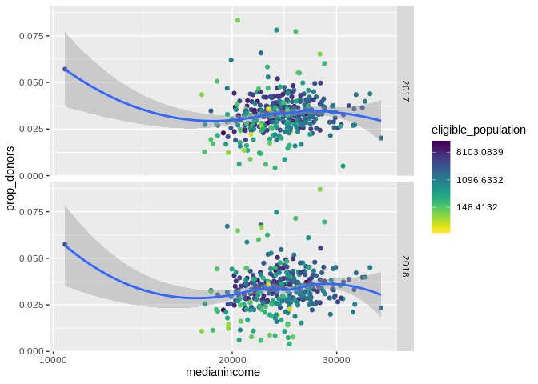
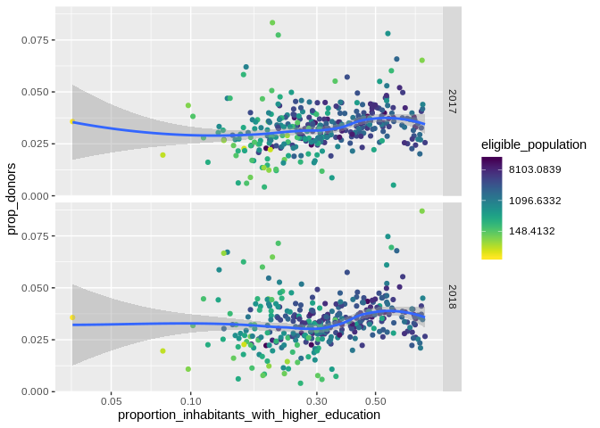
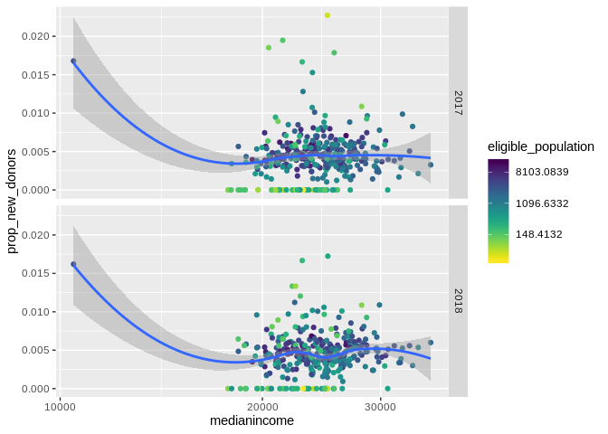
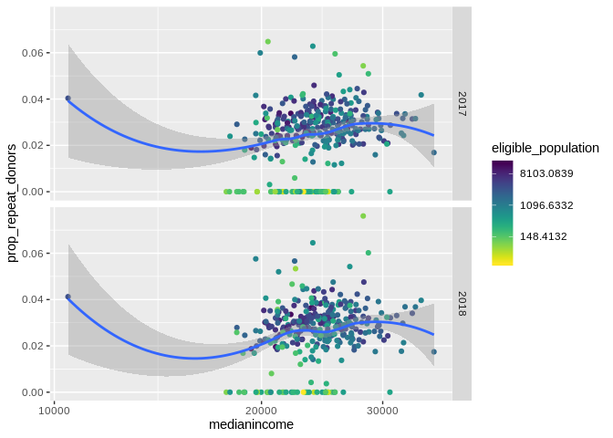
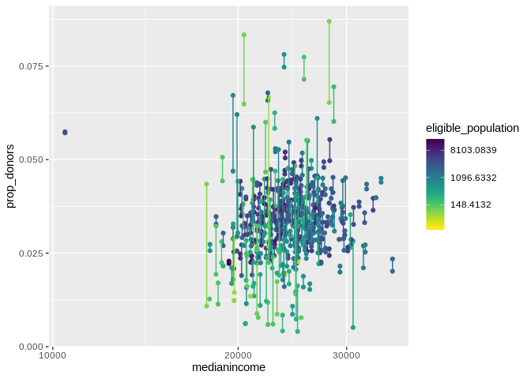
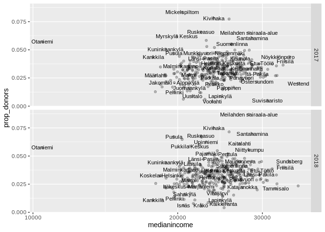
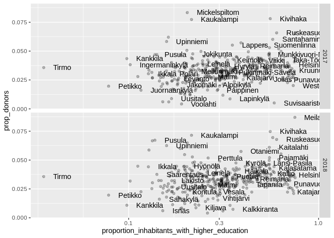

Helsinki-Uusimaa
================

``` r
library(tidyverse)
```

    ## ── Attaching packages ─────────────────────────────────────── tidyverse 1.2.1 ──

    ## ✔ ggplot2 3.2.0          ✔ purrr   0.3.2     
    ## ✔ tibble  2.1.3          ✔ dplyr   0.8.2     
    ## ✔ tidyr   0.8.3.9000     ✔ stringr 1.4.0     
    ## ✔ readr   1.3.1          ✔ forcats 0.4.0

    ## ── Conflicts ────────────────────────────────────────── tidyverse_conflicts() ──
    ## ✖ dplyr::filter() masks stats::filter()
    ## ✖ dplyr::lag()    masks stats::lag()

``` r
library(viridis)
```

    ## Loading required package: viridisLite

``` r
library(lubridate)
```

    ## 
    ## Attaching package: 'lubridate'

    ## The following object is masked from 'package:base':
    ## 
    ##     date

# Helsinki-Uusimaa is done by filtering zip smaller than 1. It only leaves 695 obs at the dataset.

``` r
huuma <-preprosessed_paavo %>% 
filter(zip < 1) 
str(huuma)
```

    ## 'data.frame':    695 obs. of  22 variables:
    ##  $ zip                                         : chr  "00100" "00120" "00130" "00140" ...
    ##  $ Year                                        : num  2017 2017 2017 2017 2017 ...
    ##  $ eligible_population                         : num  12304 4708 1036 5047 6543 ...
    ##  $ nb_donors_per_zip                           : int  466 118 38 123 167 62 164 346 24 324 ...
    ##  $ nb_donations_per_zip                        : int  722 178 56 190 242 83 242 527 29 475 ...
    ##  $ nb_first_time_donors                        : num  87 23 10 19 33 5 31 54 2 57 ...
    ##  $ nb_repeat_donors                            : num  379 95 28 104 134 57 133 292 22 267 ...
    ##  $ medianincome                                : num  26642 27133 28655 28115 25885 ...
    ##  $ averageincome                               : num  38985 39248 49622 48293 37054 ...
    ##  $ nimi                                        : chr  "Helsinki Keskusta - Etu-Töölö" "Punavuori" "Kaartinkaupunki" "Kaivopuisto - Ullanlinna" ...
    ##  $ bachelor_degree                             : num  2899 969 199 1143 1478 ...
    ##  $ masters_degree                              : num  5704 2143 500 2433 2731 ...
    ##  $ unemployed                                  : num  856 336 61 325 536 192 345 768 44 714 ...
    ##  $ employed                                    : num  10032 3872 839 4218 5433 ...
    ##  $ population18                                : num  16159 6170 1307 6767 8408 ...
    ##  $ hr_tuy                                      : num  15935 6116 1322 6866 8466 ...
    ##  $ prop_donors                                 : num  0.0379 0.0251 0.0367 0.0244 0.0255 ...
    ##  $ nb_donation_per_act_donor                   : num  1.55 1.51 1.47 1.54 1.45 ...
    ##  $ prop_new_donors                             : num  0.00707 0.00489 0.00965 0.00376 0.00504 ...
    ##  $ prop_repeat_donors                          : num  0.0308 0.0202 0.027 0.0206 0.0205 ...
    ##  $ higher_education                            : num  8603 3112 699 3576 4209 ...
    ##  $ proportion_inhabitants_with_higher_education: num  0.699 0.661 0.675 0.709 0.643 ...

``` r
ggplot(data=huuma, mapping = aes(x= medianincome, y= prop_donors, color= eligible_population))+
geom_point(mapping = aes(x= medianincome, y= prop_donors)) +
geom_smooth () + 
scale_x_log10() +
scale_color_viridis(discrete=FALSE,direction = -1,trans="log") + 
facet_grid(Year~.)
```

    ## `geom_smooth()` using method = 'loess' and formula 'y ~ x'

<!-- -->

``` r
huuma <-preprosessed_paavo %>% 
filter(zip < 1) 

ggplot(data=huuma, mapping = aes(x= proportion_inhabitants_with_higher_education, y= prop_donors, color= eligible_population))+
geom_point(mapping = aes(x= proportion_inhabitants_with_higher_education, y= prop_donors)) +
geom_smooth () + 
scale_x_log10() +
scale_color_viridis(discrete=FALSE,direction = -1,trans="log") +
facet_grid(Year~.)
```

    ## `geom_smooth()` using method = 'loess' and formula 'y ~ x'

<!-- -->

``` r
ggplot(data=huuma, mapping = aes(x= medianincome, y= prop_donors, color= eligible_population))+
geom_point(mapping = aes(x= medianincome, y= prop_donors)) +
geom_smooth () + 
scale_x_log10() +
scale_color_viridis(discrete=FALSE,direction = -1,trans="log") + 
facet_grid(Year~.)
```

    ## `geom_smooth()` using method = 'loess' and formula 'y ~ x'

<!-- -->

\#new
donors

``` r
ggplot(data=huuma, mapping = aes(x= medianincome, y= prop_new_donors, color= eligible_population))+
geom_point(mapping = aes(x= medianincome, y= prop_new_donors)) +
geom_smooth () + 
scale_x_log10() +
scale_color_viridis(discrete=FALSE,direction = -1,trans="log") + 
facet_grid(Year~.)
```

    ## `geom_smooth()` using method = 'loess' and formula 'y ~ x'

<!-- -->

\#repeat
donors

``` r
ggplot(data=huuma, mapping = aes(x= medianincome, y= prop_repeat_donors, color= eligible_population))+
geom_point(mapping = aes(x= medianincome, y= prop_repeat_donors)) +
geom_smooth () + 
scale_x_log10() +
scale_color_viridis(discrete=FALSE,direction = -1,trans="log") + 
facet_grid(Year~.)
```

    ## `geom_smooth()` using method = 'loess' and formula 'y ~ x'

<!-- -->

``` r
ggplot(data=huuma, mapping = aes(x= medianincome, y= prop_donors, group= zip, color=eligible_population))+
geom_point(mapping = aes(x= medianincome, y= prop_donors)) +
#geom_smooth () + 
scale_x_log10() +
scale_color_viridis(discrete=FALSE,direction = -1,trans="log") + 
geom_boxplot() 
```

<!-- -->

``` r
#coord_flip()
```

\# Not very informative part

``` r
 ggplot(data = huuma,
            mapping = aes(x = medianincome, y = prop_donors))+
geom_point(alpha= 0.25) +
scale_x_log10() + 
  geom_text(data = huuma,check_overlap = TRUE, na.rm= TRUE, size=3,
mapping = aes(label = nimi)) + 
facet_grid(Year ~.)
```

<!-- -->

``` r
 ggplot(data = huuma,
            mapping = aes(x = proportion_inhabitants_with_higher_education, y = prop_donors))+
geom_point(alpha= 0.25) +
scale_x_log10() + 
  geom_text(data = huuma,check_overlap = TRUE,show.legend = TRUE,hjust = 0, nudge_x = 0.05,
mapping = aes(label = nimi)) +
facet_grid(Year ~.)
```

<!-- -->
