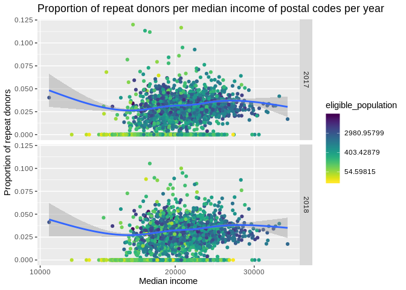
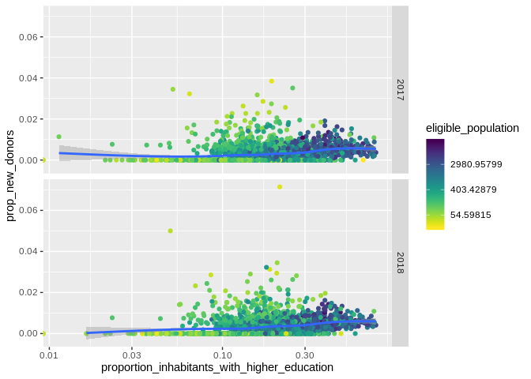
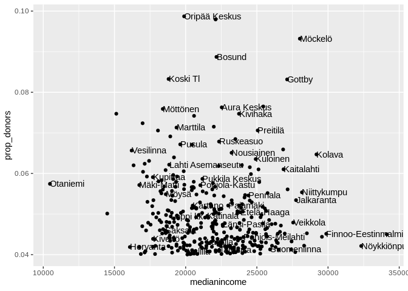

Visualisation
================

``` r
load("/home/ilpo/Paavo/data/preprocessed.2019-07-24.RData")
```

``` r
knitr::opts_chunk$set(echo = TRUE)
```

``` r
setwd(dir="/home/ilpo/Paavo/src")
getwd()
```

    ## [1] "/home/ilpo/Paavo/src"

## R Markdown

This is an R Markdown document. Markdown is a simple formatting syntax
for authoring HTML, PDF, and MS Word documents. For more details on
using R Markdown see <http://rmarkdown.rstudio.com>.

When you click the **Knit** button a document will be generated that
includes both content as well as the output of any embedded R code
chunks within the document. You can embed an R code chunk like
    this:

``` r
library(tidyverse)
```

    ## ── Attaching packages ──────────────────────────────────────────────────────────────────────────────────────────────────────────────────────────────── tidyverse 1.2.1 ──

    ## ✔ ggplot2 3.2.0          ✔ purrr   0.3.2     
    ## ✔ tibble  2.1.3          ✔ dplyr   0.8.2     
    ## ✔ tidyr   0.8.3.9000     ✔ stringr 1.4.0     
    ## ✔ readr   1.3.1          ✔ forcats 0.4.0

    ## ── Conflicts ─────────────────────────────────────────────────────────────────────────────────────────────────────────────────────────────────── tidyverse_conflicts() ──
    ## ✖ dplyr::filter() masks stats::filter()
    ## ✖ dplyr::lag()    masks stats::lag()

``` r
library(lubridate)
```

    ## 
    ## Attaching package: 'lubridate'

    ## The following object is masked from 'package:base':
    ## 
    ##     date

``` r
library(viridis)
```

    ## Loading required package: viridisLite

# Relationship between proportion of donors and median income.

``` r
df <- as.tbl(preprosessed_paavo) %>% filter(!is.na(prop_donors))
p <- ggplot(data=df)
p <- p +  geom_point(mapping=aes(y = prop_donors, x = medianincome, colour=eligible_population))
p <- p +   scale_x_log10() + geom_smooth(aes(y = prop_donors, x = medianincome)) +
 scale_color_viridis(discrete=FALSE,direction = -1,trans="log")+
labs(x = "Median income",
        y = "Proportion of donors",
        title = "Proportion of donors per median income of postal codes per year")+
facet_grid(Year ~.)
p
```

    ## `geom_smooth()` using method = 'gam' and formula 'y ~ s(x, bs = "cs")'

    ## Warning: Removed 6 rows containing non-finite values (stat_smooth).

    ## Warning: Removed 6 rows containing missing values (geom_point).

<!-- --> \# New
donors and repeated donors per median income

``` r
df <- as.tbl(preprosessed_paavo) %>% filter(!is.na(prop_new_donors))
p <- ggplot(data=df)
p <- p +  geom_point(mapping=aes(y = prop_new_donors, x = medianincome, colour=eligible_population))+
  scale_color_viridis(discrete=FALSE,direction = -1,trans="log")+
  facet_grid(Year~.)
p
```

    ## Warning: Removed 6 rows containing missing values (geom_point).

<!-- -->

``` r
df <- as.tbl(preprosessed_paavo) %>% filter(!is.na(prop_donors))
p <- ggplot(data=df)
p <- p +  geom_point(mapping=aes(y = prop_repeat_donors, x = medianincome, colour=eligible_population))+
  scale_color_viridis(discrete=FALSE,direction = -1,trans="log")+
geom_smooth(aes(y = prop_repeat_donors, x = medianincome)) + 
facet_grid (Year~.)
p
```

    ## `geom_smooth()` using method = 'gam' and formula 'y ~ s(x, bs = "cs")'

    ## Warning: Removed 6 rows containing non-finite values (stat_smooth).

    ## Warning: Removed 6 rows containing missing values (geom_point).

<!-- -->

# Average income

``` r
df <- as.tbl(preprosessed_paavo) %>% filter(!is.na(prop_donors))
p <- ggplot(data=df)
p <- p +  geom_point(mapping=aes(y = prop_donors, x = averageincome, colour=eligible_population))
p <- p +   scale_x_log10() + geom_smooth(aes(y = prop_donors, x = medianincome)) +
 scale_color_viridis(discrete=FALSE,direction = -1,trans="log")+
labs(x = "Average income",
        y = "Proportion of donors",
        title = "Proportion of donors per average income of postal codes per year")+
facet_grid(Year ~.)
p
```

    ## `geom_smooth()` using method = 'gam' and formula 'y ~ s(x, bs = "cs")'

    ## Warning: Removed 6 rows containing non-finite values (stat_smooth).

    ## Warning: Removed 6 rows containing missing values (geom_point).

<!-- -->

``` r
df <- as.tbl(preprosessed_paavo) %>% filter(!is.na(prop_new_donors))
p <- ggplot(data=df)
p <- p +  geom_point(mapping=aes(y = prop_new_donors, x = averageincome, colour=eligible_population))
p <- p +   scale_x_log10() + geom_smooth(aes(y = prop_new_donors, x = averageincome)) +
 scale_color_viridis(discrete=FALSE,direction = -1,trans="log")+
labs(x = "Average income",
        y = "Proportion of first time donors",
        title = "Proportion of donors per average income of postal codes per year")+
facet_grid(Year ~.)
p
```

    ## `geom_smooth()` using method = 'gam' and formula 'y ~ s(x, bs = "cs")'

    ## Warning: Removed 6 rows containing non-finite values (stat_smooth).

    ## Warning: Removed 6 rows containing missing values (geom_point).

<!-- -->

``` r
df <- as.tbl(preprosessed_paavo) %>% filter(!is.na(prop_repeat_donors))
p <- ggplot(data=df)
p <- p +  geom_point(mapping=aes(y = prop_repeat_donors, x = averageincome, colour=eligible_population))
p <- p +   scale_x_log10() + geom_smooth(aes(y = prop_repeat_donors, x = averageincome)) +
 scale_color_viridis(discrete=FALSE,direction = -1,trans="log")+
labs(x = "Average income",
        y = "Proportion of non repeat donors",
        title = "Proportion of repeat  donors per average income of postal codes per year")+
facet_grid(Year ~.)
p
```

    ## `geom_smooth()` using method = 'gam' and formula 'y ~ s(x, bs = "cs")'

    ## Warning: Removed 6 rows containing non-finite values (stat_smooth).

    ## Warning: Removed 6 rows containing missing values (geom_point).

<!-- -->

Relationship between higher education and proportion of donors

``` r
p <- ggplot(data=df)
p <- p +  geom_point(mapping=aes(y = prop_donors, x = proportion_inhabitants_with_higher_education, colour=eligible_population))
p <- p +   scale_x_log10() + geom_smooth(aes(y = prop_donors, x = proportion_inhabitants_with_higher_education)) +
scale_color_viridis(discrete=FALSE,direction = -1,trans="log") + 
  facet_grid(Year~.)
p
```

    ## Warning: Transformation introduced infinite values in continuous x-axis
    
    ## Warning: Transformation introduced infinite values in continuous x-axis

    ## `geom_smooth()` using method = 'gam' and formula 'y ~ s(x, bs = "cs")'

    ## Warning: Removed 15 rows containing non-finite values (stat_smooth).

    ## Warning: Removed 6 rows containing missing values (geom_point).

<!-- --> \#
First time donors

``` r
p <- ggplot(data=df)
p <- p +  geom_point(mapping=aes(y = prop_new_donors, x = proportion_inhabitants_with_higher_education, colour=eligible_population))
p <- p +   scale_x_log10() + geom_smooth(aes(y = prop_new_donors, x = proportion_inhabitants_with_higher_education)) +
scale_color_viridis(discrete=FALSE,direction = -1,trans="log") +
  facet_grid(Year~.)
p
```

    ## Warning: Transformation introduced infinite values in continuous x-axis
    
    ## Warning: Transformation introduced infinite values in continuous x-axis

    ## `geom_smooth()` using method = 'gam' and formula 'y ~ s(x, bs = "cs")'

    ## Warning: Removed 15 rows containing non-finite values (stat_smooth).

    ## Warning: Removed 6 rows containing missing values (geom_point).

<!-- --> \#
repeated donors

``` r
p <- ggplot(data=df)
p <- p +  geom_point(mapping=aes(y = prop_repeat_donors, x = proportion_inhabitants_with_higher_education, colour=eligible_population))
p <- p +   scale_x_log10() + geom_smooth(aes(y = prop_repeat_donors, x = proportion_inhabitants_with_higher_education)) +
scale_color_viridis(discrete=FALSE,direction = -1,trans="log") +
  facet_grid(Year~.)
p
```

    ## Warning: Transformation introduced infinite values in continuous x-axis
    
    ## Warning: Transformation introduced infinite values in continuous x-axis

    ## `geom_smooth()` using method = 'gam' and formula 'y ~ s(x, bs = "cs")'

    ## Warning: Removed 15 rows containing non-finite values (stat_smooth).

    ## Warning: Removed 6 rows containing missing values (geom_point).

<!-- -->
