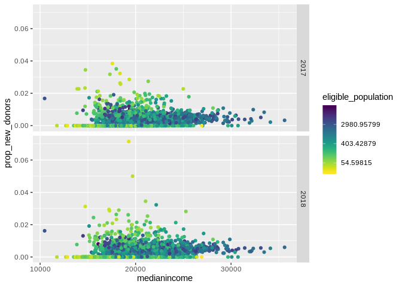
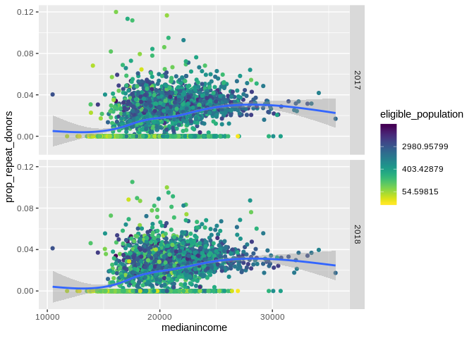

Visualisation
================

``` r
load("/home/ilpo/Paavo/data/preprocessed.RData")
preprosessed_paavo$zip <- gsub('.*NA.*',NA,preprosessed_paavo$zip)
preprosessed_paavo$Year <- gsub('.*NA.*',NA,preprosessed_paavo$Year)
```

``` r
knitr::opts_chunk$set(echo = TRUE)
```

``` r
setwd(dir="/home/ilpo/Paavo/src")
getwd()
```

    ## [1] "/home/ilpo/Paavo/src"

## R Markdown

This is an R Markdown document. Markdown is a simple formatting syntax
for authoring HTML, PDF, and MS Word documents. For more details on
using R Markdown see <http://rmarkdown.rstudio.com>.

When you click the **Knit** button a document will be generated that
includes both content as well as the output of any embedded R code
chunks within the document. You can embed an R code chunk like
    this:

``` r
library(tidyverse)
```

    ## ── Attaching packages ────────────────────────────────────────────────────────────────────────────────────── tidyverse 1.2.1 ──

    ## ✔ ggplot2 3.2.0          ✔ purrr   0.3.2     
    ## ✔ tibble  2.1.3          ✔ dplyr   0.8.2     
    ## ✔ tidyr   0.8.3.9000     ✔ stringr 1.4.0     
    ## ✔ readr   1.3.1          ✔ forcats 0.4.0

    ## ── Conflicts ───────────────────────────────────────────────────────────────────────────────────────── tidyverse_conflicts() ──
    ## ✖ dplyr::filter() masks stats::filter()
    ## ✖ dplyr::lag()    masks stats::lag()

``` r
library(lubridate)
```

    ## 
    ## Attaching package: 'lubridate'

    ## The following object is masked from 'package:base':
    ## 
    ##     date

# Is there a relationship of income and proportion of donors in the population?

filtering prop\_donors smaller than 1 and took common logarithm

``` r
preprosessed_paavo %>% 
filter(prop_donors<=1) %>% 
ggplot(aes(x = averageincome, y= prop_donors)) +
geom_point(alpha = 0.25) +
scale_x_log10()  +
facet_grid(Year~.) +
labs(x = "Average income",
         y = "Proportion of donors",
         title = "Proportion of donors per average income")
```

    ## Warning: Removed 6 rows containing missing values (geom_point).

<!-- -->

# basic plot for median.

``` r
preprosessed_paavo %>% 
ggplot(aes(y= prop_donors, x= medianincome)) +
geom_point() + 
facet_grid(Year~.)
```

    ## Warning: Removed 1970 rows containing missing values (geom_point).

<!-- -->

\#Logarithm and filtering.

``` r
preprosessed_paavo %>% 
filter(prop_donors<=1) %>% 
ggplot(aes(y = prop_donors, x = medianincome, color=prop_donors)) +
geom_point(alpha = 0.25) +
scale_x_log10() +
#geom_smooth () +
labs(x = "Median income",
         y = "Proportion of donors",
         title = "Proportion of donors per median income of postal codes per year")+
facet_grid(Year ~.)
```

    ## Warning: Removed 6 rows containing missing values (geom_point).

<!-- -->

``` r
preprosessed_paavo %>%  
filter(proportion_inhabitants_with_higher_education <= 1) %>% 
ggplot(aes(x=proportion_inhabitants_with_higher_education, y=  prop_donors, color= prop_donors)) +
geom_jitter(alpha= 0.25)+
geom_smooth()+
labs(x = "Proportion of inhabitants with higher education",
         y = "Proportion of donors",
         title = "Proportion of donors per proportion of people with university degree")
```

    ## `geom_smooth()` using method = 'gam' and formula 'y ~ s(x, bs = "cs")'

    ## Warning: Removed 1164 rows containing non-finite values (stat_smooth).

    ## Warning: Removed 1164 rows containing missing values (geom_point).

<!-- -->

``` r
#acet_grid (Year~.)
```

\`

Is there a relationship between proportion of people with higher
education and proportion of donors in the population?

``` r
preprosessed_paavo %>% 
ggplot(aes(x=proportion_inhabitants_with_higher_education, y= prop_donors))+
geom_point() +
facet_grid(Year~.)
```

    ## Warning: Removed 1970 rows containing missing values (geom_point).

<!-- -->

b,Same plot separately for first time donors and others

,
