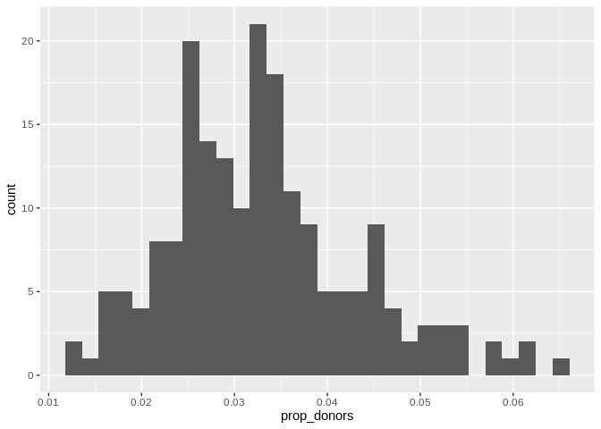
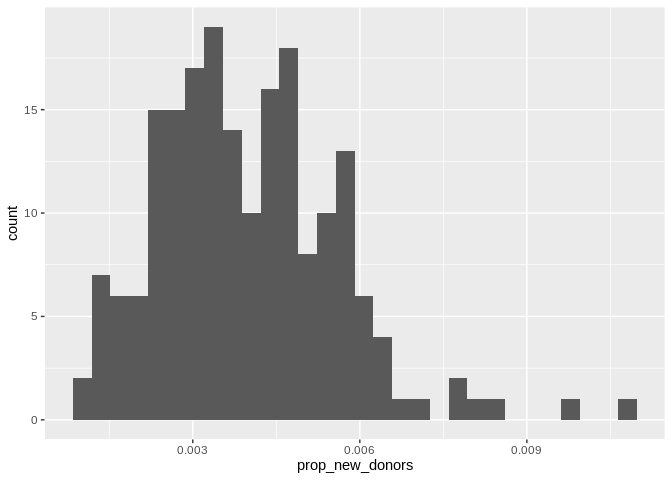
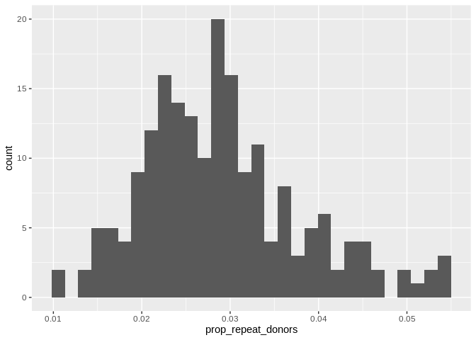
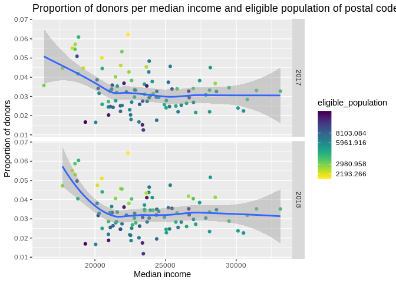
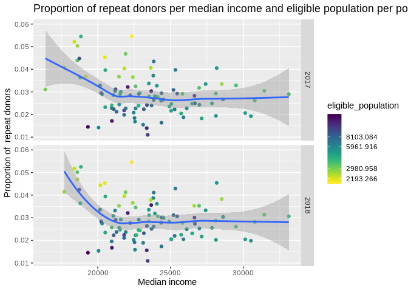
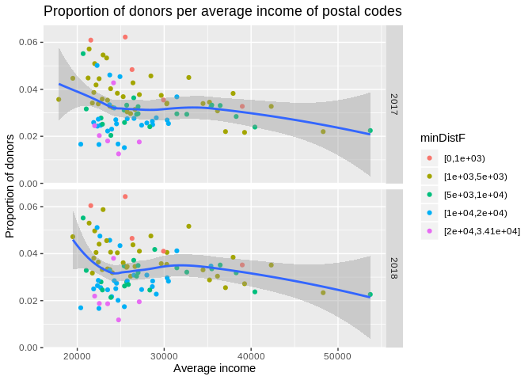
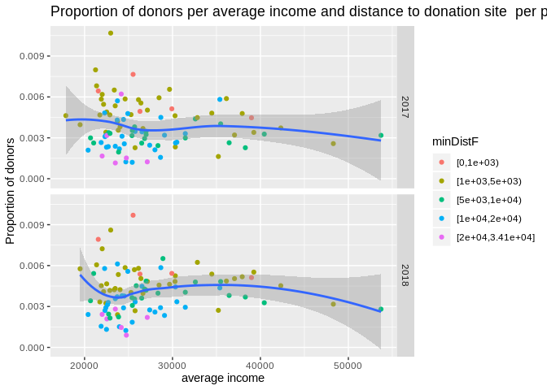
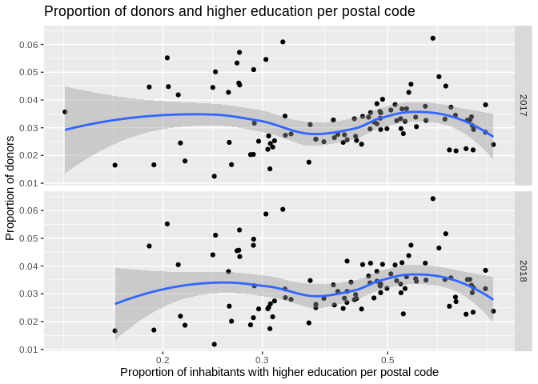
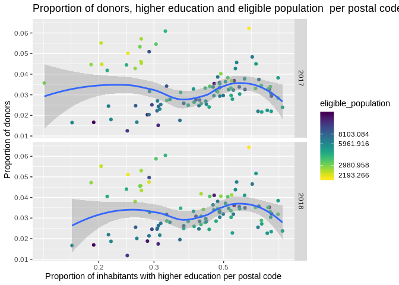
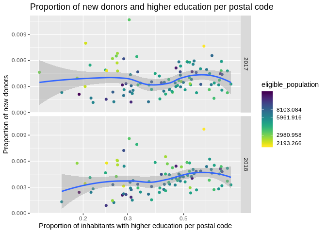

Visualising model data
================
Ilpo Arminen
8/16/2019

``` r
library(tidyverse)
```

    ## ── Attaching packages ─────────────────────────────────────── tidyverse 1.2.1 ──

    ## ✔ ggplot2 3.2.0          ✔ purrr   0.3.2     
    ## ✔ tibble  2.1.3          ✔ dplyr   0.8.2     
    ## ✔ tidyr   0.8.3.9000     ✔ stringr 1.4.0     
    ## ✔ readr   1.3.1          ✔ forcats 0.4.0

    ## ── Conflicts ────────────────────────────────────────── tidyverse_conflicts() ──
    ## ✖ dplyr::filter() masks stats::filter()
    ## ✖ dplyr::lag()    masks stats::lag()

``` r
library(lubridate)
```

    ## 
    ## Attaching package: 'lubridate'

    ## The following object is masked from 'package:base':
    ## 
    ##     date

``` r
library(knitr)
library(viridis)
```

    ## Loading required package: viridisLite

``` r
library(table1)
```

    ## 
    ## Attaching package: 'table1'

    ## The following objects are masked from 'package:base':
    ## 
    ##     units, units<-

``` r
load("/home/ilpo/Paavo/data/model_data.RData")
```

# Table one from model data

``` r
label(model_data$medianincome)  <- "Median income of household per postal code"
label(model_data$averageincome) <- "Average income of household per postal code"
label(model_data$proportion_inhabitants_with_higher_education)  <- "Share of inhabitants with higher education per postal code"
label(model_data$prop_donors) <- "Proportion of donors per postal code."
label(model_data$nb_fixed_donations_per_zip) <- "Proportion of donations per postal code"
label(model_data$nb_fixed_donors_per_zip) <- "Number of donors per zip"
label(model_data$proportion_inhabitants_with_higher_education) <- "Proportion_inhabitants_with_higher_education"
label(model_data$nb_fixed_repeat_donors) <- "Number of donors who donated more than once per zip"
label(model_data$nb_fixed_first_time_donors) <- "Number of first time donors per zip"
label(model_data$nb_fixed_donation_per_act_donor) <- "Number of donations divided by numbers of donor per zip"
label(model_data$eligible_population) <- "Number of residents per zip who is suitable for donating blood"
units(model_data$medianincome) <- "Euro"
units(model_data$averageincome) <- "Euro" 

 table1(~prop_donors + eligible_population + nb_fixed_donors_per_zip + nb_fixed_donations_per_zip + nb_fixed_donors_per_zip + medianincome + averageincome + proportion_inhabitants_with_higher_education + proportion_inhabitants_with_higher_education + prop_repeat_donors + prop_new_donors + prop_donors + nb_fixed_donation_per_act_donor,data = model_data, overall = "Total", topclass="Rtable1-grid Rtable1-center")
```

    ## [1] "<table class=\"Rtable1-grid Rtable1-center\">\n<thead>\n<tr>\n<th class='rowlabel firstrow lastrow'></th>\n<th class='firstrow lastrow'><span class='stratlabel'>Total<br><span class='stratn'>(n=302)</span></span></th>\n</tr>\n</thead>\n<tbody>\n<tr>\n<td class='rowlabel firstrow'><span class='varlabel'>Proportion of donors per postal code.</span></td>\n<td class='firstrow'></td>\n</tr>\n<tr>\n<td class='rowlabel'>Mean (SD)</td>\n<td>0.0315 (0.0110)</td>\n</tr>\n<tr>\n<td class='rowlabel lastrow'>Median [Min, Max]</td>\n<td class='lastrow'>0.0308 [0.00846, 0.0647]</td>\n</tr>\n<tr>\n<td class='rowlabel firstrow'><span class='varlabel'>Number of residents per zip who is suitable for donating blood</span></td>\n<td class='firstrow'></td>\n</tr>\n<tr>\n<td class='rowlabel'>Mean (SD)</td>\n<td>4960 (2810)</td>\n</tr>\n<tr>\n<td class='rowlabel lastrow'>Median [Min, Max]</td>\n<td class='lastrow'>4440 [1110, 15700]</td>\n</tr>\n<tr>\n<td class='rowlabel firstrow'><span class='varlabel'>Number of donors per zip</span></td>\n<td class='firstrow'></td>\n</tr>\n<tr>\n<td class='rowlabel'>Mean (SD)</td>\n<td>145 (86.9)</td>\n</tr>\n<tr>\n<td class='rowlabel lastrow'>Median [Min, Max]</td>\n<td class='lastrow'>117 [53.0, 552]</td>\n</tr>\n<tr>\n<td class='rowlabel firstrow'><span class='varlabel'>Proportion of donations per postal code</span></td>\n<td class='firstrow'></td>\n</tr>\n<tr>\n<td class='rowlabel'>Mean (SD)</td>\n<td>248 (143)</td>\n</tr>\n<tr>\n<td class='rowlabel lastrow'>Median [Min, Max]</td>\n<td class='lastrow'>205 [100, 929]</td>\n</tr>\n<tr>\n<td class='rowlabel firstrow'><span class='varlabel'>Median income of household per postal code<span class='varunits'> (Euro)</span></span></td>\n<td class='firstrow'></td>\n</tr>\n<tr>\n<td class='rowlabel'>Mean (SD)</td>\n<td>23700 (3320)</td>\n</tr>\n<tr>\n<td class='rowlabel lastrow'>Median [Min, Max]</td>\n<td class='lastrow'>23500 [16400, 33100]</td>\n</tr>\n<tr>\n<td class='rowlabel firstrow'><span class='varlabel'>Average income of household per postal code<span class='varunits'> (Euro)</span></span></td>\n<td class='firstrow'></td>\n</tr>\n<tr>\n<td class='rowlabel'>Mean (SD)</td>\n<td>27200 (5770)</td>\n</tr>\n<tr>\n<td class='rowlabel lastrow'>Median [Min, Max]</td>\n<td class='lastrow'>25700 [17900, 53700]</td>\n</tr>\n<tr>\n<td class='rowlabel firstrow'><span class='varlabel'>Proportion_inhabitants_with_higher_education</span></td>\n<td class='firstrow'></td>\n</tr>\n<tr>\n<td class='rowlabel'>Mean (SD)</td>\n<td>0.417 (0.156)</td>\n</tr>\n<tr>\n<td class='rowlabel lastrow'>Median [Min, Max]</td>\n<td class='lastrow'>0.408 [0.132, 0.770]</td>\n</tr>\n<tr>\n<td class='rowlabel firstrow'><span class='varlabel'>prop_repeat_donors</span></td>\n<td class='firstrow'></td>\n</tr>\n<tr>\n<td class='rowlabel'>Mean (SD)</td>\n<td>0.0279 (0.00977)</td>\n</tr>\n<tr>\n<td class='rowlabel lastrow'>Median [Min, Max]</td>\n<td class='lastrow'>0.0266 [0.00812, 0.0557]</td>\n</tr>\n<tr>\n<td class='rowlabel firstrow'><span class='varlabel'>prop_new_donors</span></td>\n<td class='firstrow'></td>\n</tr>\n<tr>\n<td class='rowlabel'>Mean (SD)</td>\n<td>0.00363 (0.00173)</td>\n</tr>\n<tr>\n<td class='rowlabel lastrow'>Median [Min, Max]</td>\n<td class='lastrow'>0.00337 [0.000334, 0.0108]</td>\n</tr>\n<tr>\n<td class='rowlabel firstrow'><span class='varlabel'>Number of donations divided by numbers of donor per zip</span></td>\n<td class='firstrow'></td>\n</tr>\n<tr>\n<td class='rowlabel'>Mean (SD)</td>\n<td>1.73 (0.145)</td>\n</tr>\n<tr>\n<td class='rowlabel lastrow'>Median [Min, Max]</td>\n<td class='lastrow'>1.71 [1.41, 2.32]</td>\n</tr>\n</tbody>\n</table>\n"

``` r
#kable(model_data)
```

# Distributions of variables

\#\#Distribution of eligible population variable

``` r
ggplot(data=model_data, mapping = aes(x= eligible_population))+
geom_histogram (binwidth= 1000)
```

<!-- -->
\#\#\# Distribution of proportion of donors variable

``` r
ggplot(data=model_data, mapping = aes(x= prop_donors))+
geom_histogram ()  
```

    ## `stat_bin()` using `bins = 30`. Pick better value with `binwidth`.

<!-- -->

``` r
#scale_x_log10()
```

## Distribution of proportion of donors variable on logarithmic scale

``` r
ggplot(data=model_data, mapping = aes(x= prop_donors))+
geom_histogram ()  +
scale_x_log10()
```

    ## `stat_bin()` using `bins = 30`. Pick better value with `binwidth`.

<!-- -->
\#\#\# Distribution of minimum distance variable

``` r
ggplot(data= model_data, mapping= aes(x=minDist)) + 
geom_histogram()
```

    ## `stat_bin()` using `bins = 30`. Pick better value with `binwidth`.

<!-- -->
Distiribution of proportion\_inhabitants\_with\_higher\_education
variable

``` r
ggplot(data= model_data, mapping= aes(x=proportion_inhabitants_with_higher_education )) + 
geom_histogram()
```

    ## `stat_bin()` using `bins = 30`. Pick better value with `binwidth`.

<!-- -->

# Median income

\#\#Median income and proportion of donors

``` r
ggplot(data=model_data, mapping = aes(x= medianincome, y= prop_donors))+
geom_point(mapping = aes(x= medianincome, y= prop_donors)) +
geom_smooth (method = "loess") + 
scale_x_log10() +
  labs(x = "Median income",
        y = "Proportion of donors",
        title = "Proportion of donors per median income of postal codes")
```

<!-- -->

``` r
#facet_grid(Year~.)

#There seems to be quite a number of areas with high proportion of donors and lower than 20k median income. After checking this, it seems that areas are all from Lahti. Also need to pay attention that im not visualising the years separately, so  there are same data points with different year. it seems that there could be  (mild)  positive correlation between median income and proportion of donors, but only to some degree so that richest ares do not have highest prop donors and there are areas with high prop of donors and less than 20k median income, so there might be even negative correlation.  I would guess that Helsinki would fit to linear model better, than the whole dataset.
```

## proportion of donors and median income with zip labels.

``` r
 ggplot(data = model_data,
            mapping = aes(x = medianincome, y = prop_donors))+
geom_point(alpha= 0.25) +
scale_x_log10() + 
  geom_text(data = model_data ,check_overlap = TRUE, na.rm= TRUE, size=3,
mapping = aes(label = name)) +
 labs(x = "Median income",
        y = "Proportion of donors",
        title = "Proportion of donors per median income of postal codes")
```

<!-- -->

``` r
#facet_grid(Year ~.)

# This if helpful for seeing that high proportion of donors seems to be areas near the fixed sites, atleast in Ruskeasuo, Etelä-Haaga and Lahti Asemanseutu. 
```

## Median income, distance with proportion of donors

``` r
ggplot(data=model_data, mapping = aes(x= medianincome, y= prop_donors, color= minDist))+
geom_point(mapping = aes(x= medianincome, y= prop_donors)) +
geom_smooth () + 
scale_x_log10() +
scale_color_viridis(discrete=FALSE,direction = -1,trans="log") +
   labs(x = "Median income",
        y = "Proportion of donors",
        title = "Proportion of donors per median income and distance to donation site per postal code") +
facet_grid(Year~.)
```

    ## Warning: Transformation introduced infinite values in discrete y-axis
    
    ## Warning: Transformation introduced infinite values in discrete y-axis

    ## `geom_smooth()` using method = 'loess' and formula 'y ~ x'

<!-- -->

``` r
# It seems that distance to donation site does not matter as much as i thought. This could be matter of minDIst categories that hides the trend. I should maybe change the colors so i coulld see the differences easier. 
```

### Median income and population with proportion of donors

``` r
ggplot(data=model_data, mapping = aes(x= medianincome, y= prop_donors, color= eligible_population))+
geom_point(mapping = aes(x= medianincome, y= prop_donors)) +
geom_smooth () + 
scale_x_log10() +
scale_color_viridis(discrete=FALSE,direction = -1,trans="log") + 
 labs(x = "Median income",
        y = "Proportion of donors",
        title = "Proportion of donors per median income and eligible population of postal codes")
```

    ## `geom_smooth()` using method = 'loess' and formula 'y ~ x'

<!-- -->

``` r
#facet_grid(Year~.)
facet_grid(Year~.)
```

    ## <ggproto object: Class FacetGrid, Facet, gg>
    ##     compute_layout: function
    ##     draw_back: function
    ##     draw_front: function
    ##     draw_labels: function
    ##     draw_panels: function
    ##     finish_data: function
    ##     init_scales: function
    ##     map_data: function
    ##     params: list
    ##     setup_data: function
    ##     setup_params: function
    ##     shrink: TRUE
    ##     train_scales: function
    ##     vars: function
    ##     super:  <ggproto object: Class FacetGrid, Facet, gg>

``` r
# Highest proportion of donors tend to come from smaller postal codes which sounds pretty reasonable, since there need to be smaller amount of donors per population. 
```

\#proportion of new donors plus median income +
distance

``` r
ggplot(data=model_data, mapping = aes(x= medianincome, y= prop_new_donors, color= minDist))+
geom_point(mapping = aes(x= medianincome, y= prop_new_donors)) +
geom_smooth () + 
scale_x_log10() +
scale_color_viridis(discrete=FALSE,direction = -1,trans="log") + 
   labs(x = "Median income",
        y = "Proportion of new donors",
        title = "Proportion of new donors per median income and distance to donation sites of postal codes")+
facet_grid(Year~.)
```

    ## Warning: Transformation introduced infinite values in discrete y-axis
    
    ## Warning: Transformation introduced infinite values in discrete y-axis

    ## `geom_smooth()` using method = 'loess' and formula 'y ~ x'

<!-- -->

``` r
# So this looks new donors and distance per median income. It seems that new donors do not live nearby of donation sites, so it looks pretty similar to all donors plot.  Trend might be sligtly negative.
```

Proportion of new donors, median income +
population

``` r
ggplot(data=model_data, mapping = aes(x= medianincome, y= prop_new_donors, color= eligible_population))+
geom_point(mapping = aes(x= medianincome, y= prop_new_donors)) +
geom_smooth () + 
scale_x_log10() +
scale_color_viridis(discrete=FALSE,direction = -1,trans="log") + 
 labs(x = "Median income",
        y = "Proportion of new donors",
        title = "Proportion of new donors per median income and eligible population of postal codes")+
facet_grid(Year~.)
```

    ## `geom_smooth()` using method = 'loess' and formula 'y ~ x'

<!-- -->

``` r
# New donors also tend to come from postal codes from smaller population. 
```

# proportion of repeat donors, median income + distance

``` r
ggplot(data=model_data, mapping = aes(x= medianincome, y= prop_repeat_donors, color= minDist))+
geom_point(mapping = aes(x= medianincome, y= prop_repeat_donors)) +
geom_smooth () + 
scale_x_log10() +
scale_color_viridis(discrete=FALSE,direction = -1,trans="log") + 
   labs(x = "Median income",
        y = "Proportion of repeat donors",
        title = "Proportion of repeat donors per median income and distance to donation site per postal code") + 
facet_grid(Year~.)
```

    ## Warning: Transformation introduced infinite values in discrete y-axis
    
    ## Warning: Transformation introduced infinite values in discrete y-axis

    ## `geom_smooth()` using method = 'loess' and formula 'y ~ x'

<!-- -->

##### Proportion of repeat donors, median income, colored by eligible population

``` r
ggplot(data=model_data, mapping = aes(x= medianincome, y= prop_repeat_donors, color= eligible_population))+
geom_point(mapping = aes(x= medianincome, y= prop_repeat_donors)) +
geom_smooth () + 
scale_x_log10() +
scale_color_viridis(discrete=FALSE,direction = -1,trans="log") + 
   labs(x = "Median income",
        y = "Proportion of  repeat donors",
        title = "Proportion of repeat donors per median income and eligible population per postal code") + 
facet_grid(Year~.)
```

    ## `geom_smooth()` using method = 'loess' and formula 'y ~ x'

<!-- -->

# Average income

\#\#proportion of donors and average income, colored by eligible
population

``` r
ggplot(data=model_data, mapping = aes(x= averageincome, y= prop_donors, color= eligible_population))+
geom_point(mapping = aes(x= averageincome, y= prop_donors)) +
geom_smooth () + 
scale_x_log10() +
scale_color_viridis(discrete=FALSE,direction = -1,trans="log") + 
   labs(x = "Average income",
        y = "Proportion of donors",
        title = "Proportion of donors per average income and eligible population per postal code") +
#facet_grid(Year~.)
facet_grid(Year~.)
```

    ## `geom_smooth()` using method = 'loess' and formula 'y ~ x'

<!-- -->

\#\#average income and
distance

``` r
ggplot(data=model_data, mapping = aes(x= averageincome, y= prop_donors, color= minDist))+
geom_point(mapping = aes(x= averageincome, y= prop_donors)) +
geom_smooth () + 
scale_x_log10() +
scale_color_viridis(discrete=FALSE,direction = -1,trans="log") + 
   labs(x = "Average income",
        y = "Proportion of donors",
        title = "Proportion of donors per average income of postal codes")+
facet_grid(Year~.)
```

    ## Warning: Transformation introduced infinite values in discrete y-axis
    
    ## Warning: Transformation introduced infinite values in discrete y-axis

    ## `geom_smooth()` using method = 'loess' and formula 'y ~ x'

<!-- -->
\#Proportion of new donors and average income
(distance)

``` r
ggplot(data=model_data, mapping = aes(x= averageincome, y= prop_new_donors, color= minDist))+
geom_point(mapping = aes(x= averageincome, y= prop_new_donors)) +
geom_smooth () + 
scale_x_log10() +
scale_color_viridis(discrete=FALSE,direction = -1,trans="log") + 
 labs(x = "Median income",
        y = "Proportion of donors",
        title = "Proportion of donors per median income and distance to donation site  per postal code") +
facet_grid(Year~.)
```

    ## Warning: Transformation introduced infinite values in discrete y-axis
    
    ## Warning: Transformation introduced infinite values in discrete y-axis

    ## `geom_smooth()` using method = 'loess' and formula 'y ~ x'

<!-- -->

#### proportion of new donors and average income + population

``` r
ggplot(data=model_data, mapping = aes(x= averageincome, y= prop_new_donors, color= eligible_population))+
geom_point(mapping = aes(x= averageincome, y= prop_new_donors)) +
geom_smooth () + 
scale_x_log10() +
scale_color_viridis(discrete=FALSE,direction = -1,trans="log") + 
 labs(x = "Median income",
        y = "Proportion of  new donors",
        title = "Proportion of new donors per average income  and population size per postal code") +
facet_grid(Year~.)
```

    ## `geom_smooth()` using method = 'loess' and formula 'y ~ x'

<!-- -->

##### proportion of repeat donors, average income and (population)

``` r
ggplot(data=model_data, mapping = aes(x= averageincome, y= prop_repeat_donors, color= minDist))+
geom_point(mapping = aes(x= averageincome, y= prop_repeat_donors)) +
geom_smooth () + 
scale_x_log10() +
scale_color_viridis(discrete=FALSE,direction = -1,trans="log") + 
   labs(x = "Average income",
        y = "Proportion of repeat donors",
        title = "Proportion of repeat donors per average income and distance to donation site  of postal codes")+
facet_grid(Year~.)
```

    ## Warning: Transformation introduced infinite values in discrete y-axis
    
    ## Warning: Transformation introduced infinite values in discrete y-axis

    ## `geom_smooth()` using method = 'loess' and formula 'y ~ x'

<!-- -->

\#Higher
education

# Higher education and proportion of donors

``` r
ggplot(data=model_data, mapping = aes(x= proportion_inhabitants_with_higher_education, y= prop_donors))+
geom_point(mapping = aes(x= proportion_inhabitants_with_higher_education,, y= prop_donors)) +
geom_smooth () + 
scale_x_log10() +
scale_color_viridis(discrete=FALSE,direction = -1,trans="log") + 
     labs(x = "Proportion of inhabitants with higher education per postal code",
        y = "Proportion of donors",
        title = "Proportion of donors and higher education per postal code") +
facet_grid(Year~.)
```

    ## `geom_smooth()` using method = 'loess' and formula 'y ~ x'

<!-- -->

``` r
#  Median income and tertiary education plots seems to be pretty similar. Postal codes from Lahti doesn't really fit into linear trend. Although smoothing curve tend to have a little bit more linearity curve before it drops down.  I would presume that there is  stronger correlation than with proportion of donors and median income.  
```

## Higher education and distance and proportion of donors

``` r
ggplot(data=model_data, mapping = aes(x= proportion_inhabitants_with_higher_education, y= prop_donors, color= minDist))+
geom_point(mapping = aes(x= proportion_inhabitants_with_higher_education,, y= prop_donors)) +
geom_smooth () + 
scale_x_log10() +
scale_color_viridis(discrete=FALSE,direction = -1,trans="log") + 
   labs(x = "Proportion of inhabitants with higher education per postal code",
        y = "Proportion of donors",
        title = "Proportion of donors, higher education and distance to donation site per postal code") +  
facet_grid(Year~.)
```

    ## Warning: Transformation introduced infinite values in discrete y-axis
    
    ## Warning: Transformation introduced infinite values in discrete y-axis

    ## `geom_smooth()` using method = 'loess' and formula 'y ~ x'

<!-- -->

``` r
# Distance doesn't seems to have a lot of effect  on this plot. There are some data points from close distances, but there isn't really any kind of trend that favors close distance donations. 
```

### Higher education and population and proportion of donors

``` r
ggplot(data=model_data, mapping = aes(x= proportion_inhabitants_with_higher_education, y= prop_donors, color= eligible_population)) +
geom_point(mapping = aes(x= proportion_inhabitants_with_higher_education,, y= prop_donors))  +
geom_smooth () + 
scale_x_log10() +
scale_color_viridis(discrete=FALSE,direction = -1,trans="log") + 
   labs(x = "Proportion of inhabitants with higher education per postal code",
        y = "Proportion of donors",
        title = "Proportion of donors, higher education and eligible population  per postal code") +
facet_grid(Year~.)
```

    ## `geom_smooth()` using method = 'loess' and formula 'y ~ x'

<!-- -->

``` r
# Population size of postal code tends to favor high number of donors in smaller places. This is in line with common sense since donations are measured by dividing the population size with number of donors.  Highest number of tertiary educated inhabitants behave similar to those highest number of median income areas, where there are quite a downfall in donation trend. 
```

##### proportion of new donors, higher education and eligible population

``` r
ggplot(data=model_data, mapping = aes(x= proportion_inhabitants_with_higher_education, y= prop_new_donors, color= eligible_population))+
geom_point(mapping = aes(x= proportion_inhabitants_with_higher_education,, y= prop_new_donors)) +
geom_smooth () + 
scale_x_log10() +
scale_color_viridis(discrete = FALSE,direction = -1,trans="log") + 
   labs(x = "Proportion of inhabitants with higher education per postal code",
        y = "Proportion of new donors",
        title = "Proportion of new donors and higher education per postal code") +
facet_grid(Year~.)
```

    ## `geom_smooth()` using method = 'loess' and formula 'y ~ x'

<!-- -->

#### proportion of repeat donors, higher education and distance

``` r
ggplot(data=model_data, mapping = aes(x= proportion_inhabitants_with_higher_education, y= prop_repeat_donors, color=minDist))+
geom_point(mapping = aes(x= proportion_inhabitants_with_higher_education,, y= prop_repeat_donors)) +
geom_smooth () + 
scale_x_log10() +
scale_color_viridis(discrete=FALSE,direction = -1,trans="log") + 
     labs(x = "Proportion of inhabitants with higher education per postal code",
        y = "Proportion of repeat donors",
        title = "Proportion of repeat donors and higher education per postal code") +
facet_grid(Year~.)
```

    ## Warning: Transformation introduced infinite values in discrete y-axis
    
    ## Warning: Transformation introduced infinite values in discrete y-axis

    ## `geom_smooth()` using method = 'loess' and formula 'y ~ x'

<!-- -->

##### proportion of repeat donors, higher education and eligible population

``` r
ggplot(data=model_data, mapping = aes(x= proportion_inhabitants_with_higher_education, y= prop_repeat_donors, color=eligible_population))+
geom_point(mapping = aes(x= proportion_inhabitants_with_higher_education,, y= prop_repeat_donors)) +
geom_smooth () + 
scale_x_log10() +
scale_color_viridis(discrete=FALSE,direction = -1,trans="log") + 
     labs(x = "Proportion of inhabitants with higher education per postal code",
        y = "Proportion of repeat  donors",
        title = "Proportion of repeat donors and higher education per postal code") +
facet_grid(Year~.)
```

    ## `geom_smooth()` using method = 'loess' and formula 'y ~ x'

<!-- -->

# Distance

\#Distance and proportion of donors

``` r
ggplot(data=model_data, mapping = aes(x= minDist, y= prop_donors))+
geom_point(mapping = aes(x= minDist, y= prop_donors)) +
geom_smooth () + 
scale_x_log10() +
scale_color_viridis(discrete=FALSE,direction = -1,trans="log") + 
labs(x = "Distance to closest donation site",
        y = "Proportion of donors",
        title = "Proportion of  donors and distance to closest donation site") +
facet_grid(Year~.)
```

    ## Warning: Transformation introduced infinite values in continuous x-axis
    
    ## Warning: Transformation introduced infinite values in continuous x-axis

    ## `geom_smooth()` using method = 'loess' and formula 'y ~ x'

    ## Warning: Removed 4 rows containing non-finite values (stat_smooth).

<!-- -->

``` r
# So i could not see it from the pictures where distance was only coloring feature, but plotting distance versus proportion of donors shows negatively linear trend.  Ith shows that when the distance goes to 5-6 km the donations start to drop pretty heavily. 
```

## Distance and proportion of repeated donors

``` r
ggplot(data=model_data, mapping = aes(x= minDist, y= prop_repeat_donors))+
geom_point(mapping = aes(x= minDist, y= prop_repeat_donors)) +
geom_smooth () + 
scale_x_log10() +
scale_color_viridis(discrete=FALSE,direction = -1,trans="log") + 
  labs(x = "Distance to closest donation site",
        y = "Proportion of repeat donors",
        title = "Proportion of  repeat donors and distance to closest donation site") +
facet_grid(Year~.)
```

    ## Warning: Transformation introduced infinite values in continuous x-axis
    
    ## Warning: Transformation introduced infinite values in continuous x-axis

    ## `geom_smooth()` using method = 'loess' and formula 'y ~ x'

    ## Warning: Removed 4 rows containing non-finite values (stat_smooth).

<!-- -->

``` r
# Same negative trend is visible on repeated donors also. 
```

### Distance and proportion of new donors

``` r
ggplot(data=model_data, mapping = aes(x= minDist, y= prop_new_donors))+
geom_point(mapping = aes(x= minDist, y= prop_new_donors)) +
geom_smooth () + 
scale_x_log10() +
scale_color_viridis(discrete=FALSE,direction = -1,trans="log") + 
    labs(x = "Distance to closest donation site",
        y = "Proportion of new donors",
        title = "Proportion of  new donors and distance to closest donation site") +
facet_grid(Year~.)
```

    ## Warning: Transformation introduced infinite values in continuous x-axis
    
    ## Warning: Transformation introduced infinite values in continuous x-axis

    ## `geom_smooth()` using method = 'loess' and formula 'y ~ x'

    ## Warning: Removed 4 rows containing non-finite values (stat_smooth).

<!-- -->
