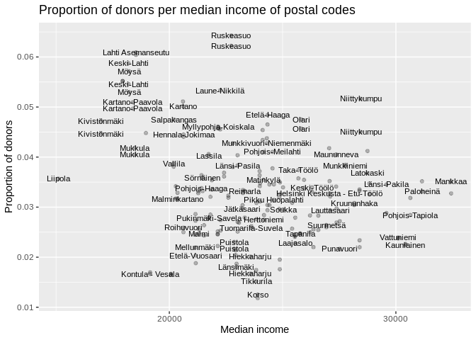
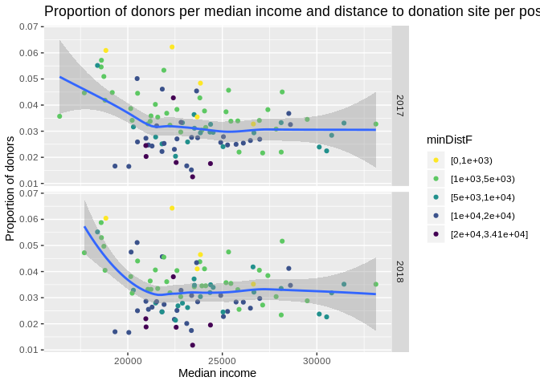
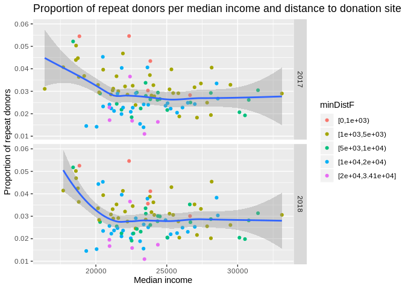
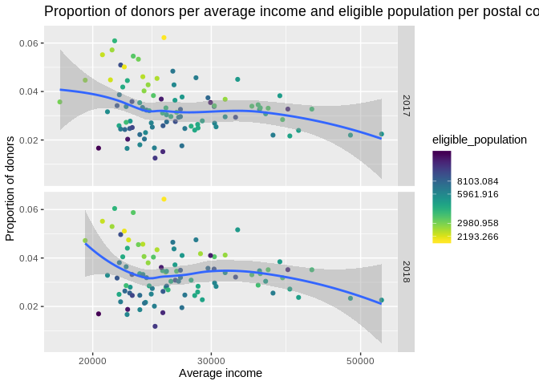
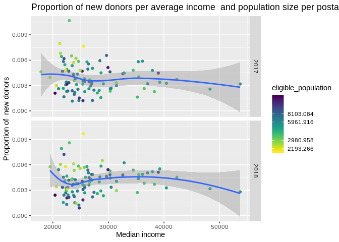
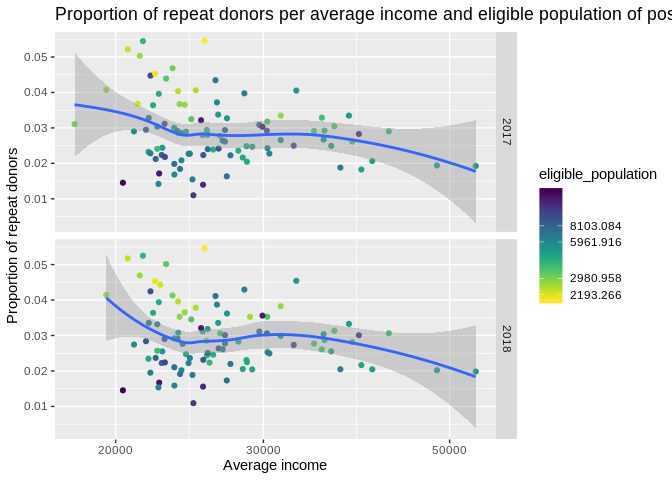
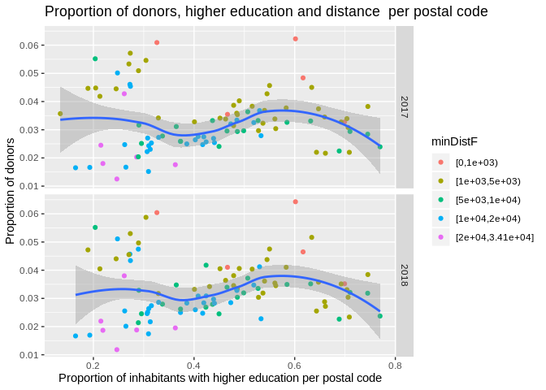

Visualising model data
================
Ilpo Arminen
8/16/2019

``` r
library(tidyverse)
```

    ## ── Attaching packages ───────────────────────────────────────────────────────────────────────────────────────────────────────────── tidyverse 1.2.1 ──

    ## ✔ ggplot2 3.2.0          ✔ purrr   0.3.2     
    ## ✔ tibble  2.1.3          ✔ dplyr   0.8.2     
    ## ✔ tidyr   0.8.3.9000     ✔ stringr 1.4.0     
    ## ✔ readr   1.3.1          ✔ forcats 0.4.0

    ## ── Conflicts ──────────────────────────────────────────────────────────────────────────────────────────────────────────────── tidyverse_conflicts() ──
    ## ✖ dplyr::filter() masks stats::filter()
    ## ✖ dplyr::lag()    masks stats::lag()

``` r
library(lubridate)
```

    ## 
    ## Attaching package: 'lubridate'

    ## The following object is masked from 'package:base':
    ## 
    ##     date

``` r
library(knitr)
library(viridis)
```

    ## Loading required package: viridisLite

``` r
library(table1)
```

    ## 
    ## Attaching package: 'table1'

    ## The following objects are masked from 'package:base':
    ## 
    ##     units, units<-

``` r
library(GGally)
```

    ## Registered S3 method overwritten by 'GGally':
    ##   method from   
    ##   +.gg   ggplot2

    ## 
    ## Attaching package: 'GGally'

    ## The following object is masked from 'package:dplyr':
    ## 
    ##     nasa

``` r
library(corrplot)
```

    ## corrplot 0.84 loaded

``` r
library(psycho)
```

    ## Registered S3 method overwritten by 'MuMIn':
    ##   method         from
    ##   predict.merMod lme4

    ## Registered S3 methods overwritten by 'huge':
    ##   method    from   
    ##   plot.sim  BDgraph
    ##   print.sim BDgraph

    ## Registered S3 method overwritten by 'xts':
    ##   method     from
    ##   as.zoo.xts zoo

    ## message: psycho's `analyze()` is deprecated in favour of the report package. Check it out at https://github.com/easystats/report

``` r
load("/home/ilpo/Paavo/data/model_data.RData")
```

\#Tranforming variables and filtering the
data

``` r
model_data$minDistF<- cut(model_data$minDist,breaks = c(-1,1000, 5000,10000,20000,max(model_data$minDist))+1,include.lowest =TRUE,right = FALSE) #minDist looks weird in plots, so it needed to factorised. 

# new dataframe filtered for regression
modified_data <- model_data %>% 
filter(medianincome < 30000) %>%  # filtering few outliers away
mutate(minDistkm= minDist /  1000) %>% # meters to kilometers
filter(minDistkm > 0.5)        # filtering distances less than 500m 
```

\#Table one from model
data

``` r
label(model_data$medianincome)  <- "Median income of household per postal code"
label(model_data$averageincome) <- "Average income of household per postal code"
label(model_data$proportion_inhabitants_with_higher_education)  <- "Share of inhabitants with higher education per postal code"
label(model_data$prop_donors) <- "Proportion of donors per postal code."
label(model_data$nb_fixed_donations_per_zip) <- "Proportion of donations per postal code"
label(model_data$nb_fixed_donors_per_zip) <- "Number of donors per zip"
label(model_data$proportion_inhabitants_with_higher_education) <- "Proportion_inhabitants_with_higher_education"
label(model_data$nb_fixed_repeat_donors) <- "Number of donors who donated more than once per zip"
label(model_data$nb_fixed_first_time_donors) <- "Number of first time donors per zip"
label(model_data$nb_fixed_donation_per_act_donor) <- "Number of donations divided by numbers of donor per zip"
label(model_data$eligible_population) <- "Number of residents per zip who is suitable for donating blood"
units(model_data$medianincome) <- "Euro"
units(model_data$averageincome) <- "Euro" 

 table1(~prop_donors + eligible_population + nb_fixed_donors_per_zip + nb_fixed_donations_per_zip + nb_fixed_donors_per_zip + medianincome + averageincome + proportion_inhabitants_with_higher_education + proportion_inhabitants_with_higher_education + prop_repeat_donors + prop_new_donors + prop_donors + nb_fixed_donation_per_act_donor,data = model_data, overall = "Total", topclass="Rtable1-grid Rtable1-center")
```

\[1\] "\<table class="Rtable1-grid
Rtable1-center"\>

<thead>

<tr>

<th class="rowlabel firstrow lastrow">

</th>

<th class="firstrow lastrow">

<span class="stratlabel">Total<br><span class="stratn">(n=194)</span></span>

</th>

</tr>

</thead>

<tbody>

<tr>

<td class="rowlabel firstrow">

<span class="varlabel">Proportion of donors per postal code.</span>

</td>

<td class="firstrow">

</td>

</tr>

<tr>

<td class="rowlabel">

Mean (SD)

</td>

<td>

0.0331 (0.0103)

</td>

</tr>

<tr>

<td class="rowlabel lastrow">

Median \[Min, Max\]

</td>

<td class="lastrow">

0.0324 \[0.0118, 0.0643\]

</td>

</tr>

<tr>

<td class="rowlabel firstrow">

<span class="varlabel">Number of residents per zip who is suitable for
donating blood</span>

</td>

<td class="firstrow">

</td>

</tr>

<tr>

<td class="rowlabel">

Mean (SD)

</td>

<td>

5920 (2860)

</td>

</tr>

<tr>

<td class="rowlabel lastrow">

Median \[Min, Max\]

</td>

<td class="lastrow">

5170 \[1960, 15700\]

</td>

</tr>

<tr>

<td class="rowlabel firstrow">

<span class="varlabel">Number of donors per zip</span>

</td>

<td class="firstrow">

</td>

</tr>

<tr>

<td class="rowlabel">

Mean (SD)

</td>

<td>

184 (87.0)

</td>

</tr>

<tr>

<td class="rowlabel lastrow">

Median \[Min, Max\]

</td>

<td class="lastrow">

155 \[100, 552\]

</td>

</tr>

<tr>

<td class="rowlabel firstrow">

<span class="varlabel">Proportion of donations per postal code</span>

</td>

<td class="firstrow">

</td>

</tr>

<tr>

<td class="rowlabel">

Mean (SD)

</td>

<td>

310 (143)

</td>

</tr>

<tr>

<td class="rowlabel lastrow">

Median \[Min, Max\]

</td>

<td class="lastrow">

267 \[157, 929\]

</td>

</tr>

<tr>

<td class="rowlabel firstrow">

<span class="varlabel">Median income of household per postal
code<span class="varunits"> (Euro)</span></span>

</td>

<td class="firstrow">

</td>

</tr>

<tr>

<td class="rowlabel">

Mean (SD)

</td>

<td>

23600 (3210)

</td>

</tr>

<tr>

<td class="rowlabel lastrow">

Median \[Min, Max\]

</td>

<td class="lastrow">

23400 \[16400, 33100\]

</td>

</tr>

<tr>

<td class="rowlabel firstrow">

<span class="varlabel">Average income of household per postal
code<span class="varunits"> (Euro)</span></span>

</td>

<td class="firstrow">

</td>

</tr>

<tr>

<td class="rowlabel">

Mean (SD)

</td>

<td>

27300 (6210)

</td>

</tr>

<tr>

<td class="rowlabel lastrow">

Median \[Min, Max\]

</td>

<td class="lastrow">

25500 \[17900,
53700\]

</td>

</tr>

<tr>

<td class="rowlabel firstrow">

<span class="varlabel">Proportion\_inhabitants\_with\_higher\_education</span>

</td>

<td class="firstrow">

</td>

</tr>

<tr>

<td class="rowlabel">

Mean (SD)

</td>

<td>

0.439 (0.157)

</td>

</tr>

<tr>

<td class="rowlabel lastrow">

Median \[Min, Max\]

</td>

<td class="lastrow">

0.439 \[0.134, 0.770\]

</td>

</tr>

<tr>

<td class="rowlabel firstrow">

<span class="varlabel">prop\_repeat\_donors</span>

</td>

<td class="firstrow">

</td>

</tr>

<tr>

<td class="rowlabel">

Mean (SD)

</td>

<td>

0.0292 (0.00908)

</td>

</tr>

<tr>

<td class="rowlabel lastrow">

Median \[Min, Max\]

</td>

<td class="lastrow">

0.0283 \[0.0109, 0.0546\]

</td>

</tr>

<tr>

<td class="rowlabel firstrow">

<span class="varlabel">prop\_new\_donors</span>

</td>

<td class="firstrow">

</td>

</tr>

<tr>

<td class="rowlabel">

Mean (SD)

</td>

<td>

0.00398 (0.00163)

</td>

</tr>

<tr>

<td class="rowlabel lastrow">

Median \[Min, Max\]

</td>

<td class="lastrow">

0.00378 \[0.000895, 0.0107\]

</td>

</tr>

<tr>

<td class="rowlabel firstrow">

<span class="varlabel">Number of donations divided by numbers of donor
per zip</span>

</td>

<td class="firstrow">

</td>

</tr>

<tr>

<td class="rowlabel">

Mean (SD)

</td>

<td>

1.70 (0.130)

</td>

</tr>

<tr>

<td class="rowlabel lastrow">

Median \[Min, Max\]

</td>

<td class="lastrow">

1.69 \[1.41, 2.29\]

</td>

</tr>

</tbody>

</table>

"

\#Distributions of variables

\#\#Distribution of eligible population variable

``` r
ggplot(data=model_data, mapping = aes(x= eligible_population))+
geom_histogram (binwidth= 500)
```

<!-- -->

``` r
# Just to keep in mind that most of postal codes have around 2-5 thousand habitants. 
```

### Distribution of proportion of donors variable

``` r
ggplot(data=model_data, mapping = aes(x= prop_donors))+
geom_histogram ()  
```

    ## `stat_bin()` using `bins = 30`. Pick better value with `binwidth`.

<!-- -->
\#\# Proportion of repeat donors

``` r
ggplot(data=model_data, mapping = aes(x= prop_new_donors))+
geom_histogram ()  
```

    ## `stat_bin()` using `bins = 30`. Pick better value with `binwidth`.

<!-- -->

### Proportion of new donors

``` r
ggplot(data=model_data, mapping = aes(x= prop_repeat_donors))+
geom_histogram ()  
```

    ## `stat_bin()` using `bins = 30`. Pick better value with `binwidth`.

<!-- -->

\#\#\#Distribution of minimum distance variable

``` r
ggplot(data= model_data, mapping= aes(x=minDist)) + 
geom_histogram()
```

    ## `stat_bin()` using `bins = 30`. Pick better value with `binwidth`.

<!-- -->

``` r
# Most of postal codes in this data are around 10km distance to donation sites 
```

Distiribution of proportion\_inhabitants\_with\_higher\_education
variable

``` r
ggplot(data= model_data, mapping= aes(x=proportion_inhabitants_with_higher_education )) + 
geom_histogram()
```

    ## `stat_bin()` using `bins = 30`. Pick better value with `binwidth`.

<!-- -->

``` r
# Proportion of higher 
```

\#Median income

\#\#Median income and proportion of donors

``` r
ggplot(data=model_data, mapping = aes(x= medianincome, y= prop_donors))+
geom_point(mapping = aes(x= medianincome, y= prop_donors)) +
geom_smooth (method = "loess") + 
scale_x_log10() +
  labs(x = "Median income",
        y = "Proportion of donors",
        title = "Proportion of donors per median income of postal codes")
```

<!-- -->

``` r
#facet_grid(Year~.)

#There seems to be quite a number of areas with high proportion of donors and lower than 20k median income. After checking this, it seems that areas are all from Lahti. Also need to pay attention that im not visualising the years separately, so  there are same data points with different year. it seems that there could be  (mild)  positive correlation between median income and proportion of donors, but only to some degree so that richest ares do not have highest prop donors and there are areas with high prop of donors and less than 20k median income, so there might be even negative correlation.  I would guess that Helsinki would fit to linear model better, than the whole dataset. 
```

## proportion of donors and median income with zip labels.

``` r
 ggplot(data = model_data,
            mapping = aes(x = medianincome, y = prop_donors))+
geom_point(alpha= 0.25) +
scale_x_log10() + 
  geom_text(data = model_data ,check_overlap = TRUE, na.rm= TRUE, size=3,
mapping = aes(label = name)) +
 labs(x = "Median income",
        y = "Proportion of donors",
        title = "Proportion of donors per median income of postal codes")
```

<!-- -->

``` r
#facet_grid(Year ~.)

# This if helpful for seeing that high proportion of donors seems to be areas near the fixed sites, atleast in Ruskeasuo, Etelä-Haaga and Lahti Asemanseutu and that Lahti has lot of areas where median income is low, but there are high proportion of donors.
```

## Median income, distance with proportion of donors

``` r
ggplot(data=model_data)+
geom_point(mapping = aes(x= medianincome, y= prop_donors,color= minDistF)) +
geom_smooth ( mapping = aes(x= medianincome, y= prop_donors)) + 
scale_color_viridis(discrete=TRUE,direction = -1) +
   labs(x = "Median income",
        y = "Proportion of donors",
        title = "Proportion of donors per median income and distance to donation site per postal code") +
facet_grid(Year~.)
```

    ## `geom_smooth()` using method = 'loess' and formula 'y ~ x'

<!-- -->

``` r
# Distance does matter a lot as high proportion of donors comes from nearby fixed sites. 
```

\#\#prop donors, median income and distance (km)

``` r
ggplot(data=modified_data)+
geom_point(mapping = aes(x= medianincome, y= prop_donors,color= minDistkm)) +
geom_smooth ( mapping = aes(x= medianincome, y= prop_donors)) + 
scale_color_viridis(direction = -1) +
   labs(x = "Median income",
        y = "Proportion of donors",
        title = "Proportion of donors per median income and distance to donation site per postal code") +
facet_grid(Year~.)
```

    ## `geom_smooth()` using method = 'loess' and formula 'y ~ x'

<!-- -->

``` r
# In this picture its pretty easy to see, that high proportion of donors comes from distances around 10 km
```

### Median income and population with proportion of donors

``` r
ggplot(data=model_data, mapping = aes(x= medianincome, y= prop_donors, color= eligible_population))+
geom_point(mapping = aes(x= medianincome, y= prop_donors)) +
geom_smooth (mapping = aes(x= medianincome, y= prop_donors)) + 
scale_color_viridis(discrete=FALSE,direction = -1,trans="log") + 
 labs(x = "Median income",
        y = "Proportion of donors",
        title = "Proportion of donors per median income and eligible population of postal codes")+ 
facet_grid(Year~.)
```

    ## `geom_smooth()` using method = 'loess' and formula 'y ~ x'

<!-- -->

``` r
# Highest proportion of donors tend to come from smaller postal codes which sounds pretty reasonable, since there need to be smaller amount of donors per population. 
```

\#proportion of new donors plus median income + distance

``` r
ggplot(data=model_data)+
geom_point(mapping = aes(x= medianincome, y= prop_new_donors,color= minDistF)) +
geom_smooth(mapping = aes(x= medianincome, y= prop_new_donors))
```

    ## `geom_smooth()` using method = 'loess' and formula 'y ~ x'

<!-- -->

``` r
# So this looks new donors and distance per median income. It seems that new donors do not live nearby of donation sites, so it looks pretty similar to all donors plot.  Distance tends to explain a lot more than median income, which seems to have negative trend. 
```

Proportion of new donors, median income + population

``` r
ggplot(data=model_data) +
geom_point(mapping = aes(x= medianincome, y= prop_new_donors,, color= eligible_population)) +
geom_smooth (aes(x= medianincome, y= prop_new_donors)) + 
scale_color_viridis(discrete=FALSE,direction = -1,trans="log") + 
 labs(x = "Median income",
        y = "Proportion of new donors",
        title = "Proportion of new donors per median income and eligible population of postal codes")+
facet_grid(Year~.)
```

    ## `geom_smooth()` using method = 'loess' and formula 'y ~ x'

<!-- -->

``` r
# New donors also tend to come from postal codes from smaller population. 
```

# proportion of repeat donors, median income + distance

``` r
ggplot(data=model_data) +
geom_point(mapping = aes(x= medianincome, y= prop_repeat_donors, color=minDistF)) +
geom_smooth (mapping = aes(x= medianincome, y= prop_repeat_donors)) + 
#scale_color_viridis(discrete=FALSE,direction = -1) + 
   labs(x = "Median income",
        y = "Proportion of repeat donors",
        title = "Proportion of repeat donors per median income and distance to donation site per postal code") + 
facet_grid(Year~.)
```

    ## `geom_smooth()` using method = 'loess' and formula 'y ~ x'

<!-- -->

``` r
#same trend is visible on repeat donors also. 
```

##### Proportion of repeat donors, median income, colored by eligible population

``` r
ggplot(data=model_data, mapping = aes(x= medianincome, y= prop_repeat_donors, color= eligible_population))+
geom_point(mapping = aes(x= medianincome, y= prop_repeat_donors)) +
geom_smooth () + 
#scale_x_log10() +
scale_color_viridis(discrete=FALSE,direction = -1,trans="log") + 
   labs(x = "Median income",
        y = "Proportion of  repeat donors",
        title = "Proportion of repeat donors per median income and eligible population per postal code") + 
facet_grid(Year~.)
```

    ## `geom_smooth()` using method = 'loess' and formula 'y ~ x'

<!-- -->

# Average income

\#\#proportion of donors and average income, colored by eligible
population

``` r
ggplot(data=model_data, mapping = aes(x= averageincome, y= prop_donors, color= eligible_population))+
geom_point(mapping = aes(x= averageincome, y= prop_donors)) +
geom_smooth () + 
scale_x_log10() +
scale_color_viridis(discrete=FALSE,direction = -1,trans="log") + 
   labs(x = "Average income",
        y = "Proportion of donors",
        title = "Proportion of donors per average income and eligible population per postal code") +
facet_grid(Year~.)
```

    ## `geom_smooth()` using method = 'loess' and formula 'y ~ x'

<!-- -->

``` r
# Averaga income and proportion of donors shows lack of donations from richest areas. Its reasonable that donations tend to come from areas where most of postal code tend to be. 
```

\#\#average income and distance

``` r
ggplot(data=model_data)+
geom_point(mapping = aes(x= averageincome, y= prop_donors,color= minDistF)) +
geom_smooth (mapping = aes(x= averageincome, y= prop_donors)) + 
#scale_color_viridis() + 
   labs(x = "Average income",
        y = "Proportion of donors",
        title = "Proportion of donors per average income of postal codes") +
facet_grid(Year~.)
```

    ## `geom_smooth()` using method = 'loess' and formula 'y ~ x'

<!-- -->

``` r
# Average income seems to have negative correlation with prop donors.  All the observations are scattered pretty randomly  into 20-30k area. 
```

\#Proportion of new donors and average income (distance)

``` r
ggplot(data=model_data)+
geom_point(mapping = aes(x= averageincome, y= prop_new_donors,color= minDistF)) +
geom_smooth (mapping = aes(x= averageincome, y= prop_new_donors)) + 
 labs(x = "average income",
        y = "Proportion of donors",
        title = "Proportion of donors per average income and distance to donation site  per postal code") +
facet_grid(Year~.)
```

    ## `geom_smooth()` using method = 'loess' and formula 'y ~ x'

<!-- -->

#### proportion of new donors and average income + population

``` r
ggplot(data=model_data, mapping = aes(x= averageincome, y= prop_new_donors, color= eligible_population))+
geom_point(mapping = aes(x= averageincome, y= prop_new_donors)) +
geom_smooth () + 
#scale_x_log10() +
scale_color_viridis(discrete=FALSE,direction = -1,trans="log") + 
 labs(x = "Median income",
        y = "Proportion of  new donors",
        title = "Proportion of new donors per average income  and population size per postal code") +
facet_grid(Year~.)
```

    ## `geom_smooth()` using method = 'loess' and formula 'y ~ x'

<!-- -->

##### Proportion of repeat donors, average income and distance

``` r
ggplot(data=model_data)+
geom_point(mapping = aes(x= averageincome, y= prop_repeat_donors,color= minDistF)) +
geom_smooth (mapping = aes(x= averageincome, y= prop_repeat_donors)) + 
#scale_x_log10() +
#scale_color_viridis(discrete=FALSE,direction = -1,trans="log") + 
   labs(x = "Average income",
        y = "Proportion of repeat donors",
        title = "Proportion of repeat donors per average income and distance to donation site  of postal codes")+
facet_grid(Year~.)
```

    ## `geom_smooth()` using method = 'loess' and formula 'y ~ x'

<!-- -->
\#\#\#\#\# Proportion of repeat donors, average income and
population

``` r
ggplot(data=model_data, mapping = aes(x= averageincome, y= prop_repeat_donors, color= eligible_population))+
geom_point(mapping = aes(x= averageincome, y= prop_repeat_donors)) +
geom_smooth () + 
scale_x_log10() +
scale_color_viridis(discrete=FALSE,direction = -1,trans="log") + 
   labs(x = "Average income",
        y = "Proportion of repeat donors",
        title = "Proportion of repeat donors per average income and eligible population of postal codes")+
facet_grid(Year~.)
```

    ## `geom_smooth()` using method = 'loess' and formula 'y ~ x'

<!-- -->

\#Higher
education

# Higher education and proportion of donors

``` r
ggplot(data=model_data, mapping = aes(x= proportion_inhabitants_with_higher_education, y= prop_donors))+
geom_point(mapping = aes(x= proportion_inhabitants_with_higher_education,, y= prop_donors)) +
geom_smooth (method="loess") + 
scale_x_log10() +
scale_color_viridis(discrete=FALSE,direction = -1,trans="log") + 
     labs(x = "Proportion of inhabitants with higher education per postal code",
        y = "Proportion of donors",
        title = "Proportion of donors and higher education per postal code") +
facet_grid(Year~.)
```

<!-- -->

``` r
#  Median income and tertiary education plots seems to be scattered pretty similar and I would presume that if there is any correlation, it is weak linear one.  
```

## Higher education and distance and proportion of donors

``` r
ggplot(data=model_data) +
geom_point( mapping = aes(x= proportion_inhabitants_with_higher_education, y= prop_donors, color= minDistF)) +
geom_smooth ( mapping = aes(x= proportion_inhabitants_with_higher_education, y= prop_donors)) + 
#scale_x_log10() +
#scale_color_viridis(direction = -1) + 
   labs(x = "Proportion of inhabitants with higher education per postal code",
        y = "Proportion of donors",
        title = "Proportion of donors, higher education and distance  per postal code") +  
facet_grid(Year~.)
```

    ## `geom_smooth()` using method = 'loess' and formula 'y ~ x'

<!-- -->

``` r
#  Coloring the distance shows that donations do not favor educated areas, but areas with close distance to donation site. 
```

### Higher education and population and proportion of donors

``` r
ggplot(data=model_data, mapping = aes(x= proportion_inhabitants_with_higher_education, y= prop_donors, color= eligible_population)) +
geom_point(mapping = aes(x= proportion_inhabitants_with_higher_education,, y= prop_donors))  +
geom_smooth () + 
scale_x_log10() +
scale_color_viridis(discrete=FALSE,direction = -1,trans="log") + 
   labs(x = "Proportion of inhabitants with higher education per postal code",
        y = "Proportion of donors",
        title = "Proportion of donors, higher education and eligible population  per postal code") +
facet_grid(Year~.)
```

    ## `geom_smooth()` using method = 'loess' and formula 'y ~ x'

<!-- -->

``` r
# Population size of postal code tends to favor high number of donors in smaller places. This is in line with common sense since donations are measured by dividing the population size with number of donors.  Highest number of tertiary educated inhabitants behave similar to those highest number of median income areas, where there are quite a downfall in donation trend. Im not sure that the downfall is as drastic as it is with median income. 
```

##### proportion of new donors, higher education and eligible population

``` r
ggplot(data=model_data, mapping = aes(x= proportion_inhabitants_with_higher_education, y= prop_new_donors, color= eligible_population))+
geom_point(mapping = aes(x= proportion_inhabitants_with_higher_education,, y= prop_new_donors)) +
geom_smooth () + 
scale_x_log10() +
scale_color_viridis(discrete = FALSE,direction = -1,trans="log") + 
   labs(x = "Proportion of inhabitants with higher education per postal code",
        y = "Proportion of new donors",
        title = "Proportion of new donors and higher education per postal code") +
facet_grid(Year~.)
```

    ## `geom_smooth()` using method = 'loess' and formula 'y ~ x'

<!-- -->

``` r
# Eligible population shows that lot of high proportion of donor areas come from smaller postal codes even with new donors.  
```

#### proportion of repeat donors, higher education and distance

``` r
ggplot(data=model_data) +
geom_point(mapping = aes(x= proportion_inhabitants_with_higher_education, y= prop_repeat_donors, color=minDistF)) +
geom_smooth (mapping = aes(x= proportion_inhabitants_with_higher_education, y= prop_repeat_donors)) + 
     labs(x = "Proportion of inhabitants with higher education per postal code",
        y = "Proportion of repeat donors",
        title = "Proportion of repeat donors and higher education per postal code") +
facet_grid(Year~.)
```

    ## `geom_smooth()` using method = 'loess' and formula 'y ~ x'

<!-- -->

``` r
# repeated donors shows the sane tremd than other plots with education. High proportion of donors come from close postal codes to fixed site. 
```

# 

##### proportion of repeat donors, higher education and eligible population

``` r
ggplot(data=model_data, mapping = aes(x= proportion_inhabitants_with_higher_education, y= prop_repeat_donors, color=eligible_population))+
geom_point(mapping = aes(x= proportion_inhabitants_with_higher_education,, y= prop_repeat_donors)) +
geom_smooth () + 
scale_x_log10() +
scale_color_viridis(discrete=FALSE,direction = -1,trans="log") + 
     labs(x = "Proportion of inhabitants with higher education per postal code",
        y = "Proportion of repeat  donors",
        title = "Proportion of repeat donors and higher education per postal code") +
facet_grid(Year~.)
```

    ## `geom_smooth()` using method = 'loess' and formula 'y ~ x'

<!-- -->

# Distance

\#Distance and proportion of donors

``` r
ggplot(data=modified_data)+
geom_point(mapping = aes(x= minDistF, y= prop_donors)) +
geom_smooth (mapping = aes(x= minDistF, y= prop_donors)) + 
#scale_x_log10() +
#scale_color_viridis(discrete=FALSE,direction = -1,trans="log") + 
labs(x = "Distance to closest donation site",
        y = "Proportion of donors",
        title = "Proportion of  donors and distance to closest donation site") +
facet_grid(Year~.)
```

    ## `geom_smooth()` using method = 'loess' and formula 'y ~ x'

<!-- -->

``` r
# 
```

``` r
ggplot(data=model_data)+ # dataset where distance is kilometers and less than 500m distances are filtered out. 
geom_point(mapping = aes(x= minDist ,y= prop_donors)) +
geom_smooth (mapping = aes(x= minDist, y= prop_donors)) + 
scale_x_log10() +
#scale_color_viridis(discrete=FALSE,direction = -1,trans="log") + 
labs(x = "Distance to closest donation site",
        y = "Proportion of donors",
        title = "Proportion of  donors and distance to closest donation site") +
facet_grid(Year~.)
```

    ## Warning: Transformation introduced infinite values in continuous x-axis
    
    ## Warning: Transformation introduced infinite values in continuous x-axis

    ## `geom_smooth()` using method = 'loess' and formula 'y ~ x'

    ## Warning: Removed 4 rows containing non-finite values (stat_smooth).

<!-- -->

``` r
# Distance seems to have moderate negative correlation with proportion of donors. 
```

## Distance and proportion of repeated donors

``` r
ggplot(data=model_data)+
geom_point(mapping = aes(x= minDist, y= prop_repeat_donors)) +
geom_smooth ( mapping = aes(x= minDist, y= prop_repeat_donors)) + 
scale_x_log10() +
scale_color_viridis(discrete=FALSE,direction = -1,trans="log") + 
  labs(x = "Distance to closest donation site",
        y = "Proportion of repeat donors",
        title = "Proportion of  repeat donors and distance to closest donation site") +
facet_grid(Year~.)
```

    ## Warning: Transformation introduced infinite values in continuous x-axis
    
    ## Warning: Transformation introduced infinite values in continuous x-axis

    ## `geom_smooth()` using method = 'loess' and formula 'y ~ x'

    ## Warning: Removed 4 rows containing non-finite values (stat_smooth).

<!-- -->

``` r
# Same negative trend is visible on repeated donors also. 
```

### Distance and proportion of new donors

``` r
ggplot(data=model_data, mapping = aes(x= minDist, y= prop_new_donors))+
geom_point(mapping = aes(x= minDist, y= prop_new_donors)) +
geom_smooth () + 
scale_x_log10() +
scale_color_viridis(discrete=FALSE,direction = -1,trans="log") + 
    labs(x = "Distance to closest donation site",
        y = "Proportion of new donors",
        title = "Proportion of  new donors and distance to closest donation site") +
facet_grid(Year~.)
```

    ## Warning: Transformation introduced infinite values in continuous x-axis
    
    ## Warning: Transformation introduced infinite values in continuous x-axis

    ## `geom_smooth()` using method = 'loess' and formula 'y ~ x'

    ## Warning: Removed 4 rows containing non-finite values (stat_smooth).

<!-- -->

``` r
# New donors looks exactly the same as as other plots with proportion of donors and distance. 
```

# Median income and higher education

``` r
ggplot(data=model_data)+
geom_point(mapping =aes( x= medianincome, y= proportion_inhabitants_with_higher_education)) +
geom_smooth ( mapping = aes(x= medianincome, y= proportion_inhabitants_with_higher_education, method= "loess"))
```

    ## Warning: Ignoring unknown aesthetics: method

    ## `geom_smooth()` using method = 'loess' and formula 'y ~ x'

<!-- -->

``` r
#Median income and higher education tends to correlate with strongly. 
```

# Distance in kilometers with filtered data

``` r
ggplot(data=modified_data)+ # dataset where distance is kilometers and less than 500m distances are filtered out. 
geom_point(mapping = aes(x= minDistkm, y= prop_donors)) +  # meters turned into kilometers. 
geom_smooth (mapping = aes(x= minDistkm, y= prop_donors)) + 
#scale_x_log10() +
#scale_color_viridis(discrete=FALSE,direction = -1,trans="log") + 
labs(x = "Distance to closest donation site",
        y = "Proportion of donors",
        title = "Proportion of  donors and distance to closest donation site") +
facet_grid(Year~.)
```

    ## `geom_smooth()` using method = 'loess' and formula 'y ~ x'

<!-- -->

``` r
# Distance seems to have moderate negative correlation with proportion of donors. 
```

``` r
ggplot(data=modified_data)+ # dataset where distance is kilometers and less than 500m distances are filtered out. 
geom_point(mapping = aes(x= minDistkm, y= prop_repeat_donors)) +  # meters turned into kilometers. 
geom_smooth (mapping = aes(x= minDistkm, y= prop_repeat_donors)) + 
scale_x_log10() +
#scale_color_viridis(discrete=FALSE,direction = -1,trans="log") + 
labs(x = "Distance to closest donation site",
        y = "Proportion of donors",
        title = "Proportion of  donors and distance to closest donation site") +
facet_grid(Year~.)
```

    ## `geom_smooth()` using method = 'loess' and formula 'y ~ x'

<!-- -->

\#Correlation matrix and
plot

``` r
cordata <- model_data %>% # Making a new dataframe so i dont count correlation to all variables. 
dplyr::select(prop_donors,prop_new_donors,prop_repeat_donors, medianincome, averageincome,minDist,proportion_inhabitants_with_higher_education, eligible_population) #selecting wanted variables


cor <- psycho::correlation(cordata) # R doesn't recognize this particular correlation function without package name first 
plot(cor)#visualise the correlation matrix 
```

<!-- -->

``` r
myvars <- modified_data %>% 
select(prop_donors, medianincome,proportion_inhabitants_with_higher_education, minDistkm, eligible_population,prop_new_donors,prop_repeat_donors)


ggpairs(myvars)
```

<!-- -->

``` r
svg("myvars.svg",height=8,width=8)
ggpairs(myvars) 
dev.off()
```

    ## png 
    ##   2

``` r
summary(cor)
```

    ##                                              prop_donors prop_new_donors
    ## prop_donors                                                             
    ## prop_new_donors                                  0.76***                
    ## prop_repeat_donors                               0.99***         0.68***
    ## medianincome                                     -0.24*           -0.14 
    ## averageincome                                     -0.19           -0.03 
    ## minDist                                         -0.52***        -0.55***
    ## proportion_inhabitants_with_higher_education       0.02            0.15 
    ## eligible_population                             -0.43***        -0.26** 
    ##                                              prop_repeat_donors
    ## prop_donors                                                    
    ## prop_new_donors                                                
    ## prop_repeat_donors                                             
    ## medianincome                                           -0.25** 
    ## averageincome                                             -0.2 
    ## minDist                                                -0.48***
    ## proportion_inhabitants_with_higher_education                 0 
    ## eligible_population                                    -0.44***
    ##                                              medianincome averageincome
    ## prop_donors                                                            
    ## prop_new_donors                                                        
    ## prop_repeat_donors                                                     
    ## medianincome                                                           
    ## averageincome                                     0.89***              
    ## minDist                                             -0.1        -0.24* 
    ## proportion_inhabitants_with_higher_education      0.77***       0.78***
    ## eligible_population                                 -0.1         -0.08 
    ##                                              minDist
    ## prop_donors                                         
    ## prop_new_donors                                     
    ## prop_repeat_donors                                  
    ## medianincome                                        
    ## averageincome                                       
    ## minDist                                             
    ## proportion_inhabitants_with_higher_education -0.5***
    ## eligible_population                            0.14 
    ##                                              proportion_inhabitants_with_higher_education
    ## prop_donors                                                                              
    ## prop_new_donors                                                                          
    ## prop_repeat_donors                                                                       
    ## medianincome                                                                             
    ## averageincome                                                                            
    ## minDist                                                                                  
    ## proportion_inhabitants_with_higher_education                                             
    ## eligible_population                                                                -0.04

``` r
write_csv(summary(cor), "myformattedcortable.csv")
```

# modify the plots for presentation

``` r
ggplot(data=model_data, mapping = aes(x= medianincome, y= prop_donors))+
geom_point(mapping = aes(x= medianincome, y= prop_donors)) +
geom_smooth (method = "loess") + 
scale_x_log10() +
  theme_bw() +
  labs(x = "Median income",
        y = "Proportion of donors",
        title = "Proportion of donors per median income of postal codes")
```

<!-- -->

``` r
 ggplot(data = model_data,
            mapping = aes(x = medianincome, y = prop_donors))+
geom_point(alpha= 0.25) +
scale_x_log10() + 
  geom_text(data = model_data ,check_overlap = TRUE, na.rm= TRUE, size=3,
mapping = aes(label = name)) +
 labs(x = "Median income",
        y = "Proportion of donors",
        title = "Proportion of donors per median income of postal codes")+
  theme_bw()
```

<!-- -->

``` r
#facet_grid(Year ~.)
```

``` r
ggplot(data=modified_data)+
geom_point(mapping = aes(x= medianincome, y= prop_repeat_donors,color= minDistF)) +
geom_smooth ( mapping = aes(x= medianincome, y= prop_donors)) + 
scale_color_viridis(discrete=TRUE,direction = -1) +
   labs(x = "Median income",
        y = "Proportion of donors",
        title = "Proportion of donors per median income and distance to donation site per postal code") +
  theme_bw()+
facet_grid(Year~.)
```

    ## `geom_smooth()` using method = 'loess' and formula 'y ~ x'

<!-- -->

``` r
ggplot(data=modified_data)+
geom_point(mapping = aes(x= medianincome, y= prop_repeat_donors,color= minDistF)) +
geom_smooth ( mapping = aes(x= medianincome, y= prop_repeat_donors)) + 
scale_color_viridis(discrete=TRUE,direction = -1) +
   labs(x = "Median income",
        y = "Proportion of repeat donors",
        title = "Proportion of repeat donors per median income and distance to donation site per postal code") +
  theme_bw()+
facet_grid(Year~.)
```

    ## `geom_smooth()` using method = 'loess' and formula 'y ~ x'

<!-- -->

``` r
ggplot(data=modified_data)+
geom_point(mapping = aes(x= medianincome, y= prop_new_donors,color= minDistF)) +
geom_smooth ( mapping = aes(x= medianincome, y= prop_new_donors)) + 
scale_color_viridis(discrete=TRUE,direction = -1) +
   labs(x = "Median income",
        y = "Proportion of donors",
        title = "Proportion of donors per median income and distance to donation site per postal code") +
  theme_bw()+
facet_grid(Year~.)
```

    ## `geom_smooth()` using method = 'loess' and formula 'y ~ x'

<!-- -->

``` r
ggplot(data=model_data, mapping = aes(x= proportion_inhabitants_with_higher_education, y= prop_donors))+
geom_point(mapping = aes(x= proportion_inhabitants_with_higher_education,, y= prop_donors)) +
geom_smooth (method="loess") + 
scale_x_log10() +
scale_color_viridis(discrete=FALSE,direction = -1,trans="log") + 
     labs(x = "Proportion of inhabitants with higher education per postal code",
        y = "Proportion of donors",
        title = "Proportion of donors and higher education per postal code") +
facet_grid(Year~.)+
theme_bw()
```

<!-- -->

``` r
ggplot(data=modified_data)+ # dataset where distance is kilometers and less than 500m distances are filtered out. 
geom_point(mapping = aes(x= minDistkm ,y= prop_donors)) +
geom_smooth (mapping = aes(x= minDistkm, y= prop_donors)) + 
scale_x_log10() +
#scale_color_viridis(discrete=FALSE,direction = -1,trans="log") + 
labs(x = "Distance to closest donation site (kilometers)",
        y = "Proportion of donors",
        title = "Proportion of  donors and distance to closest donation site") +
#facet_grid(Year~.)  +
theme_bw()
```

    ## `geom_smooth()` using method = 'loess' and formula 'y ~ x'

<!-- -->

``` r
ggplot(data=modified_data)+
geom_point(mapping = aes(x=medianincome, y= proportion_inhabitants_with_higher_education))+
geom_smooth(mapping = aes(x=medianincome, y= proportion_inhabitants_with_higher_education))+
labs(x= "median income", 
    y= "Proportion inhabitants with higher education", 
    title= "Higher education and median income") + 
theme_bw()
```

    ## `geom_smooth()` using method = 'loess' and formula 'y ~ x'

<!-- -->

``` r
save(modified_data, #saving the filtered data for regression
file = paste0("name.",Sys.Date(),".RData"))
```
